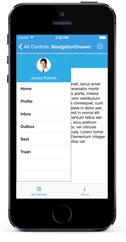

# Drawer Opening Animation

The `Transition` property specifies the sliding animations for the DrawerView panel. The `Transition` property has the following three options:

* SlideOnTop
* Push
* Reveal

N> The default transition is SlideOnTop.

## SlideOnTop

Slides the DrawerContent on top of the main content.



 

	navigationDrawer.Transition = SFNavigationDrawerTransition.SFNavigationDrawerTransitionSlideOnTop;





## Push

This transition slides the Drawer and main content simultaneously.



 

	navigationDrawer.Transition = SFNavigationDrawerTransition.SFNavigationDrawerTransitionSlideOnPush;





## Reveal

The Drawer content is in fixed position and the main content will slide to reveal the drawer content.



 

	navigationDrawer.Transition = SFNavigationDrawerTransition.SFNavigationDrawerTransitionSlideOnReveal;





