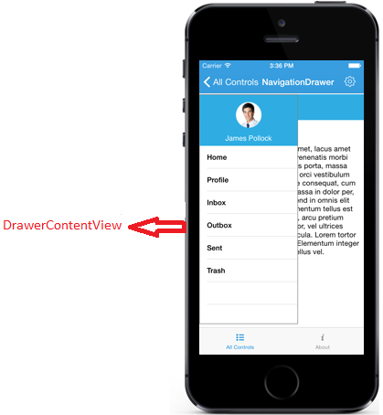
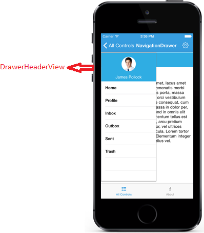
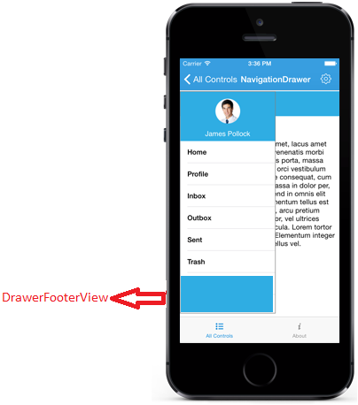

# Sliding Panel Contents

The sliding panel contents are divided into three parts and they are as follows
	
* [Drawer Content](#drawer-main-content)
* [Header Content](#drawer-header-content) 
* [Footer Content](#drawer-footer-content)

## Drawer Main Content

The sliding main content of the SfNavigationDrawer can be set with any view using `DrawerContentView`. This part mostly holds the list of menus that has to be selected to display the Main content.





	//DrawerView
	namespace NavigationDrawerTest
{
	public partial class ViewController : UIViewController
	{
		public ViewController(IntPtr handle) : base(handle)
		{
		}

		public override void ViewDidLoad()
		{
			base.ViewDidLoad();
			SFNavigationDrawer navigation = new SFNavigationDrawer();
			this.Add(navigation);
			navigation.Frame = new CGRect(0, 0, this.View.Frame.Width, this.View.Frame.Height);
			navigation.DrawerWidth = 200;

			UIView contentView = new UIView(new CGRect(0, 0, this.View.Frame.Width, this.View.Frame.Height));
            UILabel homeLabel = new UILabel();
			homeLabel.Frame = new CGRect(5, 2, contentView.Frame.Width - 8, 30);
			homeLabel.Text = "Home";
			homeLabel.TextColor = UIColor.White;
			homeLabel.BackgroundColor = UIColor.FromRGB(49, 173, 225);
			homeLabel.TextAlignment = UITextAlignment.Center;
            contentView.AddSubview(homeLabel);
			navigation.ContentView = contentView;
			UIView drawerContentView = new UIView(new CGRect(0, 0, navigation.DrawerWidth, 100));
            UIView centerview = new UIView();
			centerview.Frame = new CGRect(0, 0, navigation.DrawerWidth, 500);
			UIButton homeButton = new UIButton(new CGRect(0, 0, navigation.DrawerWidth, 50));
			homeButton.SetTitle("Home", UIControlState.Normal);
			homeButton.SetTitleColor(UIColor.Black, UIControlState.Normal);
			homeButton.HorizontalAlignment = UIControlContentHorizontalAlignment.Center;
			centerview.AddSubview(homeButton);
            UIButton profileButton = new UIButton(new CGRect(0, 50, navigation.DrawerWidth, 50));
			profileButton.SetTitle("Profile", UIControlState.Normal);
			profileButton.SetTitleColor(UIColor.Black, UIControlState.Normal);
			profileButton.HorizontalAlignment = UIControlContentHorizontalAlignment.Center;
			profileButton.Layer.CornerRadius = 0;
			profileButton.Layer.BorderColor = UIColor.FromRGB(0, 0, 0).CGColor;
			centerview.AddSubview(profileButton);

			UIButton inboxButton = new UIButton(new CGRect(0, 100, navigation.DrawerWidth, 50));
			inboxButton.SetTitle("Inbox", UIControlState.Normal);
			inboxButton.SetTitleColor(UIColor.Black, UIControlState.Normal);
			inboxButton.HorizontalAlignment = UIControlContentHorizontalAlignment.Center;
			inboxButton.Layer.CornerRadius = 0;
			inboxButton.Layer.BorderColor = UIColor.FromRGB(0, 0, 0).CGColor;
			centerview.AddSubview(inboxButton);

			UIButton outboxButton = new UIButton(new CGRect(0, 150, navigation.DrawerWidth, 50));
			outboxButton.SetTitle("Outbox", UIControlState.Normal);
			outboxButton.SetTitleColor(UIColor.Black, UIControlState.Normal);
			outboxButton.HorizontalAlignment = UIControlContentHorizontalAlignment.Center;
			outboxButton.Layer.CornerRadius = 0;
			outboxButton.Layer.BorderColor = UIColor.FromRGB(0, 0, 0).CGColor;
			centerview.AddSubview(outboxButton);

			UIButton sentItemsButton = new UIButton(new CGRect(0, 200, navigation.DrawerWidth, 50));
			sentItemsButton.SetTitle("SentItems", UIControlState.Normal);
			sentItemsButton.SetTitleColor(UIColor.Black, UIControlState.Normal);
			sentItemsButton.Layer.CornerRadius = 0;
			sentItemsButton.Layer.BorderColor = UIColor.FromRGB(0, 0, 0).CGColor;
			centerview.AddSubview(sentItemsButton);

			UIButton trashButton = new UIButton(new CGRect(0, 250, navigation.DrawerWidth, 50));
			trashButton.SetTitle("Trash", UIControlState.Normal);
			trashButton.SetTitleColor(UIColor.Black, UIControlState.Normal);
			trashButton.Layer.CornerRadius = 0;
			trashButton.Layer.BorderColor = UIColor.FromRGB(0, 0, 0).CGColor;
			centerview.AddSubview(trashButton);
			drawerContentView.AddSubview(centerview);

			navigation.DrawerContentView = drawerContentView;
			this.Add(navigation);

		}





## Drawer Header Content

Instead of providing everything in the drawer content view, `DrawerHeaderView` property can be used to display certain information like user id or names in the header part.





namespace NavigationDrawerTest
{
	public partial class ViewController : UIViewController
	{
		public ViewController(IntPtr handle) : base(handle)
		{
		}

		public override void ViewDidLoad()
		{
			base.ViewDidLoad();
			// Perform any additional setup after loading the view, typically from a nib.
			SFNavigationDrawer navigation = new SFNavigationDrawer();
			this.Add(navigation);
            navigation.Frame = new CGRect(0, 0, this.View.Frame.Width, this.View.Frame.Height);
			navigation.DrawerHeaderHeight = 100;
			navigation.DrawerWidth = 200;
            UIView contentView = new UIView(new CGRect(0, 0, this.View.Frame.Width, this.View.Frame.Height));
            UILabel homeLabel = new UILabel();
			homeLabel.Frame = new CGRect(5, 2, contentView.Frame.Width - 8, 30);
			homeLabel.Text = "Home";
			homeLabel.TextColor = UIColor.White;
			homeLabel.BackgroundColor = UIColor.FromRGB(49, 173, 225);
			homeLabel.TextAlignment = UITextAlignment.Center;
            contentView.AddSubview(homeLabel);
            UIButton menubutton = new UIButton();
			menubutton.Frame =new CGRect(10, 5, 25, 25);
			menubutton.SetBackgroundImage (new UIImage("Images/menu.png"), UIControlState.Normal);

			menubutton.TouchUpInside += (object sender, EventArgs e) => 
			{
				navigation.ToggleDrawer();
			};

			contentView.AddSubview (menubutton);
			navigation.ContentView = contentView;
            UIView headerView = new UIView(new CGRect(0, 0, navigation.DrawerWidth, 100));
            UIView HeaderView = new UIView();
			HeaderView.Frame = new CGRect(0, 0, navigation.DrawerWidth, 100);
			HeaderView.BackgroundColor = UIColor.FromRGB(49, 173, 225);
			UILabel usernameLabel = new UILabel();
			usernameLabel.Frame = new CGRect(0, 70, navigation.DrawerWidth, 30);
			usernameLabel.Text = (NSString)"James Pollock";
			usernameLabel.TextColor = UIColor.White;
			usernameLabel.TextAlignment = UITextAlignment.Center;
			HeaderView.AddSubview(usernameLabel);
			UIImageView userImg = new UIImageView(UIImage.FromBundle("Images/Image15.png"));
			userImg.Frame = new CGRect((navigation.DrawerWidth / 2) - 25, 15, 50, 50);
			HeaderView.AddSubview(userImg);
			headerView.AddSubview(HeaderView);
			navigation.DrawerHeaderView = headerView;
			this.Add(navigation);

		}
	}
}
 




## Drawer Footer Content

Similar to drawer header view, the `DrawerFooterView` property can be used to set footer content. For ex: Logout option or Exit option can be placed at Footer part.




namespace NavigationDrawerTest
{
	public partial class ViewController : UIViewController
	{
		public ViewController(IntPtr handle) : base(handle)
		{
		}

		public override void ViewDidLoad()
		{
			base.ViewDidLoad();
			// Perform any additional setup after loading the view, typically from a nib.
            SFNavigationDrawer navigation = new SFNavigationDrawer();
			this.Add(navigation);
            navigation.Frame = new CGRect(0, 0, this.View.Frame.Width, this.View.Frame.Height);
			navigation.DrawerFooterHeight = 100;
			navigation.DrawerWidth = 200;
            UIView contentView = new UIView(new CGRect(0, 0, this.View.Frame.Width, this.View.Frame.Height));
            UILabel homeLabel = new UILabel();
            homeLabel.Frame = new CGRect(5, 2, contentView.Frame.Width - 8, 30);
            homeLabel.Text = "Home";
			homeLabel.TextColor = UIColor.White;
			homeLabel.BackgroundColor = UIColor.FromRGB(49, 173, 225);
			homeLabel.TextAlignment = UITextAlignment.Center;
            contentView.AddSubview(homeLabel);
            navigation.ContentView = contentView;
            UIView footerView = new UIView(new CGRect(0, 0, navigation.DrawerWidth, 100));
            UIView FooterView = new UIView();
            FooterView.Frame = new CGRect(0, 0, navigation.DrawerWidth, 100);
            FooterView.BackgroundColor = UIColor.FromRGB(49, 173, 225);
			UILabel usernameLabel = new UILabel();
            usernameLabel.Frame = new CGRect(0, 70, navigation.DrawerWidth, 30);
            usernameLabel.Text = (NSString)"James Pollock";
			usernameLabel.TextColor = UIColor.White;
			usernameLabel.TextAlignment = UITextAlignment.Center;
            FooterView.AddSubview(usernameLabel);
			footerView.AddSubview(FooterView);
			navigation.DrawerFooterView = footerView;
			this.Add(navigation);
		}
	}
}





## Drawer Size

Gets or sets the height and width of the DrawerView panel in the NavigationDrawer control using `DrawerHeight` and `DrawerWidth` properties.





	navigation.DrawerHeight=300;
    navigation.DrawerWidth=300;





## Multiple drawers

The Navigation Drawer allows users to open the drawer on multiple sides with different toggle methods. The DrawerSettings class and its properties need to be used when users need to provide multiple drawers. The multiple drawers can be implemented using the following drawer settings:
* Default drawer settings
* Secondary drawer settings

N> The header and footer content are optional, but the drawer content is mandatory to allocate space for the drawer.
		
## Default drawer settings

Implement the default drawer using the default drawer settings class. The following code sample demonstrates how to set the properties of default drawer settings inside the DrawerSettings class.




DrawerSettings defaultDrawerSettings = new DrawerSettings();
defaultDrawerSettings.DrawerHeight = 450;
defaultDrawerSettings.Position = SFNavigationDrawerPosition.SFNavigationDrawerPositionLeft;
defaultDrawerSettings.Transition = SFNavigationDrawerTransition.SFNavigationDrawerTransitionSlideOnTop;
defaultDrawerSettings.ContentBackgroundColor = UIColor.Red;
defaultDrawerSettings.DrawerWidth = 150;
defaultDrawerSettings.DrawerHeaderHeight = 150;
defaultDrawerSettings.DrawerFooterHeight = 150;
  




N> The Navigation Drawer works with the value given for the properties inside the DrawerSettings class when using the default drawer settings.

### Header view of the default drawer

The header content can be provided to the default drawer using the `DrawerHeaderView` property inside the DrawerSettings class of DefaultDrawerSettings. The following code sample demonstrates how to set header content to the default drawer.





DrawerSettings defaultDrawerSettings = new DrawerSettings();
defaultDrawerSettings.DrawerHeaderHeight = 150;
UIView headerView = new UIView(new CGRect(0, 0, this.View.Frame.Width, this.View.Frame.Height));
UILabel header = new UILabel();
header.Frame = new CGRect(5, 2, contentView.Frame.Width - 8, 30);
header.Text = "James Pollack";
header.TextColor = UIColor.White;
header.BackgroundColor = UIColor.FromRGB(49, 173, 225);
header.TextAlignment = UITextAlignment.Center;
headerView.AddSubview(header);
defaultDrawerSettings.DrawerHeaderView = headerView;
navigation.DefaultDrawerSettings = defaultDrawerSettings;



      

### Content view of the default drawer

The drawer content can be provided to the default drawer using the `DrawerContentView` property inside the DrawerSettings class. The following code sample demonstrates how to set drawer content to the default drawer.





SfNavigationDrawer navigationDrawer = new SfNavigationDrawer();
DrawerSettings defaultDrawerSettings = new DrawerSettings();
defaultDrawerSettings.DrawerHeaderHeight = 150;
UIView contentView = new UIView(new CGRect(0, 0, this.View.Frame.Width, this.View.Frame.Height));
UILabel content = new UILabel();
content.Frame = new CGRect(5, 2, contentView.Frame.Width - 8, 30);
content.Text = "James Pollack";
content.TextColor = UIColor.White;
content.BackgroundColor = UIColor.FromRGB(49, 173, 225);
content.TextAlignment = UITextAlignment.Center;
contentView.AddSubview(content);
defaultDrawerSettings.DrawerContentView = contentView;
navigationDrawer.DefaultDrawerSettings = defaultDrawerSettings;
SetContentView(navigationDrawer);

  


   

### Footer view of the default drawer

The footer content can be provided to the default drawer using the `DrawerFooterView` property inside the DrawerSettings class of DefaultDrawerSettings. The following code sample demonstrates how to set footer content to the default drawer.





DrawerSettings defaultDrawerSettings = new DrawerSettings();
defaultDrawerSettings.DrawerFooterHeight = 150;
UIView footerView = new UIView(new CGRect(0, 0, this.View.Frame.Width, this.View.Frame.Height));
UILabel footer = new UILabel();
footer.Frame = new CGRect(5, 2, contentView.Frame.Width - 8, 30);
footer.Text = "James Pollock";
footer.TextColor = UIColor.White;
footer.BackgroundColor = UIColor.FromRGB(49, 173, 225);
footer.TextAlignment = UITextAlignment.Center;
footerView.AddSubview(footer);
defaultDrawerSettings.DrawerFooterView = footerView;
navigation.DefaultDrawerSettings = defaultDrawerSettings;



   

## Secondary drawer settings   

Implement the secondary drawer using the secondary drawer settings class. Its properties and functionalities are same as the default drawer. The secondary drawer can be set to different positions similar to the default drawer. The following code sample demonstrates how to set the properties of secondary drawer settings inside the DrawerSettings class.





DrawerSettings secondaryDrawerSettings = new DrawerSettings();
secondaryDrawerSettings.DrawerHeight = 450;
secondaryDrawerSettings.Position = SFNavigationDrawerPosition.SFNavigationDrawerPositionRight;
secondaryDrawerSettings.Transition = SFNavigationDrawerTransition.SFNavigationDrawerTransitionSlideOnTop;
secondaryDrawerSettings.ContentBackgroundColor = UIColor.Blue;
secondaryDrawerSettings.DrawerWidth = 150;
secondaryDrawerSettings.DrawerHeaderHeight = 150;
secondaryDrawerSettings.DrawerFooterHeight = 150;

  




N> When the default drawer and the secondary drawer are set to the same position, the default drawer will open on swiping.

### Header view of the secondary drawer

The header content can be provided to the secondary drawer using the `DrawerHeaderView` property inside the DrawerSettings class of SecondaryDrawerSettings. The following code sample demonstrates how to set the header content to the secondary drawer.





DrawerSettings secondaryDrawerSettings = new DrawerSettings();
secondaryDrawerSettings.DrawerHeaderHeight = 150;
UIView headerView = new UIView(new CGRect(0, 0, this.View.Frame.Width, this.View.Frame.Height));
UILabel header = new UILabel();
header.Frame = new CGRect(5, 2, contentView.Frame.Width - 8, 30);
header.Text = "James Pollack";
header.TextColor = UIColor.White;
header.BackgroundColor = UIColor.FromRGB(49, 173, 225);
header.TextAlignment = UITextAlignment.Center;
headerView.AddSubview(header);
secondaryDrawerSettings.DrawerHeaderView = headerView;
navigation.SecondaryDrawerSettings=secondaryDrawerSettings;



      

### Content view of the secondary drawer

The drawer content can be provided to the secondary drawer using the `DrawerContentView` property inside the DrawerSettings class of SecondaryDrawerSettings. The following code sample demonstrates how to set the drawer content to the secondary drawer.





SfNavigationDrawer navigationDrawer = new SfNavigationDrawer();
DrawerSettings secondaryDrawerSettings = new DrawerSettings();
secondaryDrawerSettings.DrawerHeaderHeight = 150;
UIView contentView = new UIView(new CGRect(0, 0, this.View.Frame.Width, this.View.Frame.Height));
UILabel content = new UILabel();
content.Frame = new CGRect(5, 2, contentView.Frame.Width - 8, 30);
content.Text = "James Pollack";
content.TextColor = UIColor.White;
content.BackgroundColor = UIColor.FromRGB(49, 173, 225);
content.TextAlignment = UITextAlignment.Center;
contentView.AddSubview(content);
secondaryDrawerSettings.DrawerContentView = contentView;
navigationDrawer.SecondaryDrawerSettings = secondaryDrawerSettings;
SetContentView(navigationDrawer);



   

### Footer view of the secondary drawer

The footer content can be provided to the secondary drawer using the `DrawerFooterView` property inside the DrawerSettings class of SecondaryDrawerSettings. The following code sample demonstrates how to set footer content to the secondary drawer.





DrawerSettings secondaryDrawerSettings = new DrawerSettings();
secondaryDrawerSettings.DrawerFooterHeight = 150;
UIView footerView = new UIView(new CGRect(0, 0, this.View.Frame.Width, this.View.Frame.Height));
UILabel footer = new UILabel();
footer.Frame = new CGRect(5, 2, contentView.Frame.Width - 8, 30);
footer.Text = "James Pollock";
footer.TextColor = UIColor.White;
footer.BackgroundColor = UIColor.FromRGB(49, 173, 225);
footer.TextAlignment = UITextAlignment.Center;
footerView.AddSubview(footer);
secondaryDrawerSettings.DrawerFooterView = footerView;
navigation.SecondaryDrawerSettings = secondaryDrawerSettings;



   

## Toggling method

Users can toggle the secondary drawer using the `ToggleSecondaryDrawer` method. 

 

navigationDrawer.ToggleSecondaryDrawer();



### Opening the drawer programmatically

The `IsOpen` property in the DrawerSettings of SecondaryDrawerSettings is used to open or close the drawer programmatically.

N> Users can open only one drawer at a time.
