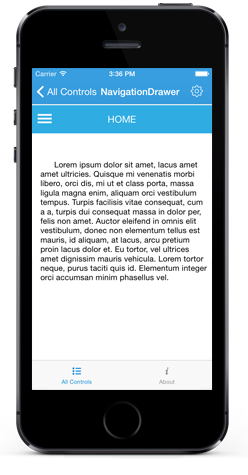

# Features

## ContentView

The main view of the NavigationDrawer can be set using `ContentView` property with desired views.



	UIView background=new UIView(new CGRect(0,50,this.Frame.Width,this.Frame.Height+72));
	background.BackgroundColor = UIColor.White;
	setvalue1 (0);
	this.Add(background);
	UIImageView userImgLabel=new UIImageView();
	userImgLabel.Frame =new CGRect ((this.Frame.Width/2)-100, 10, 80, 80);
	userImgLabel.Image = new UIImage ("Images/User.png");
	
	UILabel headerContentLabel = new UILabel ();
	headerContentLabel.Frame =new CGRect ((bounds.Width/2)-100, 10, 200, 30);
	headerContentLabel.Text="Home";
	headerContentLabel.TextColor = UIColor.White;
	headerContentLabel.TextAlignment = UITextAlignment.Center;
	this.AddSubview (headerContentLabel);
	
	UILabel textBlockLabel1 = new UILabel ();
	textBlockLabel1.Frame = new CGRect (15, 10, content.Frame.Width-20, 300);
	textBlockLabel1.Text = "Lorem ipsum dolor sit amet, lacus amet amet ultricies. Quisque mi venenatis morbi libero, orci dis, mi ut et class porta, massa ligula magna enim, aliquam orci vestibulum tempus. Turpis facilisis vitae consequat, cum a a, turpis dui consequat massa in dolor per, felis non amet. Auctor eleifend in omnis elit vestibulum, donec non elementum tellus est mauris, id aliquam, at lacus, arcu pretium proin lacus dolor et. Eu tortor, vel ultrices amet dignissim mauris vehicula. Lorem tortor neque, purus taciti quis id. Elementum integer orci accumsan minim phasellus vel.";
	textBlockLabel1.LineBreakMode = UILineBreakMode.WordWrap;
	textBlockLabel1.TextAlignment = UITextAlignment.Justified;
	textBlockLabel1.Lines = 0;
	textBlockLabel1.Font = UIFont.FromName ("Helvetica", 15f);
	
	content.AddSubview (textBlockLabel1);
	content.Add (userImgLabel);
	background.Add(content);
	

	

## DrawerContentView

The sliding main content of the NavigationDrawer which is a part of DrawerPanel can be set using `DrawerContentView` property with desired views.



	UITableView table = new UITableView(new CGRect(0, 0, sideMenuController.DrawerWidth, this.Frame.Height)); // defaults to Plain style
	tableItems = new string[] {"Home","Profile","Inbox","Outbox","Sent Items","Trash"};
	TableSource tablesource = new TableSource(tableItems);
	tablesource.customise = false;
	table.Source = tablesource;
	this.BackgroundColor = UIColor.FromRGB(63,134,246);
	HeaderView = new UIView ();
	HeaderView.Frame = new CGRect (0, 0, sideMenuController.DrawerWidth, 100);
	HeaderView.BackgroundColor = UIColor.FromRGB (49, 173, 225);
	UIView centerview = new UIView ();
	centerview.Frame = new CGRect (0, 100, sideMenuController.DrawerWidth, 500);
	centerview.Add (table);
	usernameLabel = new UILabel ();
	usernameLabel.Frame =new CGRect (0, 70, sideMenuController.DrawerWidth, 30);
	usernameLabel.Text=(NSString)"James Pollock";
	usernameLabel.TextColor = UIColor.White;
	usernameLabel.TextAlignment = UITextAlignment.Center;
	HeaderView.AddSubview (usernameLabel);

	userImg=new UIImageView();
	userImg.Frame =new CGRect ((sideMenuController.DrawerWidth/2)-25, 15, 50, 50);
	userImg.Image = new UIImage ("Images/User.png");

	HeaderView.AddSubview (userImg);

	sideMenuController.DrawerHeaderView = HeaderView;
	sideMenuController.DrawerContentView = centerview;
	sideMenuController.Position = SFNavigationDrawerPosition.SFNavigationDrawerPositionLeft;

	this.AddSubview (sideMenuController);



## DrawerFooterView

Gets or sets the footer for the DrawerView panel in the SfNavigationDrawer control using `DrawerFooterView` property.



	UILabel usernameLabel = new UILabel ();
	usernameLabel.Frame =new CGRect (0, 70, sideMenuController.DrawerWidth, 30);
	usernameLabel.Text="James Pollock";
	usernameLabel.TextColor = UIColor.White;
	usernameLabel.TextAlignment = UITextAlignment.Center;
	LinearLayout footerLayout = new LinearLayout(); 
	footerLayout.Orientation=LinearLayout.VERTICAL; 
 	footerLayout.BackgroundColor=UIColor._parseColor_("#1aa1d6"); 
	footerLayout.Gravity(Gravity._Top_);
	footerLayout.AddSubview(userName);
	navigationDrawer.DrawerFooterView.Add(footerLayout);



## DrawerHeaderView

Gets or sets the header of the DrawerView panel in the SfNavigationDrawer control using `DrawerHeaderView` property.



	UIImageView userImgLabel=new UIImageView();
	userImgLabel.Frame =new CGRect ((this.Frame.Width/2)-100, 10, 80, 80);
	userImgLabel.Image = new UIImage ("Images/User.png");
	UILabel usernameLabel = new UILabel ();
	usernameLabel.Frame =new CGRect (0, 70, sideMenuController.DrawerWidth, 30);
	usernameLabel.Text="James Pollock";
	usernameLabel.TextColor = UIColor.White;
	usernameLabel.TextAlignment = UITextAlignment.Center;
	LinearLayout headerLayout = new LinearLayout(this);
	headerLayout.Orientation=LinearLayout.VERTICAL;
	headerLayout.BackgroundColor=UIColor.parseColor("#1aa1d6");
	headerLayout.Gravity(Gravity.CENTER);
	headerLayout.AddSubview(userImg);
	headerLayout.AddSubview(userName);
	navigationDrawer.DrawerHeaderView.Add(headerLayout);
 


## Drawer Size

Gets or sets the height and width of the DrawerView panel in the NavigationDrawer control using `DrawerHeight` and `DrawerWidth` properties.



	navigationDrawer.DrawerHeight=300;
    navigationDrawer.DrawerWidth=300;

