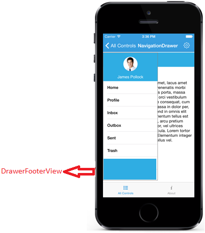

# Features

## ContentView

The main view of the NavigationDrawer can be set using `ContentView` property with desired views.



	UIView background=new UIView(new CGRect(0,50,this.Frame.Width,this.Frame.Height+72));
	background.BackgroundColor = UIColor.White;
	setvalue1 (0);
	this.Add(background);
	UIImageView userImgLabel=new UIImageView();
	userImgLabel.Frame =new CGRect ((this.Frame.Width/2)-100, 10, 80, 80);
	userImgLabel.Image = new UIImage ("Images/User.png");
	content.Add (userImgLabel);
	background.Add(content);
	

	

## DrawerContentView

The sliding main content of the NavigationDrawer which is a part of DrawerPanel can be set using `DrawerContentView` property with desired views.



	UITableView table = new UITableView(new CGRect(0, 0, sideMenuController.DrawerWidth, this.Frame.Height)); // defaults to Plain style
	tableItems = new string[] {"Home","Profile","Inbox","Outbox","Sent Items","Trash"};
	TableSource tablesource = new TableSource(tableItems);
	tablesource.customise = false;
	table.Source = tablesource;
	this.BackgroundColor = UIColor.FromRGB(63,134,246);
	HeaderView = new UIView ();
	HeaderView.Frame = new CGRect (0, 0, sideMenuController.DrawerWidth, 100);
	HeaderView.BackgroundColor = UIColor.FromRGB (49, 173, 225);
	UIView centerview = new UIView ();
	centerview.Frame = new CGRect (0, 100, sideMenuController.DrawerWidth, 500);
	centerview.Add (table);
	usernameLabel = new UILabel ();
	usernameLabel.Frame =new CGRect (0, 70, sideMenuController.DrawerWidth, 30);
	usernameLabel.Text=(NSString)"James Pollock";
	usernameLabel.TextColor = UIColor.White;
	usernameLabel.TextAlignment = UITextAlignment.Center;
	HeaderView.AddSubview (usernameLabel);

	userImg=new UIImageView();
	userImg.Frame =new CGRect ((sideMenuController.DrawerWidth/2)-25, 15, 50, 50);
	userImg.Image = new UIImage ("Images/User.png");

	HeaderView.AddSubview (userImg);

	sideMenuController.DrawerHeaderView = HeaderView;
	sideMenuController.DrawerContentView = centerview;
	sideMenuController.Position = SFNavigationDrawerPosition.SFNavigationDrawerPositionLeft;

	this.AddSubview (sideMenuController.View);



## DrawerFooterView

Gets or sets the footer for the DrawerView panel in the SfNavigationDrawer control using `DrawerFooterView` property.



	UILabel usernameLabel = new UILabel ();
	usernameLabel.Frame =new CGRect (0, 70, sideMenuController.DrawerWidth, 30);
	usernameLabel.Text="James Pollock";
	usernameLabel.TextColor = UIColor.White;
	usernameLabel.TextAlignment = UITextAlignment.Center;
	LinearLayout footerLayout = new LinearLayout(this); 
	footerLayout.Orientation=LinearLayout.VERTICAL; 
 	footerLayout.SetBackgroundColor(Color._parseColor_("#1aa1d6")); 
	footerLayout.SetGravity(Gravity._Top_);
	footerLayout.SetPadding(0, 20, 0, 0);
	footerLayout.AddView(userName);
	navigationDrawer.DrawerFooterView=footerLayout;



## DrawerHeaderView

Gets or sets the header of the DrawerView panel in the SfNavigationDrawer control using `DrawerHeaderView` property.



	UIImageView userImgLabel=new UIImageView();
	userImgLabel.Frame =new CGRect ((this.Frame.Width/2)-100, 10, 80, 80);
	userImgLabel.Image = new UIImage ("Images/User.png");
	UILabel usernameLabel = new UILabel ();
	usernameLabel.Frame =new CGRect (0, 70, sideMenuController.DrawerWidth, 30);
	usernameLabel.Text="James Pollock";
	usernameLabel.TextColor = UIColor.White;
	usernameLabel.TextAlignment = UITextAlignment.Center;
	LinearLayout headerLayout = new LinearLayout(this);
	headerLayout.Orientation=LinearLayout.VERTICAL;
	headerLayout.SetBackgroundColor(Color.parseColor("#1aa1d6"));
	headerLayout.SetGravity(Gravity.CENTER);
	headerLayout.SetPadding(0, 20, 0, 0);
	headerLayout.addView(userImg);
	headerLayout.AddView(userName);
	navigationDrawer.DrawerHeaderView=headerLayout;
 


## Drawer Size

Gets or sets the height and width of the DrawerView panel in the NavigationDrawer control using `DrawerHeight` and `DrawerWidth` properties.



	navigationDrawer.DrawerHeight=300;
    navigationDrawer.DrawerWidth=300;

