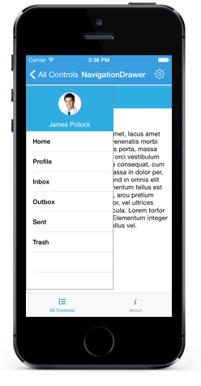

# Overview

The NavigationDrawer is a sliding panel menu that slides out from the screen edge, allowing you to organize content in a hidden panel. The drawer can be revealed by swiping from any of the four screen edges or programmatically on demand, providing an intuitive navigation experience for mobile applications.

## Key Features

* `Position` - Specifies various sliding positions of the drawer content in Navigation Drawer. 

* `Transition` - Specifies the transition type of the Navigation Drawer.

* **Position** - Configure the drawer to slide from any of the four screen edges (left, right, top, or bottom) to suit your application's layout requirements.

* **Transition** - Choose from multiple transition animations including SlideOnTop, Push, and Reveal to create smooth and engaging drawer opening effects.

* **Multiple Drawers** - Support for implementing multiple drawers with different positions and configurations using default and secondary drawer settings.

* **Flexible Content** - Customize drawer content with header, main content, and footer sections to organize navigation elements effectively.

* **Gesture Support** - Built-in swipe gesture recognition for intuitive drawer interaction, with options to enable or disable gestures as needed.

* **Programmatic Control** - Methods to open, close, and toggle drawer state programmatically, providing full control over drawer behavior.

* **Customizable Appearance** - Extensive styling options including drawer size, background colors, and content layout customization.

* **Touch Threshold** - Configurable touch sensitivity for gesture-based drawer activation to optimize user experience.

## Use Cases

The NavigationDrawer is ideal for:

* **Mobile Navigation Menus** - Primary navigation for mobile applications with multiple sections
* **Settings Panels** - Quick access to application settings and preferences
* **User Profiles** - Display user information and account-related options
* **Filter Options** - Contextual filtering controls for data-heavy applications
* **Secondary Actions** - Additional actions and tools that don't fit in the main interface

## Getting Started

To begin using the NavigationDrawer in your Xamarin.iOS application, refer to the [Getting Started](getting-started) guide for step-by-step implementation instructions.
