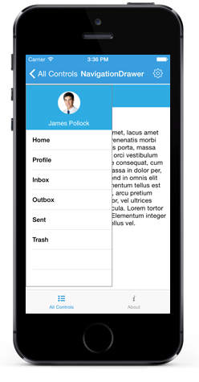
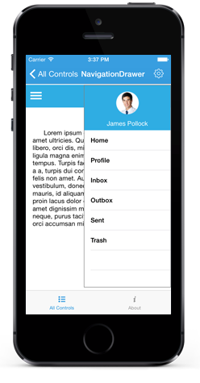
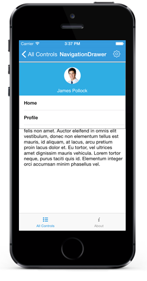
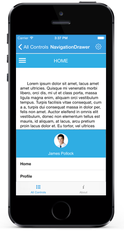

# Position

The `Position` property specifies the sliding position of the DrawerView panel. The `Position` property has the following four options:

* Left

* Right

* Top

* Bottom

N> The default option is Left.

## Left

Sets the NavigationDrawer sliding position to the left.



	navigationDrawer.Position = SFNavigationDrawerPosition.SFNavigationDrawerPositionLeft;



## Right

Sets the NavigationDrawer sliding position to the right.



	navigationDrawer.Position = SFNavigationDrawerPosition.SFNavigationDrawerPositionRight;



	
## Top

Sets the NavigationDrawer sliding position to the top.



	navigationDrawer.Position = SFNavigationDrawerPosition.SFNavigationDrawerPositionTop;



## Bottom

Sets the NavigationDrawer sliding position to the bottom.



	navigationDrawer.Position = SFNavigationDrawerPosition.SFNavigationDrawerPositionBottom;



