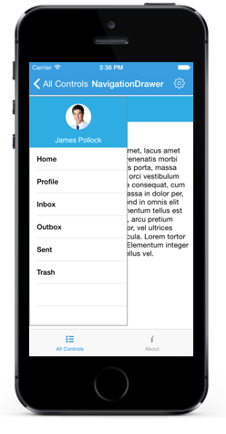

# Transition

The `Transition` property specifies the sliding animations for the DrawerView panel. The `Transition` property has the following three options:

* SlideOnTop
* Push
* Reveal

N> The default transition is SlideOnTop.

## SlideOnTop

Slides the DrawerContent on top of the main content.

 

	slideDrawer.Transition=Transition.SlideOnTop;



## Push

This transition slides the Drawer and main content simultaneously.

 

	slideDrawer.Transition=Transition.Push;



## Reveal

The Drawer content is in fixed position and the main content will slide to reveal the drawer content.

 

	slideDrawer.Transition=Transition.Reveal;



