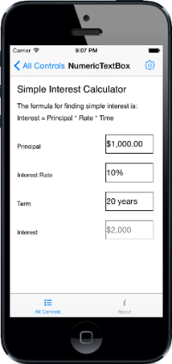

# Getting Started

This section explains you the steps to configure a NumericTextBox control in a real-time scenario and also provides a walk-through on some of the customization features available in NumericTextBox control.
                        
## Reference Essential Studio Components in your Solution

After installing Essential Studio for Xamarin, you can find all the required assemblies in the installation folders, typically:

{Syncfusion Installed location}\Essential Studio{version number}\lib

N> Assemblies are available in unzipped package location in Mac

and below assembly reference to the iOS unified project.

iOS-unifed\Syncfusion.SfNumericTextBox.iOS.dll

## Add SfNumericTextBox

* Adding namespace for the added assemblies. 





	Using Syncfusion.SFNumericTextBox.iOS; 





* Now add the SfNumericTextBox control with a required optimal name by using the included namespace.





SFNumericTextBox numericTextBox =new SFNumericTextBox();
this.AddSubview(numericTextBox); 





## Enable Parsing Mode

SfNumericTextBox provides option to display the value in double or decimal. Following code shows the Decimal parsing mode which can be set through `ParsingMode` property.





numericTextBox.ParsingMode=SFNumericTextBoxParsingMode.Decimal;
	




## Configuring properties

Format string, value maximum number of decimal digits can be customized in SfNumericTextBox.





	numericTextBox.Value=1000;
	numericTextBox.Watermark=(NSString)"Principal Amount";
	numericTextBox.MaximumNumberDecimalDigits=2;
	numericTextBox.FormatString="c";
	numericTextBox.AllowNull= true;
	numericTextBox.CultureInfo= new NSLocale("en_us");
	numericTextBox.PercentDisplayMode = SFNumericTextBoxPercentDisplayMode.Compute;





