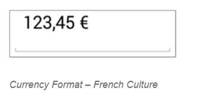

# Localization

The SFNumericTextBox value can be localized to any specific culture. It can be specified by setting the `Culture` property with `NSLocale` object instance.

N> Default `Culture` property value is en-US.





numericTextBox.CultureInfo = new NSLocale("zh-CN");
	




