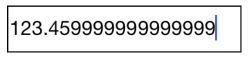
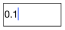

# Number Formatting in NumericTextBox

The values of the SfNumericTextBox can be configured to display different formats like currency format, percent format etc. 

## Format String

The `FormatString` property determines the format specifier by which the display text has to be formatted. 

N> The control displays the formatted text on lost focus. Default Value of `FormatString` is "n".

### Display Currency Notation

`c` - Displays the value with currency notation.
	


[C#]
	
numericTextBox.FormatString = "c";
	 

	
### Display Number Notation

`n` – Display the value in number format.
	


[C#]
	
numericTextBox.FormatString = "n";
	 

	
### Display Percentage Notation

`p` – Display the value in percentage.
	


[C#]

numericTextBox.FormatString = "p";
	 

	
N> Instead of using above `FormatString` types, we can provide any symbol or value as string in `FormatString` property which will be appended with the value in SfNumericTextBox. 

## Parser Input Value

The value of the SfNumericTextBox can be parsed based on the `ParserMode ` property. 

N> The `ParserMode` is of type Parsers containing enum values of Double and Decimal. The default Value for `ParserMode` is Double.



[C#]

numericTextBox.ParserMode = SFNumericTextBoxParsers.Decimal;
	  


## Compute to Percentage

The `PercentDisplayMode` property can be used to display numeric data in Percent mode. 

N> The control displays the percent value on lost focus. 

It provides the following options:

* `Value`: Displays the value with percentage symbol.



[C#]

numericTextBox.PercentDisplayMode = SFNumericTextBoxPercentDisplayMode.Value;



* `Compute`: Displays the computed value with percentage symbol.



[C#]

numericTextBox.PercentDisplayMode = SFNumerictextBoxPercentDisplayMode.Compute;



