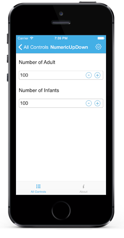
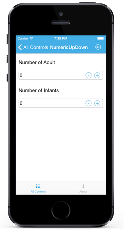

# AutoReverse in SfNumericUpDown

While incrementing, the control will start from Minimum once it reaches the Maximum and vice-versa.

N> By default the property value is false.





[C#]

numeric.AutoReverse = true;





## Continuous Spinning Between Ranges

User can restrict the Values between a specific range by setting `Maximum` and `Minimum` property value.

N> By default the minimum property value is 0 and maximum property value is 100.





[C#]

numeric.Minimum = 10;
numeric.Maximum = 50





## Set Increment

Frequency in which values gets incremented can be decided using `StepValue` property.

N> By default the property value is 1.





[C#]

numeric.StepValue = 6;





## Selection Support

The `SelectAllOnFocus` property is used to specify whether the text should be selected when the control gets focus.





[C#]

numeric.SelectAllOnFocus = true;
  



