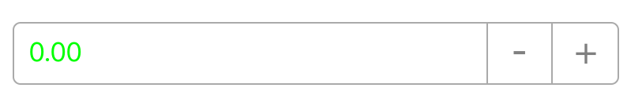
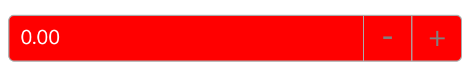
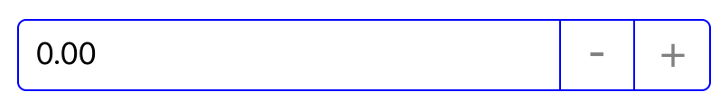

# Colors in SfNumericUpDown

SfNumericUpDown is used to set custom background, text, and border colors through the following properties:

* `TextColor` - Sets the color of NumericUpDown's value

* `BackgroundColor` - Sets the background color of NumericUpDown.

* `BorderColor` - Sets the border custom color of NumericUpDown

* `WatermarkColor` - Sets the watermark custom color of NumericUpDown's watermark Text.

### TextColor

The following code sample demonstrates how to set the TextColor:



[C#]

SfNumericUpDown numeric = new SfNumericUpDown()
{
	
	TextColor = Color.Green,
};



### BackgroundColor

The following code sample demonstrates how to set the BackgroundColor:



[C#]

SfNumericUpDown numeric = new SfNumericUpDown()
{
	
	BackgroundColor = Color.Red,
	TextColor = Color.White,
};



### BorderColor

The following code sample demonstrates how to set the BorderColor color:



[C#]

SfNumericUpDown numeric = new SfNumericUpDown()
{
	
	BorderColor = UIColor.Blue,
};



### WatermarkColor

The following code sample demonstrates how to set the WatermarkColor:



[C#]

SfNumericUpDown numeric = new SfNumericUpDown()
{
	
	Watermark = (NSString)"Enter a Number",
	WatermarkColor = UIColor.Blue,
	AllowNull=true,
};



