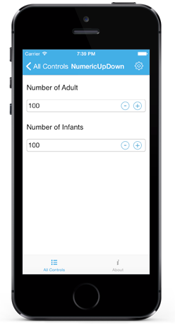

# Features

## MaximumNumberDecimalDigits

The maximum number of digits to be displayed after the decimal point can be specified by using `MaximumNumberDecimalDigits` property. 

N> The `MaximumNumberDecimalDigits` property can be provided with positive value only.



	numericupdown.MaximumNumberDecimalDigits = 2;



## Nullable Value

The null values can be set in NumericUpDown `Value` property, by setting `AllowNull` property value to true.

N> By default, the property value is false.



	numericupdown.AllowNull=true;



## AutoReverse

While incrementing, the control will start from Minimum once it reaches the Maximum and vice-versa.

N> By default the property value is false.



	numericupdown.AutoReverse = true;



## Range

User can restrict the Values between a specific range by setting `Maximum` and `Minimum` property value.

N> By default the minimum property value is 0 and maximum property value is 100.



	numericupdown.Minimum = 10;
	numericupdown.Maximum = 50



## Step Value

Frequency in which values gets incremented can be decided using `StepValue` property.

N> By default the property value is 1.



	numericupdown.StepValue = 6;


