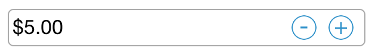
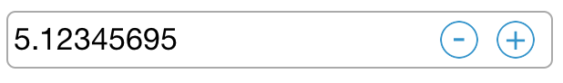
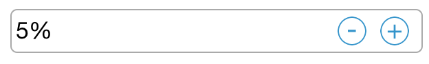

# Number Formatting in NumericUpDown

## Format String

The `FormatString` property determines the format specifier by which the display text has to be formatted. 

N> The control displays the formatted text on lost focus. Default Value of `FormatString` is "n".

It has three types,

* `c` - Display the value with currency notation.


	


[C#]
	
numeric.FormatString = "c";
	 




{{ codesnippet1 | UnOrderList_Indent_Level_1 }} 	

* `n` – Display the value in number format.


	


[C#]
	
numeric.FormatString = "n";
	 




{{ codesnippet2 | UnOrderList_Indent_Level_1 }} 	

* `p` – Display the value in Percentage.





[C#]

numeric.FormatString = "p";
	 




{{ codesnippet3 | UnOrderList_Indent_Level_1 }} 	

N> Instead of using above `FormatString` types, we can provide any symbol or value as string in `FormatString` property which will be appended with the value in NumericUpDown.

## Parser Mode

The value of the NumericUpDown can be parsed based on the `ParsingMode` property. 

N> The `ParsingMode` is of type Parsers containing enum values of Double and Decimal. The default Value for `ParsingMode` is Double.



[C#]

numeric.ParsingMode = SFNumericUpDownParsingMode.Decimal;
	  


## Percent Display Mode

The `PercentDisplayMode` property can be used to display numeric data in Percent mode. 

N> The control displays the percent value on lost focus. 

It provides the following options:

* `Value`: Displays the value with percentage symbol.





[C#]

numeric.PercentDisplayMode = SFNumericUpDownPercentDisplayMode.Value;





{{ codesnippet4 | UnOrderList_Indent_Level_1 }} 

* `Compute`: Displays the computed value with percentage symbol.





[C#]

numeric.PercentDisplayMode = SFNumericUpDownPercentDisplayMode.Compute;





{{ codesnippet5 | UnOrderList_Indent_Level_1 }} 

