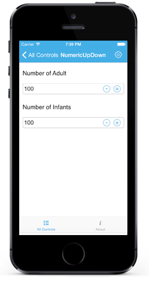
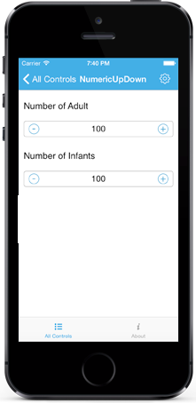

# Spin Button Alignment

Spin Button position in the NumericUpDown control can be changed relative to the TextBox based on `SpinButtonAlignment` property. 

There are three built-in modes.

### Right

Spin Buttons will get aligned to the right side of the control.





numericupdown.SpinButttonAlignment = SFNumericUpDownSpinButtonAlignment.Right;





### Left

Spin Buttons will get aligned to the left side of the control.





numericupdown.SpinButttonAlignment = SFNumericUpDownSpinButtonAlignment.Left;





### Both

Spin Buttons will get aligned to the both side of the control.





numericupdown.SpinButttonAlignment = SFNumericUpDownSpinButtonAlignment.Both;





N> By default the property value is Right.

