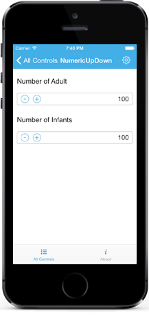

# Spin Button Alignment

Spin Button position in the NumericUpDown control can be changed relative to the TextBox based on `SpinButtonAlignment` property. 

There are three built-in modes.

### Right

Spin Buttons will get aligned to the right side of the control.





[C#]

numeric.SpinButtonAlignment = SFNumericUpDownSpinButtonAlignment.Right;





### Left

Spin Buttons will get aligned to the left side of the control.





[C#]

numeric.SpinButtonAlignment = SFNumericUpDownSpinButtonAlignment.Left;





### Both

Spin Buttons will get aligned to the both side of the control.





[C#]

numeric.SpinButtonAlignment = SFNumericUpDownSpinButtonAlignment.Both;





N> By default the property value is Right.

## UpDownButtonSetting customization

You can customize the UpDownButton of `SfNumericUpDown` control by using any of the following ways:

1. View
2. Image
3. FontIconText

### By using the View





[C#]

SfNumericUpDown numeric = new SfNumericUpDown();

UITextField increment = new UITextField()
{
    Text = "Add",
    TextColor = UIColor.Blue,
};

numeric.IncrementButtonSettings = new UpDownButtonSettings()
{
    ButtonView = increment,        
};

UITextField decrement = new UITextField()
{
    Text = "Reduce",
    TextColor = UIColor.Blue,
};

numeric.DecrementButtonSettings = new UpDownButtonSettings()
{
    ButtonView = decrement,        
};





### By using the Image with ButtonHeight and ButtonWidth





[C#]

SfNumericUpDown numeric = new SfNumericUpDown();

numeric.IncrementButtonSettings = new UpDownButtonSettings()
{
    ButtonImage = "up.png",    
    ButtonHeight = 50,
	ButtonWidth = 50,
};

numeric.DecrementButtonSettings = new UpDownButtonSettings()
{
    ButtonImage = "down.png", 
	ButtonHeight = 50,
	ButtonWidth = 50,	
};

this.Add(numeric);





### By using the FontIconText





[C#]

SfNumericUpDown numeric = new SfNumericUpDown();

numeric.IncrementButtonSettings = new UpDownButtonSettings()
{
    ButtonFontIconFontFamily = "SegoeMDL2Assets",
    ButtonFontIcon = "\xE710",
};

numeric.DecrementButtonSettings = new UpDownButtonSettings()
{
    ButtonFontIconFontFamily = "SegoeMDL2Assets",
    ButtonFontIcon = "\xE732",
};

this.Add(numeric);





## Additional customization properties of UpDownButtonSettings

### BackgroundColor

This property is used to change the background color of the increment and decrement buttons.



[C#]

SfNumericUpDown numeric = new SfNumericUpDown();

numeric.IncrementButtonSettings = new UpDownButtonSettings()
{
    BackgroundColor = UIColor.Red,
};

numeric.DecrementButtonSettings = new UpDownButtonSettings()
{
    BackgroundColor = UIColor.Green,
};





### HighlightedBackgroundColor

This property is used to change the background color of the increment or decrement button.





[C#]

SfNumericUpDown numeric = new SfNumericUpDown();
 
numeric.IncrementButtonSettings = new UpDownButtonSettings()
{
    HighlightedBackgroundColor = UIColor.Red,
};

numeric.DecrementButtonSettings = new UpDownButtonSettings()
{
    HighlightedBackgroundColor = UIColor.Green,
};
 





### ButtonFontColor

This property is used to change the text color of the increment and decrement buttons.





[C#]

SfNumericUpDown numeric = new SfNumericUpDown();
 
numeric.IncrementButtonSettings = new UpDownButtonSettings()
{
    ButtonFontColor = UIColor.Blue,
};

numeric.DecrementButtonSettings = new UpDownButtonSettings()
{
    ButtonFontColor = UIColor.Yellow,
};





### HighlightedFontColor

This property is used to change the text color of the button by clicking the increment or decrement button.





[C#]

SfNumericUpDown numeric = new SfNumericUpDown();
 
numeric.IncrementButtonSettings = new UpDownButtonSettings()
{
    HighlightedFontColor = UIColor.Blue,
};

numeric.DecrementButtonSettings = new UpDownButtonSettings()
{
    HighlightedFontColor = UIColor.Yellow,
};





