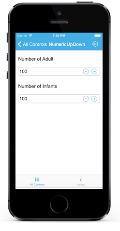
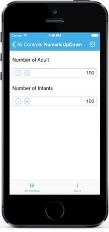
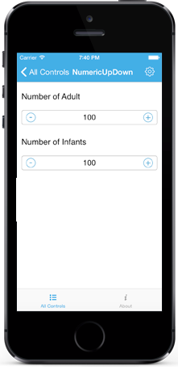

# Appearance

## SpinButton Alignment

Spin Button position in the NumericUpDown control can be changed relative to the TextBox based on `SpinButtonAlignment` property. 

There are three built-in modes.

### Right

Spin Buttons will get aligned to the right side of the control.



	sfNumericUpDown.SpinButttonAlignment = SpinButtonAlignment.Right;



### Left

Spin Buttons will get aligned to the left side of the control.



	sfNumericUpDown.SpinButttonAlignment = SpinButtonAlignment.Left;



### Both

Spin Buttons will get aligned to the both side of the control.



	sfNumericUpDown.SpinButttonAlignment = SpinButtonAlignment.Both;



N> By default the property value is Right.

