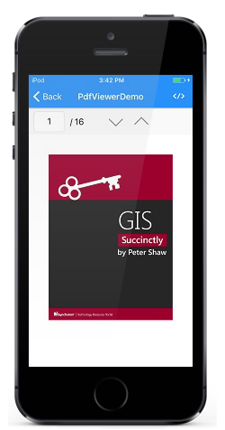

# Getting started

This section demonstrates how to create an application that displays a PDF file using SfPdfViewer control.

## Assembly Required

After installing Essential Studio for Xamarin, you can find all the required assemblies in the installation folders,

{Syncfusion Essential Studio Installed location}\Essential Studio\{Essential Studio version}\Xamarin\lib\ios-unified\

Example: C:\Program Files (x86)\Syncfusion\Essential Studio\15.3.0.28\Xamarin\lib\ios-unified\

For creating a PDF Viewer for iOS, the following assemblies need to be referenced in your iOS project.

<table>
<tr>
<th>Project</th>
<th>Required assemblies</th>
</tr>
<tr>
<td>Xamarin.iOS</td>
<td>Syncfusion.Compression.Portable.dll Syncfusion.Pdf.Portable.dll Syncfusion.SfPdfViewer.iOS.dll Syncfusion.SfBusyIndicator.iOS.dll </td>
</tr>
</table>

N> Starting with v16.2.0.x, if you reference Syncfusion assemblies from trial setup or from the NuGet feed, you also have to include a license key in your projects. Please refer to [this link](https://help.syncfusion.com/common/essential-studio/licensing/license-key) to know about registering Syncfusion license key in your Xamarin.iOS application to use our components.

## Create a simple PDF Viewer

Create a blank iOS application in Xamarin Studio and name it as "GettingStartediOS". Add references to the above-mentioned assemblies in the project. 

Add a new folder named “Assets” to the project. Place the PDF document you need to display in the folder and set the PDF’s build action property to "Embedded Resource". Here GIS Succinctly.pdf file is used. 

Add a new ViewController to the project with the name “MainViewController”. In the FinishedLaunching method of AppDelegate.cs file, set the RootViewController property of the UIWindow to the added ViewController using the following code snippet. 




Window.RootViewController = new MainViewController();




Please add the following code snippet In the MainViewController class

* In the MainViewController.cs file instantiate the SfPdfViewer in the override method ViewDidLoad
* Add the instance to the MainViewController’s View as a SubView. 
* Load the stream of the PDF to SfPdfViewer in the override method ViewDidAppear. 




SfPdfViewer pdfViewerControl;

    public override void ViewDidLoad()
    {
        base.ViewDidLoad();
        pdfViewerControl = new SfPdfViewer();
        this.View.AddSubview(pdfViewerControl);
    }

    public override void ViewDidAppear(bool animated)
    {
        base.ViewDidAppear(animated);
        var fileStream = typeof(MainViewController).GetTypeInfo().Assembly.GetManifestResourceStream("GettingStartediOS.Assets.GIS Succinctly.pdf");
        pdfViewerControl.LoadDocument(fileStream);
    }




Deploying this project in an iOS device would display the PDF document and allow you to scroll and zoom through the pages.

## Unloading PDF document from the Viewer

The SfPdfViewer control allows you to unload the PDF document from the viewer, when the PDF document is not in use anymore. This releases the PDF document and all its associated resources of the application.

You need to call the Unload method of SfPdfViewer control as in the below code snippet to achieve the same.




pdfViewerControl.Unload();




## How to get & set the current page number?

PageChanged event of the PDF viewer can be used to track the change in the current page being displayed in the PDF viewer. 

This below code snippet demonstrates how to track the current page number being viewed using PageChanged event and how to navigate to the respective page in the PDF Viewer.




SfPdfViewer pdfViewerControl;
UITextField pageNumberField;

        public override void ViewDidLoad()
        {
            base.ViewDidLoad();
            pageNumberField = new UITextField();
            pageNumberField.Text = "1";
            pageNumberField.BorderStyle = UITextBorderStyle.Line;
            pageNumberField.Frame = new CGRect(0, 20, 100, 50);
            pageNumberField.TextAlignment = UITextAlignment.Center;
            pageNumberField.ShouldReturn += (textField) =>
            {
                int input = 0;
                if (int.TryParse(pageNumberField.Text, out input) && input > 0 && (input <= pdfViewerControl.PageCount))
                {
                    pdfViewerControl.GoToPage(input);
                    pageNumberField.Text = pdfViewerControl.PageNumber.ToString();
                }
                return true;
            };
                this.View.AddSubview(pageNumberField);
            pdfViewerControl = new SfPdfViewer();
            pdfViewerControl.Frame = new CGRect(this.View.Frame.X, 70, this.View.Frame.Width, this.View.Frame.Height - 30);
            pdfViewerControl.PageChanged += PdfViewerControl_PageChanged;
            this.View.AddSubview(pdfViewerControl);
        }

        private void PdfViewerControl_PageChanged(object sender, PageChangedEventArgs args)
        {
            pageNumberField.Text = args.PageNumber.ToString();
        }

        public override void ViewDidAppear(bool animated)
        {
            base.ViewDidAppear(animated);
            var fileStream = typeof(MainViewController).GetTypeInfo().Assembly.GetManifestResourceStream("GettingStartediOS.Assets.GIS Succinctly.pdf");
            pdfViewerControl.LoadDocument(fileStream);
        }




N>**When a page number which is not in the bounds (1 – page count) is provided as an input to the GoToPage method, no action will be performed. 

## How to get & set the current page number?

PageChanged event of the PDF viewer can be used to track the change in the current page being displayed in the PDF viewer. 

This below code snippet demonstrates how to track the current page number being viewed using PageChanged event and how to navigate to the respective page in the PDF Viewer.




SfPdfViewer pdfViewerControl;
UITextField pageNumberField;

public override void ViewDidLoad()
        {
            base.ViewDidLoad();
            pageNumberField = new UITextField();
            pageNumberField.Text = "1";
            pageNumberField.BorderStyle = UITextBorderStyle.Line;
            pageNumberField.Frame = new CGRect(0, 20, 100, 50);
            pageNumberField.TextAlignment = UITextAlignment.Center;
            pageNumberField.ShouldReturn += (textField) =>
            {
                int input = 0;
                if (int.TryParse(pageNumberField.Text, out input) && input > 0 && (input <= pdfViewerControl.PageCount))
                {
                    pdfViewerControl.GoToPage(input);
                    pageNumberField.Text = pdfViewerControl.PageNumber.ToString();
                }
                return true;
            };
                this.View.AddSubview(pageNumberField);
            pdfViewerControl = new SfPdfViewer();
            pdfViewerControl.Frame = new CGRect(this.View.Frame.X, 70, this.View.Frame.Width, this.View.Frame.Height - 30);
            pdfViewerControl.PageChanged += PdfViewerControl_PageChanged;
            this.View.AddSubview(pdfViewerControl);
        }

        private void PdfViewerControl_PageChanged(object sender, PageChangedEventArgs args)
        {
            pageNumberField.Text = args.PageNumber.ToString();
        }

        public override void ViewDidAppear(bool animated)
        {
            base.ViewDidAppear(animated);
            var fileStream = typeof(MainViewController).GetTypeInfo().Assembly.GetManifestResourceStream("GettingStartediOS.Assets.GIS Succinctly.pdf");
            pdfViewerControl.LoadDocument(fileStream);
        }




N>**When a page number which is not in the bounds (1 – page count) is provided as an input to the GoToPage method, no action will be performed. 

## How to get the total page number?

PageCount property of the PDF viewer can be used to acquire the total number of pages in the PDF document that is currently loaded. The PageCount property of the PDF viewer will be updated only after loading the PDF document, it can be tracked using DocumentLoaded event of the PDF viewer.




		SfPdfViewer pdfViewerControl;
		UILabel pageCountLabel;

		public override void ViewDidLoad()
        {
            base.ViewDidLoad();
            pdfViewerControl = new SfPdfViewer();
            pdfViewerControl.Frame = new CGRect(this.View.Frame.X, 70, this.View.Frame.Width, this.View.Frame.Height - 30);
            pdfViewerControl.DocumentLoaded += PdfViewerControl_DocumentLoaded;
            pageCountLabel = new UILabel();
            pageCountLabel.Frame = new CGRect(120, 5, 40, 40);
            pageCountLabel.TextAlignment = UITextAlignment.Center;
            this.View.AddSubview(pdfViewerControl);
            this.View.AddSubview(pageCountLabel);
        }

        private void PdfViewerControl_DocumentLoaded(object sender, EventArgs args)
        {
            pageCountLabel.Text = pdfViewerControl.PageCount.ToString();
        }

        public override void ViewDidAppear(bool animated)
        {
            base.ViewDidAppear(animated);
            var fileStream = typeof(MainViewController).GetTypeInfo().Assembly.GetManifestResourceStream("GettingStartediOS.Assets.GIS Succinctly.pdf");
            pdfViewerControl.LoadDocument(fileStream);
        }




N>**When the current page is the first page, GoToPreviousPage method will not have any effect. Similarly, when in last page, GoToNextPage method will not have any effect.

## Designing a toolbar

This section depicts how to design a toolbar for the PDF viewer and include functionalities such as page navigation options. This simple toolbar consists of options such as current page number, total page count in the PDF document, go to previous page and go to next page.

In MainViewController.cs, add the below code snippet which contains the implementation for the following operations

* Access & display the current page number being displayed and navigate to the specified page.
* Display the total number of pages
* Navigate to the previous page
* Navigate to the next page




        SfPdfViewer pdfViewerControl;
        private const float DefaultToolbarHeight = 50f;

        private UIView parentView;
        private UIView toolbar;
        UITextField pageNumberField = new UITextField();
        UILabel totalPageLabel = new UILabel();
        UIButton previousPageButton = new UIButton();
        UIButton nextPageButton = new UIButton();
        UIToolbar toolBar = new UIToolbar();
        

        public override void DidReceiveMemoryWarning()
        {
            base.DidReceiveMemoryWarning();

            // Release any cached data, images, etc that aren't in use.
        }

        public override void ViewDidLoad()
        {
            base.ViewDidLoad();
            parentView = new UIView(this.View.Frame);

            pdfViewerControl = new SfPdfViewer();
            pdfViewerControl.PageChanged += PdfViewerControl_PageChanged;
            pageNumberField.Text = "1";
            toolbar = createTopToolbar();
            parentView.AddSubview(pdfViewerControl);
            this.View.AddSubview(parentView);
            this.View.AddSubview(toolbar);

        }

        protected virtual UIView createTopToolbar()
        {
            var toolBarFrame = new CGRect();
            toolBarFrame = this.View.Frame;
            toolBarFrame.Height = DefaultToolbarHeight;
            toolBarFrame.Y = 20;
            toolBar.Frame = toolBarFrame;

            toolBar.AutoresizingMask = UIViewAutoresizing.FlexibleBottomMargin | UIViewAutoresizing.FlexibleWidth;

            pageNumberField.ShouldReturn += (textField) =>
            {
                textField.ResignFirstResponder();
                int input = 0;
                if (int.TryParse(pageNumberField.Text, out input) && input > 0 && (input <= pdfViewerControl.PageCount))
                {
                    pdfViewerControl.GoToPage(input);
                }
                pageNumberField.Text = pdfViewerControl.PageNumber.ToString();
                return true;
            };

            pageNumberField.BorderStyle = UITextBorderStyle.RoundedRect;
            pageNumberField.Frame = new CGRect(65, 5, 45, 40);
            pageNumberField.HorizontalAlignment = UIControlContentHorizontalAlignment.Center;
            pageNumberField.TextAlignment = UITextAlignment.Center;
            toolBar.Add(pageNumberField);

            totalPageLabel.Frame = new CGRect(120, 5, 40, 40);
            toolBar.Add(totalPageLabel);

            nextPageButton.HorizontalAlignment = UIControlContentHorizontalAlignment.Center;
            nextPageButton.Frame = new CGRect(175, 5, 40, 40);
            nextPageButton.HorizontalAlignment = UIControlContentHorizontalAlignment.Center;
            nextPageButton.TouchUpInside += NextPageButton_TouchUpInside1;
            nextPageButton.SetBackgroundImage(UIImage.FromFile("PageDown.png"), UIControlState.Normal);
            toolBar.Add(nextPageButton);

            previousPageButton.Frame = new CGRect(230, 5, 40, 40);
            previousPageButton.HorizontalAlignment = UIControlContentHorizontalAlignment.Center;
            previousPageButton.TouchUpInside += PreviousPageButton_TouchUpInside1; ;
            previousPageButton.SetBackgroundImage(UIImage.FromFile("PageUp.png"), UIControlState.Normal);
            toolBar.Add(previousPageButton);
            return toolBar;
        }

        private void PreviousPageButton_TouchUpInside1(object sender, EventArgs e)
        {
            pdfViewerControl.GoToPreviousPage();
        }

        private void NextPageButton_TouchUpInside1(object sender, EventArgs e)
        {
            pdfViewerControl.GoToNextPage();
        }

        private void PdfViewerControl_PageChanged(object sender, PageChangedEventArgs args)
        {
            pageNumberField.Text = pdfViewerControl.PageNumber.ToString();
        }
        private void NextPageButton_TouchUpInside(object sender, EventArgs e)
        {
            pdfViewerControl.GoToNextPage();
        }

        private void PreviousPageButton_TouchUpInside(object sender, EventArgs e)
        {
            pdfViewerControl.GoToPreviousPage();
        }

        public override void ViewDidAppear(bool animated)
        {
            base.ViewDidAppear(animated);
            var fileStream = typeof(MainViewController).GetTypeInfo().Assembly.GetManifestResourceStream("GettingStartediOS.Assets.GIS Succinctly.pdf");
            pdfViewerControl.LoadDocument(fileStream);
            totalPageLabel.Text = "/ " + pdfViewerControl.PageCount.ToString();
        }

        public override void ViewDidLayoutSubviews()
        {
            base.ViewDidLayoutSubviews();
            parentView.Frame = new CGRect(this.View.Frame.X, DefaultToolbarHeight + 20, this.View.Frame.Width, this.View.Frame.Height - DefaultToolbarHeight - 20);
        }




The final output will look as like in the below screenshot.

This demo can be downloaded from the below link.

http://www.syncfusion.com/downloads/support/directtrac/general/ze/GettingStartediOS389189742