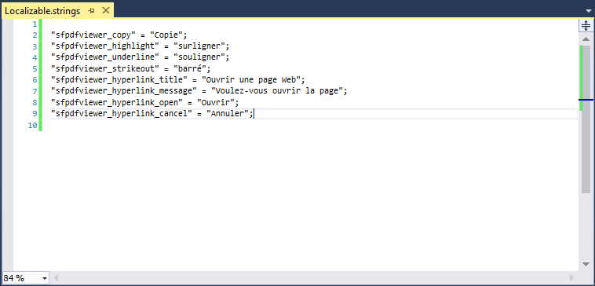
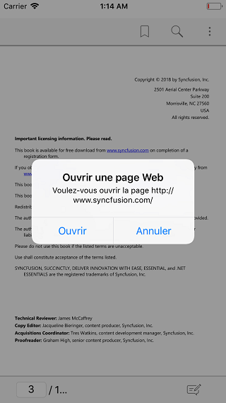

# Localization 

Localization is the process of configuring the application to a specific language. PdfViewerControl supports to localize its static text.

Create Localizable.strings in resource file in iOS.

Location- ProjectName.iOS/Resources/fr-FR/Localizable.strings

In below screenshot we have localized the text in PDF Viewer in Xamarin.iOS from English to French language.

