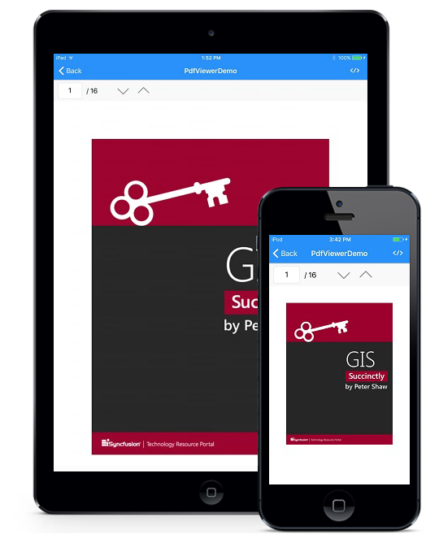

# PDFViewer

Essential PDF viewer for Xamarin is a new control that allows PDF documents to be viewed within your Xamarin.iOS applications.

## Key Features

Here is a quick summary of the features available in Essential PDF viewer.

* View PDF files.
* Navigate through the pages seamlessly.
* Magnification support.
* Virtualized pages.
