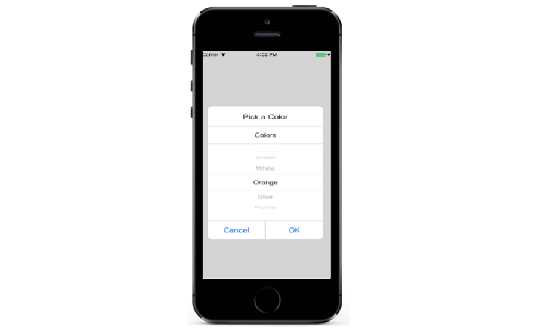

---

layout: post
title: Getting Started with Syncfusion Picker control for Xamarin.iOS
description: A quick tour to initial users on Syncfusion Picker control for Xamarin.iOS platform.
platform: Xamarin
control: Picker
documentation: ug

---

# Getting Started

This topic describes about the assembly that is required in your iOS application, when you use SfPicker. After installing Essential Studio for Xamarin, you can find all the required assemblies in the following installation folders,

{Syncfusion Essential Studio Installed location}\Essential Studio{Release Version}\lib

Add the following assembly references to the iOS unified project,

iOS-unified\Syncfusion.SfPicker.iOS.dll

## Create your first Picker in Xamarin.iOS

1) Create new iOS application in Xamarin Studio.

2) Now, create a simple data source as shown in the following code example.



public partial class ViewController : UIViewController
{
SfPicker pickerControl;

    protected ViewController(IntPtr handle) : base(handle)
    {
    // Note: this .ctor should not contain any initialization logic.
    }

    public override void ViewDidLoad()
    {
        base.ViewDidLoad();
    #region SfPickerSettings
        pickerControl = new SfPicker();
        pickerControl.SelectedIndex = 2;
        pickerControl.ShowColumnHeader = false;
        pickerControl.HeaderText = "Pick a Color";
        pickerControl.ColumnHeaderText = "Colors";
        pickerControl.ShowFooter = false;
        pickerControl.ShowHeader = true;
        pickerControl.ItemsSource = GetSource();
        View.AddSubview(pickerControl);
    }
    //simple datasource of Picker.
    List<string> GetSource()
    {
        List<string> collectionStrings;
        collectionStrings = new List<string>();
        collectionStrings.Add("Blue");
        collectionStrings.Add("Black");
        collectionStrings.Add("Red");
        collectionStrings.Add("Pink");
        collectionStrings.Add("Orange");
        collectionStrings.Add("Magenta");
        collectionStrings.Add("Yellow");
        collectionStrings.Add("Purple");
        collectionStrings.Add("Green");
        collectionStrings.Add("Gray");
        collectionStrings.Add("LightGray");
        collectionStrings.Add("Brown");
        return collectionStrings;
    }
}



3)You can add the header and footer of Picker control by enabling ShowHeader and ShowFooter property as per in the following code example,



    pickerControl = new SfPicker();
    pickerControl.SelectedIndex = 2;
    pickerControl.ShowColumnHeader = true;
    pickerControl.HeaderText = "Pick a Color";
    pickerControl.ColumnHeaderText = "Colors";
    pickerControl.ShowFooter = true;
    pickerControl.ShowHeader = true;
    pickerControl.ItemsSource = GetSource();



