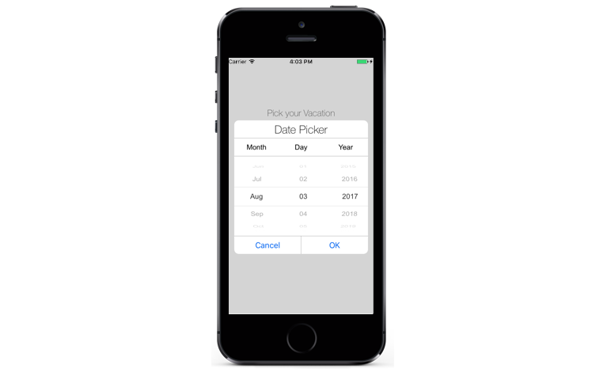

---

layout: post
title: Overview of Syncfusion Picker control for Xamarin.iOS
description: Overview and key features of Date Time Picker and how to get started with the SfPicker Control in Xamarin.iOS
platform: Xamarin.iOS
control: Picker
documentation: ug

---
# Overview of SfPicker

The Essential Xamarin.iOS Picker control allows users to pick an item among a list of items that can be customized with custom view. This control can be opened as dialog. Its rich feature set includes functionalities like  multi column, header/footer, custom view on header/footer and default validation buttons.

## Key Features

* `Multi Column`

* `Header view`

* `Footer view with default buttons`

* `RTL support.`

