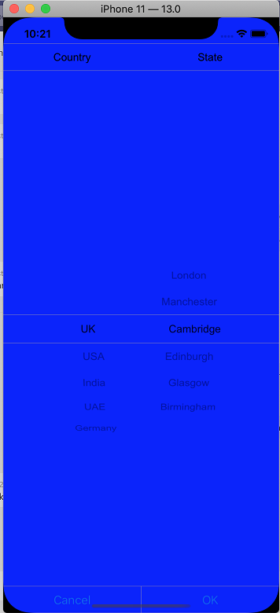

# Custom Cascading using SfPicker

We have created the cascading sample for updating state collection based on selected item of SfPicker.

Please refer the below steps to create the cascading sample.

## Steps

**Step** **1** **:** We have created three ObservableCollection with object type in PickerCascading class.

**Collection** **details** **:**

Area Collection, Country Collection and State Collection.

Country Collection -> We have added country names.

State Collection -> We have added state names.

Area Collection -> We have added above 2 collections.

Area collection is main collection we have assigned this collection to ItemSource of SfPicker control.

The below code demonstrates Area collection creation.





public class PickerCascading : INotifyPropertyChanged
{
    #region Public Properties

    /// 

    /// Area is the acutal DataSource for SfPicker control which will holds the collection of Country and State
    /// 

    /// <value>The area.</value>
    public ObservableCollection<object> Area { get; set; }

    //Country is the collection of country names
    private ObservableCollection<object> Country { get; set; }

    //State is the collection of state names
    private ObservableCollection<object> State { get; set; }

    /// 

    /// Headers api is holds the column name for every column in cascading picker
    /// 

    /// <value>The Headers.</value>
    public ObservableCollection<string> Header { get; set; }

    private object _selectedarea;

    public event PropertyChangedEventHandler PropertyChanged;

    #endregion

    //Identify the selected area using property changed method
    public object SelectedArea
    {
        get { return _selectedarea; }
        set { _selectedarea = value; RaisePropertyChanged("SelectedArea"); }
    }

    public PickerCascading()
    {
        Area = new ObservableCollection<object>();
        Header = new ObservableCollection<string>();

        Country = new ObservableCollection<object>();
        State = new ObservableCollection<object>();

        //populate Countries
        Country.Add("UK");
        Country.Add("USA");
        Country.Add("India");
        Country.Add("UAE");
        Country.Add("Germany");

        //populate states
        State.Add("London");
        State.Add("Manchester");
        State.Add("Cambridge");
        State.Add("Edinburgh");
        State.Add("Glasgow");
        State.Add("Birmingham");

        Area.Add(Country);
        Area.Add(State);
        Header.Add("Country");
        Header.Add("State");

        SelectedArea = new ObservableCollection<object>() { "UK", "Cambridge" };
    }

    //Hooked when changes occured 
    public void RaisePropertyChanged(string name)
    {
        if (PropertyChanged != null)
            PropertyChanged(this, new PropertyChangedEventArgs(name));
    }
}





**Step** **2** **:** We have updated the state collection based on selected item of country name using SelectionChanged event of SfPicker control.





private void Picker_SelectionChanged(object sender, SelectionChangedEventArgs e)
{
    if (picker.ItemsSource != null && e.NewValue is System.Collections.IList && (e.NewValue as System.Collections.IList).Count > 0 && CurrentItem != (e.NewValue as System.Collections.IList)[0].ToString())
    {
        ObservableCollection<object> source = picker.ItemsSource as ObservableCollection<object>;
        //Updated the second column collection based on first column selected value.
        (source).RemoveAt(1);
        (source).Add(GetCountry((e.NewValue as System.Collections.IList)[0].ToString()));
        picker.ItemsSource = source;
    }
}





**Step** **3** **:** We have defined column header as "Country" and "State" using ColumnHeaderText property of SfPicker control. The below code demonstrates how to define for each column of SfPicker control.





public class PickerCascading : INotifyPropertyChanged
{
    /// 

    /// Headers API is holds the column name for every column in cascading picker
    /// 

    /// <value>The Headers.</value>

    public ObservableCollection<string> Header { get; set; }

    public PickerCascading()
    {
        Header = new ObservableCollection<string>();
        Header.Add("Country");
        Header.Add("State");
    }
}





**Step** **4** **:**

We have added the cascading picker control in ViewDidLoad page. Please refer the below code snippets.





public partial class ViewController : UIViewController
{

    string CurrentItem;
    SfPicker picker;

    public ViewController(IntPtr handle) : base(handle)
    {
        picker = new SfPicker();
    }

    public override void ViewDidLoad()
    {
        base.ViewDidLoad();

        PickerCascading cascading = new PickerCascading();
        picker.ShowHeader = true;
        picker.ShowColumnHeader = true;
        picker.ShowFooter = true;
        picker.BackgroundColor = UIColor.White;
        picker.SelectionChanged += Picker_SelectionChanged;
        picker.ItemsSource = cascading.Area;
        picker.SelectedItem = cascading.SelectedArea;
        picker.ColumnHeaderText = cascading.Header;
        picker.PickerMode = PickerMode.Default;
        picker.UnSelectedItemTextColor = UIColor.Black;
        picker.HeaderText = "Select your Area";
        picker.Frame = new CoreGraphics.CGRect(0, 0, this.View.Frame.Width, this.View.Frame.Height);
        this.View.AddSubview(picker);
    }
}





Screen shot for the above code

We have attached Cascading sample for reference. Please download the sample from the following [link.](https://www.syncfusion.com/downloads/support/directtrac/general/ze/Cascading1430924976.zip)