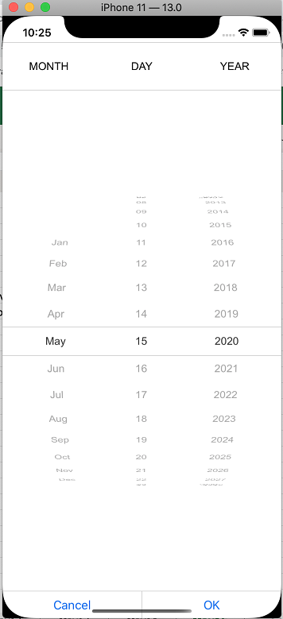

# Dealing with columns

This section will explain about the customization of SfPicker Columns.

## Adjust Column Width

SfPicker allows user to adjust the column width by hooking `SfPicker.OnColumnLoaded` event and then check the column using `ColumnLoadedEventArgs.Column` property and then adjust width of column by setting `ColumnLoadedEventArgs.ColumnWidth` property.

We have prepared below code snippets to demonstrate DateTimePicker sample using `OnColumnLoaded` event.





public partial class ViewController : UIViewController
{
    SfPicker picker;
    ColorInfo colorInfo;

    protected ViewController(IntPtr handle) : base(handle)
    {
        picker = new SfPicker();
        colorInfo = new ColorInfo();

        // Note: this .ctor should not contain any initialization logic.
    }

    public override void ViewDidLoad()
    {
        base.ViewDidLoad();

        picker.HeaderText = "Color";
        picker.ColumnHeaderHeight = 70;
        picker.ShowColumnHeader = true;
        picker.PickerMode = PickerMode.Default;
        picker.ItemsSource = colorInfo.Colors;
        picker.OnColumnLoaded += Picker_OnColumnLoaded;
        picker.SelectionChanged += Picker_SelectionChanged;
        picker.ShowHeader = true;
        picker.ShowColumnHeader = false;
        picker.Frame = new CoreGraphics.CGRect(0, 0, this.View.Frame.Width, this.View.Frame.Height);
        this.View.AddSubview(picker);
    }

    private void Picker_SelectionChanged(object sender, SelectionChangedEventArgs e)
    {
        if (e.NewValue != null)
        {
            var color = PickerHelper.GetColor(e.NewValue.ToString());
            picker.BackgroundColor = color;
        }
    }

    private void Picker_OnColumnLoaded(object sender, ColumnLoadedEventArgs e)
    {
        if (e.Column == 0)
        {
            e.ColumnWidth = 1050;
        }
    }

    public override void DidReceiveMemoryWarning()
    {
        base.DidReceiveMemoryWarning();
        // Release any cached data, images, etc that aren't in use.
    }
}





We have attached sample for reference. Please download the below sample

Sample link : https://www.syncfusion.com/downloads/support/directtrac/general/ze/PickerColumn-475089663.zip 

## Add Caption

SfPicker allows user to add header for each column by setting `SfPicker.ColumnHeaderText` property and enabling `SfPicker.ShowColumnHeader` property to True.

`ColumnHeaderText` property is of object type and user can assign string or collection. If a string type is assigned in `SfPicker.ColumnHeaderText`, that string will be updated in all the column of SfPicker.

To assign the collection in `SfPicker.ColumnHeaderText`, SfPicker column header update based on index with value on collection.

The below code illustrate assign the ColumnHeaderText for SfPicker.





public class DatePicker : SfPicker
{
    #region Public Properties

    // Months API is used to modify the Day collection as per change in Month

    internal Dictionary<string, string> Months { get; set; }

    /// 

    /// Date is the actual DataSource for SfPicker control which will holds the collection of Day ,Month and Year
    /// 

    /// <value>The date.</value>

    public ObservableCollection<object> Date { get; set; }

    //Day is the collection of day numbers

    internal ObservableCollection<object> Day { get; set; }

    //Month is the collection of Month Names

    internal ObservableCollection<object> Month { get; set; }

    //Year is the collection of Years from 1990 to 2042

    internal ObservableCollection<object> Year { get; set; }

    /// 

    /// Headers API is holds the column name for every column in date picker
    /// 

    /// <value>The Headers.</value>

    public ObservableCollection<string> Headers { get; set; }

    public ObservableCollection<object> StartDate;
    #endregion

    public DatePicker(IntPtr handle) : base(handle)
    {

        ObservableCollection<object> collection = new ObservableCollection<object>();

        //Select today dates
        collection.Add(CultureInfo.CurrentCulture.DateTimeFormat.GetMonthName(DateTime.Now.Date.Month).Substring(0, 3));

        if (DateTime.Now.Date.Day < 10)
            collection.Add("0" + DateTime.Now.Date.Day);
        else
            collection.Add(DateTime.Now.Date.Day.ToString());

        collection.Add(DateTime.Now.Date.Year.ToString());

        this.StartDate = collection;

        Months = new Dictionary<string, string>();

        Date = new ObservableCollection<object>();

        Day = new ObservableCollection<object>();

        Month = new ObservableCollection<object>();

        Year = new ObservableCollection<object>();

        Headers = new ObservableCollection<string>();

        Headers.Add("MONTH");

        Headers.Add("DAY");

        Headers.Add("YEAR");

        HeaderText = "DATE PICKER";

        PopulateDateCollection();

        this.ItemsSource = Date;

        this.ColumnHeaderText = Headers;

        ShowFooter = true;

        ShowHeader = true;

        ShowColumnHeader = true;
    }

    private void PopulateDateCollection()
    {

        //populate months

        for (int i = 1; i < 13; i++)
        {
            if (!Months.ContainsKey(CultureInfo.CurrentCulture.DateTimeFormat.GetMonthName(i).Substring(0, 3)))
                Months.Add(CultureInfo.CurrentCulture.DateTimeFormat.GetMonthName(i).Substring(0, 3), CultureInfo.CurrentCulture.DateTimeFormat.GetMonthName(i));
            Month.Add(CultureInfo.CurrentCulture.DateTimeFormat.GetMonthName(i).Substring(0, 3));
        }

        //populate year
        for (int i = 1990; i < 2050; i++)
        {
            Year.Add(i.ToString());
        }

        //populate Days
        for (int i = 1; i <= DateTime.DaysInMonth(DateTime.Now.Year, DateTime.Now.Month); i++)
        {
            if (i < 10)
            {
                Day.Add("0" + i);
            }
            else
                Day.Add(i.ToString());
        }

        Date.Add(Month);
        Date.Add(Day);
        Date.Add(Year);
    }
}





Screen shot for the above code

 Please download the sample from the following [link.](https://www.syncfusion.com/downloads/support/directtrac/general/ze/DealingWithColumn-1587662390.zip)