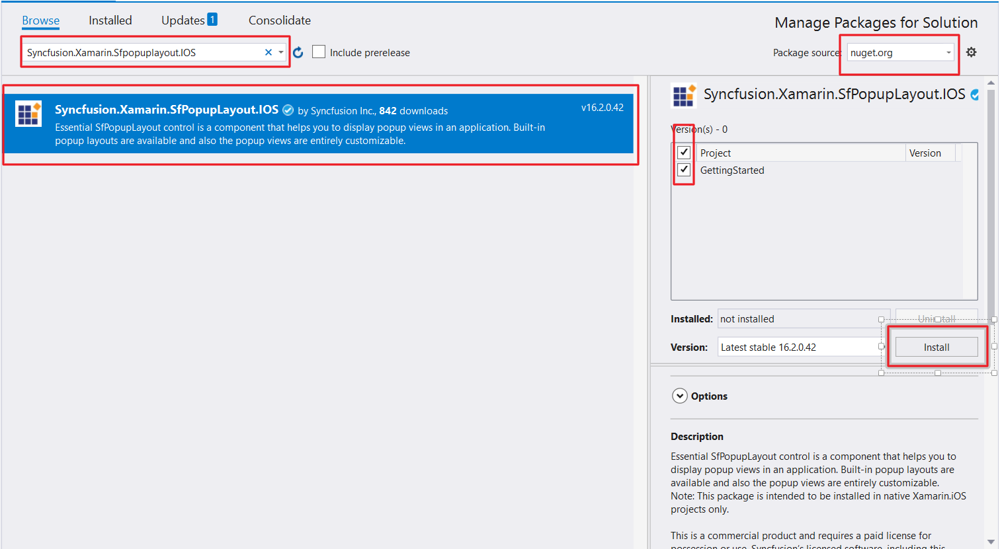

# Getting Started

This section provides a quick overview for working with SfPopupLayout in Xamarin.iOS. Walk through the entire process of creating a simple application with this control.

## Assembly Deployment

After installing Essential Studio for Xamarin, all the required assemblies can be found in {Syncfusion Essential Studio Installed location}\Essential Studio\16.1.0.24\Xamarin\lib this installation folder.

e.g., C:\Program Files (x86)\Syncfusion\Essential Studio\16.1.0.24\Xamarin\lib

N> Assemblies can be found in unzipped package location in Mac.

### SfPopupLayout for Xamarin.iOS

The following assembly should be added as reference from the "lib" folder to use SfPopupLayout in the application:

<table>
<tr>
<th> Project </th>
<th> Required assemblies </th>
</tr>
<tr>
<td> Xamarin.iOS </td>
<td> ios-unified\Syncfusion.SfPopupLayout.iOS.dll </td>
</tr>
</table>

## NuGet Configuration

To install SfPopupLayout control in the application, configure the NuGet package of the Syncfusion components. Refer to the following KB to configure the NuGet package of the Syncfusion components: 

[How to configure package source and install Syncfusion NuGet packages in an existing project?](https://www.syncfusion.com/kb/7441/how-to-configure-package-source-and-install-syncfusion-nuget-packages-in-an-existing-project)

The following NuGet package should be added to use SfPopupLayout control in the application:

<table>
<tr>
<th> Project </th>
<th> Required packages </th>
</tr>
<tr>
<td> Xamarin.iOS </td>
<td> Syncfusion.Xamarin.SfPopupLayout.iOS </td>
</tr>
</table>

Refer to the following screenshot in which the Syncfusion.Xamarin.SfPopupLayout.iOS package is highlighted:

## Create a sample application with SfPopupLayout

SfPopupLayout control can be configured entirely in C# code. To create a sample application for this control, follow the topics:  

* [Create a simple popup](#create-a-simple-popup)  
* [Adding SfPopupLayout in Xamarin.iOS](#adding-sfpopuplayout-in-xamarin.iOS) 
* [Adding a UILabel as the ContentView of the SfPopupLayout](#adding-a-uilabel-as-the-contentview-of-the-sfpopuplayout) 
* [AppearanceMode](#appearancemode) 
* [Showing SfPopupLayout at various position](#showing-sfPopupLayout-at-various-position)
* [AnimationMode](#animationmode)
* [Sample Link](#sample-link)

### Create a simple popup

Create a new iOS application in Xamarin Studio or Visual Studio for Xamarin.iOS.

## Adding SfPopupLayout in Xamarin.iOS

1. Add the required assembly references to the project as mentioned in the [Assembly deployment](#assembly-deployment) section or install the NuGet as mentioned in the [NuGet installation](#nuget-installation) section.

2. Import SfPopupLayout control under the namespace `Syncfusion.iOS.PopupLayout`.

3. The SfPopupLayout can be displayed by the following methods. 
    
    * The SfPopupLayout can be displayed by making it as the base view or content view of the activity. We will refer this approach as Type A throughout this page.

    * You can continue to keep your view as the content view of the activity and still display popup over your view by simply calling the SfPopupLayout.Show() method. We will refer this approach as Type B throughout this page.

4. For Type A, set the view over which the SfPopupLayout should be displayed as the content of the SfPopupLayout using [SfPopupLayout.Content](https://help.syncfusion.com/cr/cref_files/xamarin-ios/sfpopuplayout/Syncfusion.SfPopupLayout.iOS~Syncfusion.iOS.PopupLayout.SfPopupLayout~Content.html) property.

5. Create an instance of SfPopupLayout control and add as subview of the UIViewController. Refer to the following code example to add this control to the application:

### Type A:



using Syncfusion.iOS.PopupLayout;

namespace GettingStarted
{
    public class MyViewController:UIViewController
    {
        SfPopupLayout popupLayout;
        CustomView customView;
        UIButton showPopupButton;
       
        public MyViewController()
        {
            popupLayout = new SfPopupLayout();
            popupLayout.Content = GetContentOfPopup();
            this.View.AddSubview(popupLayout);
        }
        private UIView GetContentOfPopup()
        {
            customView = new CustomView();
            customView.BackgroundColor = UIColor.White;

            showPopupButton = new UIButton();
            showPopupButton.SetTitle("Click to show Popup", UIControlState.Normal);
            showPopupButton.SetTitleColor(UIColor.White, UIControlState.Normal);
            showPopupButton.BackgroundColor = UIColor.Gray;
            showPopupButton.TouchDown += ShowPopupButton_TouchDown;

            customView.AddSubview(showPopupButton);
            return customView;
        }
        private void ShowPopupButton_TouchDown(object sender, EventArgs e)
        {
            popupLayout.Show();
        }
        public override void ViewDidLayoutSubviews()
        {
            base.ViewDidLayoutSubviews();
            popupLayout.Frame = new CGRect(0, 20, this.View.Frame.Width, this.View.Frame.Height - 20);
        }
    }
}



// CustomView.cs

public class CustomView : UIView
{
    public CustomView() : base()
    {
    }
    public override void LayoutSubviews()
    {
        base.LayoutSubviews();
        this.Subviews[0].Frame = new CGRect(0, 20, this.Frame.Right, 50);
    }
}


### Type B:



using Syncfusion.iOS.PopupLayout;

namespace GettingStarted
{
    public class MyViewController:UIViewController
    {
        SfPopupLayout popupLayout;
        UIView rootView;
        CustomView customView;
        UIButton showPopupButton;
       
        public MyViewController()
        {
            popupLayout = new SfPopupLayout();
            rootView = new UIView();
            rootView= GetContentOfPopup();
            this.View.AddSubview(rootView);
        }
        private UIView GetContentOfPopup()
        {
            customView = new CustomView();
            customView.BackgroundColor = UIColor.White;

            showPopupButton = new UIButton();
            showPopupButton.SetTitle("Click to show Popup", UIControlState.Normal);
            showPopupButton.SetTitleColor(UIColor.White, UIControlState.Normal);
            showPopupButton.BackgroundColor = UIColor.Gray;
            showPopupButton.TouchDown += ShowPopupButton_TouchDown;

            customView.AddSubview(showPopupButton);
            return customView;
        }
        private void ShowPopupButton_TouchDown(object sender, EventArgs e)
        {
            popupLayout.Show(rootView);
        }
        public override void ViewDidLayoutSubviews()
        {
            base.ViewDidLayoutSubviews();
            rootView.Frame = new CGRect(0, 20, this.View.Frame.Width, this.View.Frame.Height - 20);
        }
    }
}

If we run the above sample, the below output will appears on iOS device as shown below.

## Customizing Positioning

SfPopupLayout allows you to show the Popup content at various position based on the requirement.

Following are the list of options available to position the SfPopupLayout in your desired position

* [SfPopupLayout.IsOpen](https://help.syncfusion.com/cr/cref_files/xamarin-ios/sfpopuplayout/Syncfusion.SfPopupLayout.iOS~Syncfusion.iOS.PopupLayout.SfPopupLayout~IsOpen.html) property - Shows SfPopupLayout at the center.
* [SfPopupLayout.Show()](https://help.syncfusion.com/cr/cref_files/xamarin-ios/sfpopuplayout/Syncfusion.SfPopupLayout.iOS~Syncfusion.iOS.PopupLayout.SfPopupLayout~Show.html) - It is similar to SfPopupLayout.IsOpen property.
* [SfPopupLayout.Show(x-position, y-position)](https://help.syncfusion.com/cr/cref_files/xamarin-ios/sfpopuplayout/Syncfusion.SfPopupLayout.iOS~Syncfusion.iOS.PopupLayout.SfPopupLayout~Show.html) - Shows SfPopupLayout at the specified X and y position.
* [SfPopupLayout.ShowAtTouchPoint()](https://help.syncfusion.com/cr/cref_files/xamarin-ios/sfpopuplayout/Syncfusion.SfPopupLayout.iOS~Syncfusion.iOS.PopupLayout.SfPopupLayout~ShowAtTouchPoint.html) - Shows SfPopupLayout at the touch point.
* [SfPopupLayout.ShowRelativeToView(View, RelativePosition)](https://help.syncfusion.com/cr/cref_files/xamarin-ios/sfpopuplayout/Syncfusion.SfPopupLayout.iOS~Syncfusion.iOS.PopupLayout.SfPopupLayout~ShowRelativeToView.html) - Choose to show SfPopupLayout at any of the 8 positions relative to the specified view.

## Customizing Layouts

By default, you can choose from the following layouts available in SfPopupLayout using the property [SfPopupLayout.AppearanceMode](https://help.syncfusion.com/cr/cref_files/xamarin-ios/sfpopuplayout/Syncfusion.SfPopupLayout.iOS~Syncfusion.iOS.PopupLayout.AppearanceMode.html).

* [OneButton](https://help.syncfusion.com/cr/cref_files/xamarin-ios/sfpopuplayout/Syncfusion.SfPopupLayout.iOS~Syncfusion.iOS.PopupLayout.AppearanceMode.html) - Shows SfPopupLayout with OneButton in the FooterView. This is the default value.
* [TwoButton](https://help.syncfusion.com/cr/cref_files/xamarin-ios/sfpopuplayout/Syncfusion.SfPopupLayout.iOS~Syncfusion.iOS.PopupLayout.AppearanceMode.html) - Shows SfPopupLayout with TwoButtons in the FooterView.
* You can also customize the entire view of the popup by loading templates or custom views individually for the header, body and footer of the popup.

### Adding a UILabel as the ContentView of the SfPopupLayout

Any view can be added as the popup content using the [SfPopupLayout.PopupView.ContentView](https://help.syncfusion.com/cr/cref_files/xamarin-ios/sfpopuplayout/Syncfusion.SfPopupLayout.iOS~Syncfusion.iOS.PopupLayout.PopupView~ContentView.html) property to refresh it. Refer to the following code example in which a UILabel is added as popup content:



using Syncfusion.iOS.PopupLayout;

namespace GettingStarted
{
    public class MyViewController:UIViewController
    {
        SfPopupLayout popupLayout;
        CustomView customView;
        UIButton showPopupButton;
        UILabel popupContentView;

        public MyViewController()
        {
            popupLayout = new SfPopupLayout();

            popupContentView = new UILabel();
            popupContentView.Text = "This is the Customized view for SfPopupLayout";
            popupContentView.TextColor = UIColor.Black;
            popupContentView.BackgroundColor = UIColor.Cyan;
            popupContentView.TextAlignment = UITextAlignment.Center;

            // Adding ContentView of the SfPopupLayout
            popupLayout.PopupView.ContentView = popupContentView;
            popupLayout.Content = GetContentOfPopup();
            this.View.AddSubview(popupLayout);
        }
        private UIView GetContentOfPopup()
        {
            customView = new CustomView();
            customView.BackgroundColor = UIColor.White;

            showPopupButton = new UIButton();
            showPopupButton.SetTitle("Click to show Popup", UIControlState.Normal);
            showPopupButton.SetTitleColor(UIColor.White, UIControlState.Normal);
            showPopupButton.BackgroundColor = UIColor.Gray;
            showPopupButton.TouchDown += ShowPopupButton_TouchDown;

            customView.AddSubview(showPopupButton);
            return customView;
        }
        private void ShowPopupButton_TouchDown(object sender, EventArgs e)
        {
            popupLayout.Show();
        }
        public override void ViewDidLayoutSubviews()
        {
            base.ViewDidLayoutSubviews();
            popupLayout.Frame = new CGRect(0, 20, this.View.Frame.Width, this.View.Frame.Height - 20);
        }
    }
}


N> Setting of ContentView is same for both Type A and Type B

If we run the above sample, the below output will appears on iOS device as shown below.

## Customizing Animations

Built-in animations are available in SfPopupLayout, which is applied when the PopupView opens and closes in the screen.
By default, you can choose from the following Animations available in SfPopupLayout using the property [SfPopupLayout.AnimationMode](https://help.syncfusion.com/cr/cref_files/xamarin-ios/sfpopuplayout/Syncfusion.SfPopupLayout.iOS~Syncfusion.iOS.PopupLayout.AnimationMode.html).

* [Zoom](https://help.syncfusion.com/cr/cref_files/xamarin-ios/sfpopuplayout/Syncfusion.SfPopupLayout.iOS~Syncfusion.iOS.PopupLayout.AnimationMode.html) - Zoom-out animation will be applied if the PopupView opens and zoom-in animation will be applied if the PopupView closes. This is the default AnimationMode
* [Fade](https://help.syncfusion.com/cr/cref_files/xamarin-ios/sfpopuplayout/Syncfusion.SfPopupLayout.iOS~Syncfusion.iOS.PopupLayout.AnimationMode.html) - Fade-out animation will be applied if the PopupView opens and Fade-in animation will be applied if the PopupView closes.
* [SlideOnLeft](https://help.syncfusion.com/cr/cref_files/xamarin-ios/sfpopuplayout/Syncfusion.SfPopupLayout.iOS~Syncfusion.iOS.PopupLayout.AnimationMode.html) - PopupView will be animated from left-to-right, when it opens and it will be animated from right-to-left when the PopupView closes.
* [SlideOnTop](https://help.syncfusion.com/cr/cref_files/xamarin-ios/sfpopuplayout/Syncfusion.SfPopupLayout.iOS~Syncfusion.iOS.PopupLayout.AnimationMode.html) - PopupView will be animated from top-to-bottom, when it opens and it will be animated from bottom-to-top when the PopupView closes.
* [None](https://help.syncfusion.com/cr/cref_files/xamarin-ios/sfpopuplayout/Syncfusion.SfPopupLayout.iOS~Syncfusion.iOS.PopupLayout.AnimationMode.html) - Animation will not be applied.

## Sample link

You can download the source code of this sample [here](http://www.syncfusion.com/downloads/support/directtrac/general/ze/GettingStarted1822336781).
