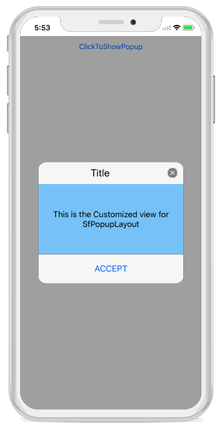
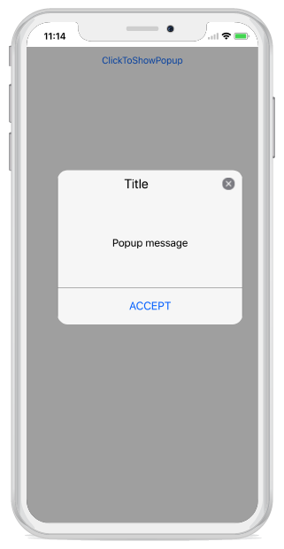
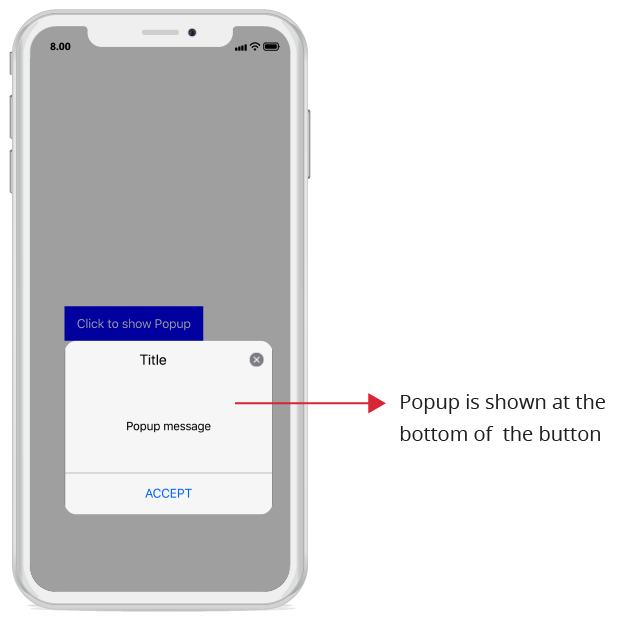
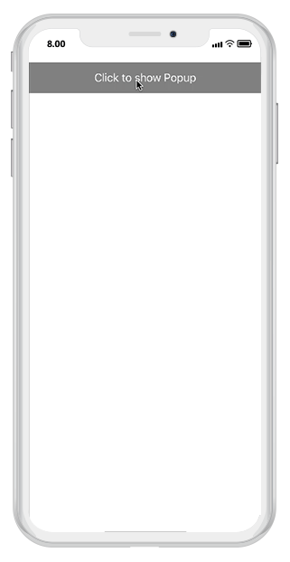
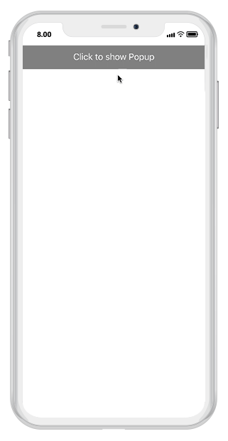
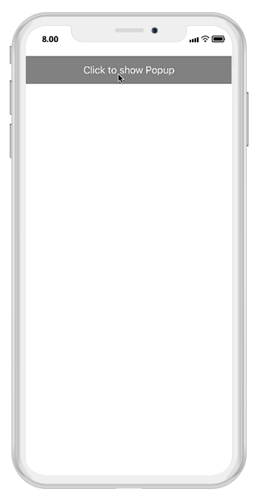

# Getting Started

This section provides a quick overview for working with SfPopupLayout in Xamarin.iOS. Walk through the entire process of creating a simple application with this control.

## Assembly deployment

After installing Essential Studio for Xamarin, all the required assemblies can be found in {Syncfusion Essential Studio Installed location}\Essential Studio\16.1.0.24\Xamarin\lib this installation folder.

e.g., C:\Program Files (x86)\Syncfusion\Essential Studio\16.1.0.24\Xamarin\lib

N> Assemblies can be found in unzipped package location in Mac.

### SfPopupLayout for Xamarin.iOS

The following assembly should be added as reference from the "lib" folder to use SfPopupLayout in the application:

<table>
<tr>
<th> Project </th>
<th> Required assemblies </th>
</tr>
<tr>
<td> Xamarin.iOS </td>
<td> ios-unified\Syncfusion.SfPopupLayout.iOS.dll </td>
</tr>
</table>

## NuGet installation

To install SfPopupLayout control in the application, configure the NuGet package of the Syncfusion components. Refer to the following KB to configure the NuGet package of the Syncfusion components: 

[How to configure package source and install Syncfusion NuGet packages in an existing project?](https://www.syncfusion.com/kb/7441/how-to-configure-package-source-and-install-syncfusion-nuget-packages-in-an-existing-project)

### SfPopupLayout for Xamarin.iOS

The following NuGet package should be added to use SfPopupLayout control in the application:

<table>
<tr>
<th> Project </th>
<th> Required packages </th>
</tr>
<tr>
<td> Xamarin.iOS </td>
<td> Syncfusion.Xamarin.SfPopupLayout.iOS </td>
</tr>
</table>

Refer to the following screenshot in which the Syncfusion.Xamarin.SfPopupLayout.iOS package is highlighted:

## Create a sample application with SfPopupLayout

SfPopupLayout control can be configured entirely in C# code. To create a sample application for this control, follow the topics:  

* [Creating the project](#creating-the-project)  
* [Adding SfPopupLayout in Xamarin.iOS](#adding-sfpopuplayout-in-xamarin.iOS) 
* [Adding a UILabel as the ContentView of the SfPopupLayout](#adding-a-uilabel-as-the-contentview-of-the-sfpopuplayout) 
* [AppearanceMode](#appearancemode) 
* [Showing SfPopupLayout at various position](#showing-sfPopupLayout-at-various-position)
* [AnimationMode](#animationmode)
* [Sample Link](#sample-link)

### Creating the project

Create a new iOS application in Xamarin Studio or Visual Studio for Xamarin.iOS.

### Adding SfPopupLayout in Xamarin.iOS

1. Add the required assembly references to the project as mentioned in the [Assembly deployment](#assembly-deployment) section or install the NuGet as mentioned in the [NuGet installation](#nuget-installation) section.

2. Import SfPopupLayout control under the namespace `Syncfusion.iOS.PopupLayout`.

3. Set the hosting view of the SfPopupLayout as a content of the SfPopupLayout using [SfPopupLayout.Content]() property.

4. Create an instance of SfPopupLayout control and add as the subview of the UIViewController. Refer to the following code example to add this control to the application:

#### Type A:



using Syncfusion.iOS.PopupLayout;

namespace GettingStarted
{
    public class MyViewController:UIViewController
    {
        SfPopupLayout popupLayout;
        CustomView customView;
        UIButton showPopupButton;
       
        public MyViewController()
        {
            popupLayout = new SfPopupLayout();
            popupLayout.Content = GetContentOfPopup();
            this.View.AddSubview(popupLayout);
        }
        private UIView GetContentOfPopup()
        {
            customView = new CustomView();
            customView.BackgroundColor = UIColor.White;

            showPopupButton = new UIButton();
            showPopupButton.SetTitle("Click to show Popup", UIControlState.Normal);
            showPopupButton.SetTitleColor(UIColor.White, UIControlState.Normal);
            showPopupButton.BackgroundColor = UIColor.Gray;
            showPopupButton.TouchDown += ShowPopupButton_TouchDown;

            customView.AddSubview(showPopupButton);
            return customView;
        }
        private void ShowPopupButton_TouchDown(object sender, EventArgs e)
        {
            popupLayout.Show();
        }
        public override void ViewDidLayoutSubviews()
        {
            base.ViewDidLayoutSubviews();
            popupLayout.Frame = new CGRect(0, 20, this.View.Frame.Width, this.View.Frame.Height - 20);
        }
    }
}



// CustomView.cs

public class CustomView : UIView
{
    public CustomView() : base()
    {
    }
    public override void LayoutSubviews()
    {
        base.LayoutSubviews();
        this.Subviews[0].Frame = new CGRect(0, 20, this.Frame.Right, 50);
    }
}


#### Type B:



using Syncfusion.iOS.PopupLayout;

namespace GettingStarted
{
    public class MyViewController:UIViewController
    {
        SfPopupLayout popupLayout;
        UIView rootView;
        CustomView customView;
        UIButton showPopupButton;
       
        public MyViewController()
        {
            popupLayout = new SfPopupLayout();
            rootView = new UIView();
            rootView= GetContentOfPopup();
            this.View.AddSubview(rootView);
        }
        private UIView GetContentOfPopup()
        {
            customView = new CustomView();
            customView.BackgroundColor = UIColor.White;

            showPopupButton = new UIButton();
            showPopupButton.SetTitle("Click to show Popup", UIControlState.Normal);
            showPopupButton.SetTitleColor(UIColor.White, UIControlState.Normal);
            showPopupButton.BackgroundColor = UIColor.Gray;
            showPopupButton.TouchDown += ShowPopupButton_TouchDown;

            customView.AddSubview(showPopupButton);
            return customView;
        }
        private void ShowPopupButton_TouchDown(object sender, EventArgs e)
        {
            popupLayout.Show(rootView);
        }
        public override void ViewDidLayoutSubviews()
        {
            base.ViewDidLayoutSubviews();
            rootView.Frame = new CGRect(0, 20, this.View.Frame.Width, this.View.Frame.Height - 20);
        }
    }
}

If we run the above sample, the below output will appears on iOS device as shown below.

### Adding a UILabel as the ContentView of the SfPopupLayout

Any view can be added as the popup content using the [SfPopupLayout.PopupView.ContentView]() property to refresh it. Refer to the following code example in which a UILabel is added as popup content:



using Syncfusion.iOS.PopupLayout;

namespace GettingStarted
{
    public class MyViewController:UIViewController
    {
        SfPopupLayout popupLayout;
        CustomView customView;
        UIButton showPopupButton;
        UILabel popupContentView;

        public MyViewController()
        {
            popupLayout = new SfPopupLayout();

            popupContentView = new UILabel();
            popupContentView.Text = "This is the Customized view for SfPopupLayout";
            popupContentView.TextColor = UIColor.Black;
            popupContentView.BackgroundColor = UIColor.Cyan;
            popupContentView.TextAlignment = UITextAlignment.Center;

            // Adding ContentView of the SfPopupLayout
            popupLayout.PopupView.ContentView = popupContentView;
            popupLayout.Content = GetContentOfPopup();
            this.View.AddSubview(popupLayout);
        }
        private UIView GetContentOfPopup()
        {
            customView = new CustomView();
            customView.BackgroundColor = UIColor.White;

            showPopupButton = new UIButton();
            showPopupButton.SetTitle("Click to show Popup", UIControlState.Normal);
            showPopupButton.SetTitleColor(UIColor.White, UIControlState.Normal);
            showPopupButton.BackgroundColor = UIColor.Gray;
            showPopupButton.TouchDown += ShowPopupButton_TouchDown;

            customView.AddSubview(showPopupButton);
            return customView;
        }
        private void ShowPopupButton_TouchDown(object sender, EventArgs e)
        {
            popupLayout.Show();
        }
        public override void ViewDidLayoutSubviews()
        {
            base.ViewDidLayoutSubviews();
            popupLayout.Frame = new CGRect(0, 20, this.View.Frame.Width, this.View.Frame.Height - 20);
        }
    }
}


N> Setting of ContentView is same for both Type A and Type B

If we run the above sample, the below output will appears on iOS device as shown below.

### AppearanceMode

SfPopupLayout supports two types of [SfPopupLayout.PopupView.AppearanceMode](). By default, "AppearanceMode.OneButton" is set. You can change the appearance of the SfPopupLayout by using `SfPopupLayout.PopupView.AppearanceMode` property.
Two different appearance mode in SfPopupLayout as listed below.

<table>
<tr>
<th> Modes </th>
<th> Description </th>
</tr>
<tr>
<td> {{'[OneButton]()'| markdownify }} </td>
<td> Shows SfPopupLayout with OneButton in the FooterView. This is the default value.</td>
</tr>
<tr>
<td> {{'[TwoButton]()'| markdownify }} </td>
<td> Shows SfPopupLayout with TwoButtons in the FooterView.</td>
</tr>
</table>

#### OneButton

In the below code example we have set `SfPopupLayout.PopupView.AppearanceMode` property as `OneButton` which displays only AcceptButton in the FooterView.

##### Type A:



using Syncfusion.iOS.PopupLayout;

namespace GettingStarted
{
    public class MyViewController:UIViewController
    {
        SfPopupLayout popupLayout;
        CustomView customView;
        UIButton showPopupButton;

        public MyViewController()
        {
            popupLayout = new SfPopupLayout();
            popupLayout.Content = GetContentOfPopup();

            //Setting the AppearanceMode as OneButton
            popupLayout.PopupView.AppearanceMode = AppearanceMode.OneButton;

            this.View.AddSubview(popupLayout);
        }
        private UIView GetContentOfPopup()
        {
            customView = new CustomView();
            customView.BackgroundColor = UIColor.White;

            showPopupButton = new UIButton();
            showPopupButton.SetTitle("Click to show Popup", UIControlState.Normal);
            showPopupButton.SetTitleColor(UIColor.White, UIControlState.Normal);
            showPopupButton.BackgroundColor = UIColor.Gray;
            showPopupButton.TouchDown += ShowPopupButton_TouchDown;

            customView.AddSubview(showPopupButton);
            return customView;
        }
        private void ShowPopupButton_TouchDown(object sender, EventArgs e)
        {
            popupLayout.Show();
        }
        public override void ViewDidLayoutSubviews()
        {
            base.ViewDidLayoutSubviews();
            popupLayout.Frame = new CGRect(0, 20, this.View.Frame.Width, this.View.Frame.Height - 20);
        }
    }
}


##### Type B:



using Syncfusion.iOS.PopupLayout;

namespace GettingStarted
{
    public class MyViewController:UIViewController
    {
        SfPopupLayout popupLayout;
        CustomView customView;
        UIButton showPopupButton;
        UIView rootView;

        public MyViewController()
        {
            popupLayout = new SfPopupLayout();
            popupLayout.Content = GetContentOfPopup();

            //Setting the AppearanceMode as OneButton
            popupLayout.PopupView.AppearanceMode = AppearanceMode.OneButton;

            rootView = new UIView();
            rootView= GetContentOfPopup();
            this.View.AddSubview(rootView);
        }
        private UIView GetContentOfPopup()
        {
            customView = new CustomView();
            customView.BackgroundColor = UIColor.White;

            showPopupButton = new UIButton();
            showPopupButton.SetTitle("Click to show Popup", UIControlState.Normal);
            showPopupButton.SetTitleColor(UIColor.White, UIControlState.Normal);
            showPopupButton.BackgroundColor = UIColor.Gray;
            showPopupButton.TouchDown += ShowPopupButton_TouchDown;

            customView.AddSubview(showPopupButton);
            return customView;
        }
        private void ShowPopupButton_TouchDown(object sender, EventArgs e)
        {
            popupLayout.Show(rootView);
        }
        public override void ViewDidLayoutSubviews()
        {
            base.ViewDidLayoutSubviews();
            rootView.Frame = new CGRect(0, 20, this.View.Frame.Width, this.View.Frame.Height - 20);
        }
    }
}


If we run the above sample with `AppearanceMode` as `OneButton`, the output will appear on iOS device as shown below.

#### TwoButton

In the below code example we have set `SfPopupLayout.PopupView.AppearanceMode` property as `TwoButton` which displays only AcceptButton in the FooterView.

##### Type A:



using Syncfusion.iOS.PopupLayout;

namespace GettingStarted
{
    public class MyViewController:UIViewController
    {
        SfPopupLayout popupLayout;
        CustomView customView;
        UIButton showPopupButton;

        public MyViewController()
        {
            popupLayout = new SfPopupLayout();
            popupLayout.Content = GetContentOfPopup();

            //Setting the AppearanceMode as TwoButton
            popupLayout.PopupView.AppearanceMode = AppearanceMode.TwoButton;

            this.View.AddSubview(popupLayout);
        }
        private UIView GetContentOfPopup()
        {
            customView = new CustomView();
            customView.BackgroundColor = UIColor.White;

            showPopupButton = new UIButton();
            showPopupButton.SetTitle("Click to show Popup", UIControlState.Normal);
            showPopupButton.SetTitleColor(UIColor.White, UIControlState.Normal);
            showPopupButton.BackgroundColor = UIColor.Gray;
            showPopupButton.TouchDown += ShowPopupButton_TouchDown;

            customView.AddSubview(showPopupButton);
            return customView;
        }
        private void ShowPopupButton_TouchDown(object sender, EventArgs e)
        {
            popupLayout.Show();
        }
        public override void ViewDidLayoutSubviews()
        {
            base.ViewDidLayoutSubviews();
            popupLayout.Frame = new CGRect(0, 20, this.View.Frame.Width, this.View.Frame.Height - 20);
        }
    }
}


##### Type B:



using Syncfusion.iOS.PopupLayout;

namespace GettingStarted
{
    public class MyViewController:UIViewController
    {
        SfPopupLayout popupLayout;
        CustomView customView;
        UIButton showPopupButton;
        UIView rootView;

        public MyViewController()
        {
            popupLayout = new SfPopupLayout();
            popupLayout.Content = GetContentOfPopup();

            //Setting the AppearanceMode as TwoButton
            popupLayout.PopupView.AppearanceMode = AppearanceMode.TwoButton;

            rootView = new UIView();
            rootView= GetContentOfPopup();
            this.View.AddSubview(rootView);
        }
        private UIView GetContentOfPopup()
        {
            customView = new CustomView();
            customView.BackgroundColor = UIColor.White;

            showPopupButton = new UIButton();
            showPopupButton.SetTitle("Click to show Popup", UIControlState.Normal);
            showPopupButton.SetTitleColor(UIColor.White, UIControlState.Normal);
            showPopupButton.BackgroundColor = UIColor.Gray;
            showPopupButton.TouchDown += ShowPopupButton_TouchDown;

            customView.AddSubview(showPopupButton);
            return customView;
        }
        private void ShowPopupButton_TouchDown(object sender, EventArgs e)
        {
            popupLayout.Show(rootView);
        }
        public override void ViewDidLayoutSubviews()
        {
            base.ViewDidLayoutSubviews();
            rootView.Frame = new CGRect(0, 20, this.View.Frame.Width, this.View.Frame.Height - 20);
        }
    }
}


If we run the above sample with `AppearanceMode` as `TwoButton`, the output will appear on iOS device as shown below.

### Showing SfPopupLayout at various position

SfPopupLayout allows you to show the Popup content at various position based on the requirement.

Following are the list of options available to show SfPopupLayout at various position.

<table>
<tr>
<th> Methods / Property </th>
<th> Description </th>
</tr>
<tr>
<td> {{'[SfPopupLayout.IsOpen]()'| markdownify }} </td>
<td> Shows SfPopupLayout at the center.</td>
</tr>
<tr>
<td> {{'[SfPopupLayout.Show()]()'| markdownify }} </td>
<td> It is similar to SfPopupLayout.IsOpen property.</td>
</tr>
<tr>
<td> {{'[popupLayout.Show(x-position, y-position)]()'| markdownify }} </td>
<td> Shows SfPopupLayout at the specified X and y position.</td>
</tr>
<tr>
<td> {{'[popupLayout.ShowAtTouchPoint()]()'| markdownify }} </td>
<td> Shows SfPopupLayout at the touch point.</td>
</tr>
<tr>
<td> {{'[popupLayout.ShowRelativeToView(View, RelativePosition)]()'| markdownify }} </td>
<td> Shows SfPopupLayout at the position relative to the specified view.</td>
</tr>
</table>

#### IsOpen Property

In the below code example we have open the SfPopupLayout by using `SfPopupLayout.IsOpen` property.

##### Type A:


using Syncfusion.iOS.PopupLayout;

namespace GettingStarted
{
    public class MyViewController:UIViewController
    {
        SfPopupLayout popupLayout;
        CustomView customView;
        UIButton showPopupButton;
        
        public MyViewController()
        {
            popupLayout = new SfPopupLayout();
            popupLayout.Content = GetContentOfPopup();
            this.View.AddSubview(popupLayout);
        }
        private UIView GetContentOfPopup()
        {
            customView = new CustomView();
            customView.BackgroundColor = UIColor.White;

            showPopupButton = new UIButton();
            showPopupButton.SetTitle("Click to show Popup", UIControlState.Normal);
            showPopupButton.SetTitleColor(UIColor.White, UIControlState.Normal);
            showPopupButton.BackgroundColor = UIColor.Gray;
            showPopupButton.TouchDown += ShowPopupButton_TouchDown;
            customView.AddSubview(showPopupButton);

            return customView;
        }
        private void ShowPopupButton_TouchDown(object sender, EventArgs e)
        {
              popupLayout.IsOpen = true;
        }
        public override void ViewDidLayoutSubviews()
        {
            base.ViewDidLayoutSubviews();
            popupLayout.Frame = new CGRect(0, 20, this.View.Frame.Width, this.View.Frame.Height - 20);
        }
    }
}


N > SfPopupLayout.IsOpen property is not applicable for Type B.

If we run the above sample, the below output will appear on iOS device as shown below.

#### SfPopupLayout.Show()

In the below code example we have open the SfPopupLayout by using `SfPopupLayout.Show()`.

##### Type A:



using Syncfusion.iOS.PopupLayout;

namespace GettingStarted
{
    public class MyViewController:UIViewController
    {
        SfPopupLayout popupLayout;
        CustomView customView;
        UIButton showPopupButton;
        
        public MyViewController()
        {
            popupLayout = new SfPopupLayout();
            popupLayout.Content = GetContentOfPopup();
            this.View.AddSubview(popupLayout);
        }
        private UIView GetContentOfPopup()
        {
            customView = new CustomView();
            customView.BackgroundColor = UIColor.White;

            showPopupButton = new UIButton();
            showPopupButton.SetTitle("Click to show Popup", UIControlState.Normal);
            showPopupButton.SetTitleColor(UIColor.White, UIControlState.Normal);
            showPopupButton.BackgroundColor = UIColor.Gray;
            showPopupButton.TouchDown += ShowPopupButton_TouchDown;
            customView.AddSubview(showPopupButton);

            return customView;
        }
        private void ShowPopupButton_TouchDown(object sender, EventArgs e)
        {
            //Shows SfPopupLayout at the center of the view.
            popupLayout.Show();  
        }
        public override void ViewDidLayoutSubviews()
        {
            base.ViewDidLayoutSubviews();
            popupLayout.Frame = new CGRect(0, 20, this.View.Frame.Width, this.View.Frame.Height - 20);
        }
    }
}


##### Type B:



using Syncfusion.iOS.PopupLayout;

namespace GettingStarted
{
    public class MyViewController:UIViewController
    {
        SfPopupLayout popupLayout;
        CustomView customView;
        UIButton showPopupButton;
        UIView rootView;
        
        public MyViewController()
        {
            popupLayout = new SfPopupLayout();
            rootView = new UIView();
            rootView= GetContentOfPopup();
            this.View.AddSubview(rootView);
        }
        private UIView GetContentOfPopup()
        {
            customView = new CustomView();
            customView.BackgroundColor = UIColor.White;

            showPopupButton = new UIButton();
            showPopupButton.SetTitle("Click to show Popup", UIControlState.Normal);
            showPopupButton.SetTitleColor(UIColor.White, UIControlState.Normal);
            showPopupButton.BackgroundColor = UIColor.Gray;
            showPopupButton.TouchDown += ShowPopupButton_TouchDown;
            customView.AddSubview(showPopupButton);

            return customView;
        }
        private void ShowPopupButton_TouchDown(object sender, EventArgs e)
        {
            //Shows SfPopupLayout at the center of the view.
            popupLayout.Show(rootView);  
        }
        public override void ViewDidLayoutSubviews()
        {
            base.ViewDidLayoutSubviews();
            rootView.Frame = new CGRect(0, 20, this.View.Frame.Width, this.View.Frame.Height - 20);
        }
    }
}


If we run the above sample, the below output will appear on iOS device as shown below.

#### SfPopupLayout.Show(x-position, y-position)

In the below code example we have open the SfPopupLayout by using `SfPopupLayout.Show(x-position, y-position)`.

##### Type A:



using Syncfusion.iOS.PopupLayout;

namespace GettingStarted
{
    public class MyViewController:UIViewController
    {
        SfPopupLayout popupLayout;
        CustomView customView;
        UIButton showPopupButton;
        
        public MyViewController()
        {
            popupLayout = new SfPopupLayout();
            popupLayout.Content = GetContentOfPopup();
            this.View.AddSubview(popupLayout);
        }
        private UIView GetContentOfPopup()
        {
            customView = new CustomView();
            customView.BackgroundColor = UIColor.White;

            showPopupButton = new UIButton();
            showPopupButton.SetTitle("Click to show Popup", UIControlState.Normal);
            showPopupButton.SetTitleColor(UIColor.White, UIControlState.Normal);
            showPopupButton.BackgroundColor = UIColor.Gray;
            showPopupButton.TouchDown += ShowPopupButton_TouchDown;
            customView.AddSubview(showPopupButton);

            return customView;
        }
        private void ShowPopupButton_TouchDown(object sender, EventArgs e)
        {
            //Shows SfPopupLayout at x-position 100 and y position 100.
            popupLayout.Show(100, 100);  

        }
        public override void ViewDidLayoutSubviews()
        {
            base.ViewDidLayoutSubviews();
            popupLayout.Frame = new CGRect(0, 20, this.View.Frame.Width, this.View.Frame.Height - 20);
        }
    }
}


##### Type B:



using Syncfusion.iOS.PopupLayout;

namespace GettingStarted
{
    public class MyViewController:UIViewController
    {
        SfPopupLayout popupLayout;
        CustomView customView;
        UIButton showPopupButton;
        UIView rootView;
        
        public MyViewController()
        {
            popupLayout = new SfPopupLayout();
            rootView = new UIView();
            rootView= GetContentOfPopup();
            this.View.AddSubview(rootView);
        }
        private UIView GetContentOfPopup()
        {
            customView = new CustomView();
            customView.BackgroundColor = UIColor.White;

            showPopupButton = new UIButton();
            showPopupButton.SetTitle("Click to show Popup", UIControlState.Normal);
            showPopupButton.SetTitleColor(UIColor.White, UIControlState.Normal);
            showPopupButton.BackgroundColor = UIColor.Gray;
            showPopupButton.TouchDown += ShowPopupButton_TouchDown;
            customView.AddSubview(showPopupButton);

            return customView;
        }
        private void ShowPopupButton_TouchDown(object sender, EventArgs e)
        {
            //Shows SfPopupLayout at x-position 100 and y position 100.
            popupLayout.Show(100, 100, rootView);  

        }
        public override void ViewDidLayoutSubviews()
        {
            base.ViewDidLayoutSubviews();
            rootView.Frame = new CGRect(0, 20, this.View.Frame.Width, this.View.Frame.Height - 20);
        }
    }
}


If we run the above sample, the below output will appear on iOS device as shown below.

#### SfPopupLayout.ShowAtTouchPoint()

In the below code example we have open the SfPopupLayout by using `SfPopupLayout.ShowAtTouchPoint()`.

##### Type A:



using Syncfusion.iOS.PopupLayout;

namespace GettingStarted
{
    public class MyViewController:UIViewController
    {
        SfPopupLayout popupLayout;
        CustomView customView;
        UIButton showPopupButton;
        
        public MyViewController()
        {
            popupLayout = new SfPopupLayout();
            popupLayout.Content = GetContentOfPopup();
            this.View.AddSubview(popupLayout);
        }
        private UIView GetContentOfPopup()
        {
            customView = new CustomView();
            customView.BackgroundColor = UIColor.White;

            showPopupButton = new UIButton();
            showPopupButton.SetTitle("Click to show Popup", UIControlState.Normal);
            showPopupButton.SetTitleColor(UIColor.White, UIControlState.Normal);
            showPopupButton.BackgroundColor = UIColor.Gray;
            showPopupButton.TouchDown += ShowPopupButton_TouchDown;
            customView.AddSubview(showPopupButton);

            return customView;
        }
        private void ShowPopupButton_TouchDown(object sender, EventArgs e)
        {
            //Shows SfPopupLayout at the touch point.
            popupLayout.ShowAtTouchPoint(); 

        }
        public override void ViewDidLayoutSubviews()
        {
            base.ViewDidLayoutSubviews();
            popupLayout.Frame = new CGRect(0, 20, this.View.Frame.Width, this.View.Frame.Height - 20);
        }
    }
}


N > SfPopupLayout.ShowAtTouchPoint() is not applicable for Type B.

If we run the above sample, the below output will appear on iOS device as shown below.

#### SfPopupLayout.ShowRelativeToView(View, RelativePosition)

In the below code example we have open the SfPopupLayout by using `SfPopupLayout.ShowRelativeToView(View, RelativePosition)`.

##### Type A:



using Syncfusion.iOS.PopupLayout;

namespace GettingStarted
{
    public class MyViewController:UIViewController
    {
        SfPopupLayout popupLayout;
        CustomView customView;
        UIButton showPopupButton;
        UILabel label;
        
        public MyViewController()
        {
            popupLayout = new SfPopupLayout();
            popupLayout.Content = GetContentOfPopup();
            this.View.AddSubview(popupLayout);
        }
        private UIView GetContentOfPopup()
        {
            customView = new CustomView();
            customView.BackgroundColor = UIColor.White;

            showPopupButton = new UIButton();
            showPopupButton.SetTitle("Click to show Popup", UIControlState.Normal);
            showPopupButton.SetTitleColor(UIColor.White, UIControlState.Normal);
            showPopupButton.BackgroundColor = UIColor.Gray;
            showPopupButton.TouchDown += ShowPopupButton_TouchDown;
            customView.AddSubview(showPopupButton);

            label = new UILabel();
            label.Text = "This is SfPopupLayout";   
            label.TextColor = UIColor.Black;    
            customView.AddSubview(label);
            return customView;
        }
        private void ShowPopupButton_TouchDown(object sender, EventArgs e)
        {
            //Shows SfPopupLayout at the bottom of the label.
            popupLayout.ShowRelativeToView(label, RelativePosition.AlignBottom);
        }
        public override void ViewDidLayoutSubviews()
        {
            base.ViewDidLayoutSubviews();
            popupLayout.Frame = new CGRect(0, 20, this.View.Frame.Width, this.View.Frame.Height - 20);
        }
    }
}




// CustomView.cs

public class CustomView : UIView
{
    public CustomView() : base()
    {
    }
    public override void LayoutSubviews()
    {
        base.LayoutSubviews();
        this.Subviews[0].Frame = new CGRect(0, 20, this.Frame.Right, 50);
        this.Subviews[1].Frame = new CGRect(0, 70, this.Frame.Right, 50);
    }
}


##### Type B:



using Syncfusion.iOS.PopupLayout;

namespace GettingStarted
{
    public class MyViewController:UIViewController
    {
        SfPopupLayout popupLayout;
        CustomView customView;
        UIButton showPopupButton;
        UIView rootView;
        UILabel label;
        
        public MyViewController()
        {
            popupLayout = new SfPopupLayout();
            rootView = new UIView();
            rootView= GetContentOfPopup();
            this.View.AddSubview(rootView);
        }
        private UIView GetContentOfPopup()
        {
            customView = new CustomView();
            customView.BackgroundColor = UIColor.White;

            showPopupButton = new UIButton();
            showPopupButton.SetTitle("Click to show Popup", UIControlState.Normal);
            showPopupButton.SetTitleColor(UIColor.White, UIControlState.Normal);
            showPopupButton.BackgroundColor = UIColor.Gray;
            showPopupButton.TouchDown += ShowPopupButton_TouchDown;
            customView.AddSubview(showPopupButton);

            label = new UILabel();
            label.Text = "This is SfPopupLayout";   
            label.TextColor = UIColor.Black;    
            customView.AddSubview(label);
            return customView;
        }
        private void ShowPopupButton_TouchDown(object sender, EventArgs e)
        {
            //Shows SfPopupLayout at the bottom of the label.
            popupLayout.ShowRelativeToView(label, RelativePosition.AlignBottom, rootView);
        }
        public override void ViewDidLayoutSubviews()
        {
            base.ViewDidLayoutSubviews();
            rootView.Frame = new CGRect(0, 20, this.View.Frame.Width, this.View.Frame.Height - 20);
        }
    }
}




// CustomView.cs

public class CustomView : UIView
{
    public CustomView() : base()
    {
    }
    public override void LayoutSubviews()
    {
        base.LayoutSubviews();
        this.Subviews[0].Frame = new CGRect(0, 20, this.Frame.Right, 50);
        this.Subviews[1].Frame = new CGRect(0, 70, this.Frame.Right, 50);
    }
}


If we run the above sample, the below output will appear on iOS device as shown below.

### AnimationMode

Built-in animations are available in SfPopupLayout, which is applied when the PopupView opens and closes in the screen.
SfPopupLayout has different animation modes as listed below.

<table>
<tr>
<th> Modes </th>
<th> Description </th>
</tr>
<tr>
<td> {{'[Zoom]()'| markdownify }} </td>
<td>  Zoom-out animation will be applied if the PopupView opens and zoom-in animation will be applied if the PopupView closes. This is the default AnimationMode</td>
</tr>
<tr>
<td> {{'[Fade]()'| markdownify }} </td>
<td>  Fade-out animation will be applied if the PopupView opens and Fade-in animation will be applied if the PopupView closes</td>
</tr>
<tr>
<td> {{'[SlideOnLeft]()'| markdownify }} </td>
<td>  PopupView will be animated from left-to-right, when it opens and it will be animated from right-to-left when the PopupView closes.</td>
</tr>
<tr>
<td> {{'[SlideOnTop]()'| markdownify }} </td>
<td>  PopupView will be animated from top-to-bottom, when it opens and it will be animated from bottom-to-top when the PopupView closes.</td>
</tr>
<tr>
<td> {{'[None]()'| markdownify }} </td>
<td>  Animation will not be applied.</td>
</tr>
</table>

N> Setting of AnimationMode is same for both TypeA and TypeB.

#### Zoom Animation

Zoom-out animation will be applied if the PopupView opens and Zoom-in animation will be applied if the PopupView closes.



//MyViewController.cs

public MyViewController()
{
    ....
    popupLayout = new SfPopupLayout();
    popupLayout.Content = GetContentOfPopup();
    popupLayout.PopupView.AnimationMode = AnimationMode.Zoom;
    this.View.AddSubview(popupLayout);
    ....
}



If we run the above sample with `AnimationMode` as `Zoom`, the output will look like on iOS device as shown below.

#### Fade Animation

Fade-out animation will be applied if the PopupView opens and Fade-in animation will be applied if the PopupView closes



//MyViewController.cs

public MyViewController()
{
    ....
    popupLayout = new SfPopupLayout();
    popupLayout.Content = GetContentOfPopup();
    popupLayout.PopupView.AnimationMode = AnimationMode.Fade;
    this.View.AddSubview(popupLayout);
    ....
}



If we run the above sample with `AnimationMode` as `Fade`, the output will look like on iOS device as shown below.

#### SlideOnLeft Animation

PopupView will be animated from left-to-right, when it opens and it will be animated from right-to-left when the PopupView closes.



//MyViewController.cs

public MyViewController()
{
    ....
    popupLayout = new SfPopupLayout();
    popupLayout.Content = GetContentOfPopup();
    popupLayout.PopupView.AnimationMode = AnimationMode.SlideOnLeft;
    this.View.AddSubview(popupLayout);  
    ....
}



If we run the above sample with `AnimationMode` as `SlideOnLeft`, the output will look like on iOS device as shown below.

#### SlideOnTop Animation

PopupView will be animated from top-to-bottom, when it opens and it will be animated from bottom-to-top when the PopupView closes.



//MyViewController.cs

public MyViewController()
{
    ....
    popupLayout = new SfPopupLayout();
    popupLayout.Content = GetContentOfPopup();
    popupLayout.PopupView.AnimationMode = AnimationMode.SlideOnTop;
    this.View.AddSubview(popupLayout);  
    ....
}



If we run the above sample with `AnimationMode` as `SlideOnTop`, the output will look like on iOS device as shown below.

#### None

Animation will not be applied.



//MyViewController.cs

public MyViewController()
{
    ....
    popupLayout = new SfPopupLayout();
    popupLayout.Content = GetContentOfPopup();
    popupLayout.PopupView.AnimationMode = AnimationMode.None;
    this.View.AddSubview(popupLayout);
    ....
}



If we run the above sample with `AnimationMode` as `None`, the output will look like on iOS device as shown below.

### Sample link

You can download the source code of this sample [here]().
