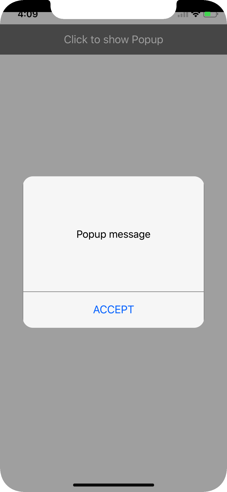
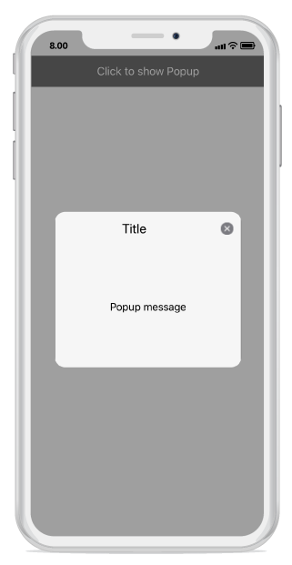
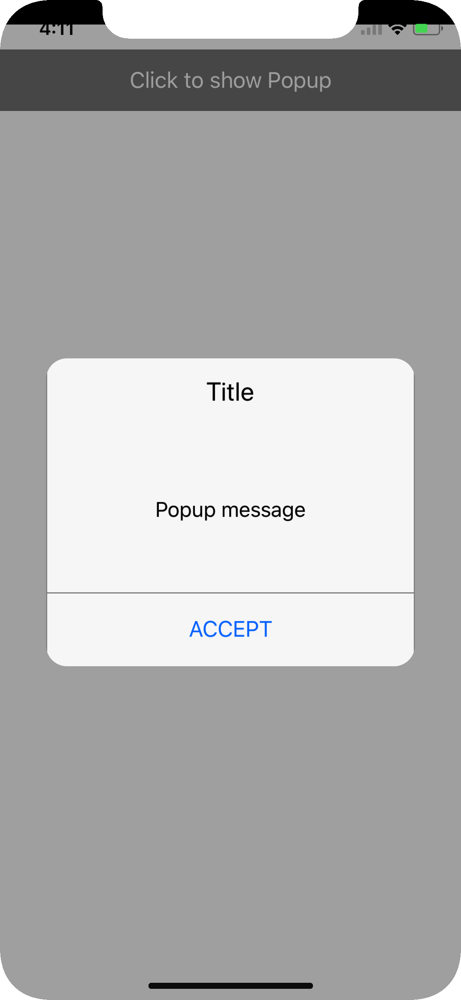
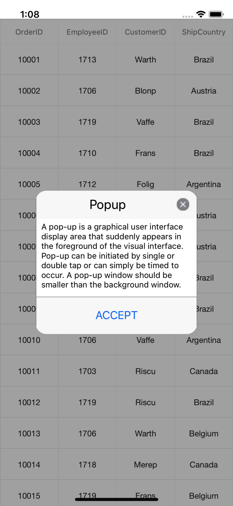
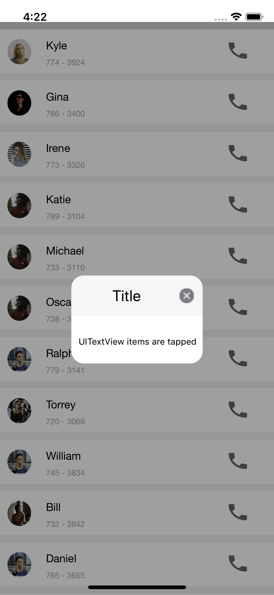
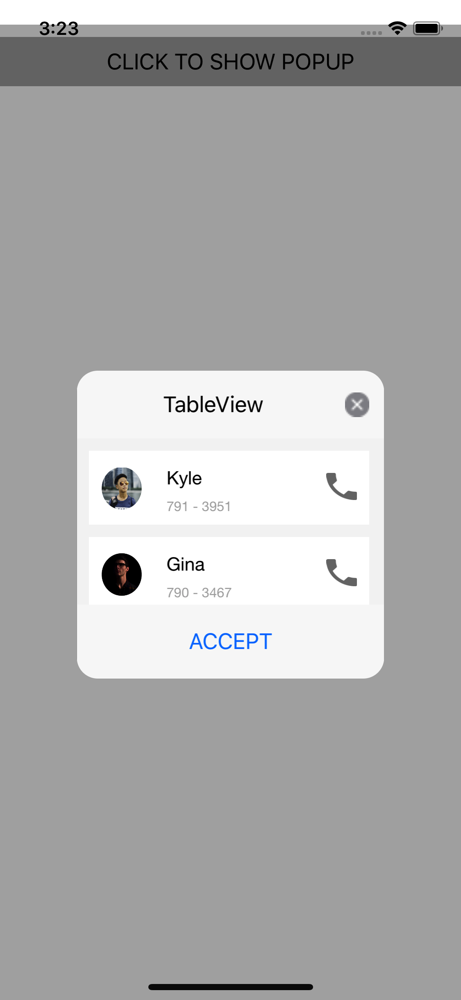

---
layout: post
title: How to | SfPopupLayout |Xamarin.iOS | Syncfusion
description: Explains how to achieve various requirements with SfPopupLayout
platform: Xamarin.iOS
control: SfPopupLayout
documentation: ug
--- 

# How to 

## hide the header in the SfPopupLayout 

The SfPopupLayout allows hiding the header by using the [SfPopupLayout.PopupView.ShowHeader](https://help.syncfusion.com/cr/xamarin-ios/Syncfusion.iOS.PopupLayout.PopupView.html#Syncfusion_iOS_PopupLayout_PopupView_ShowHeader) property. The default value of this property is `true`.




//MyViewController.cs

public MyViewController()
{
    ....
    popupLayout = new SfPopupLayout();
    popupLayout.Content = GetContentOfPopup();
    popupLayout.PopupView.ShowHeader = false;
    this.View.AddSubview(popupLayout);
    ....
}




## hide the footer in the SfPopupLayout 

The SfPopupLayout allows hiding the footer by using the [SfPopupLayout.PopupView.ShowFooter](https://help.syncfusion.com/cr/xamarin-ios/Syncfusion.iOS.PopupLayout.PopupView.html#Syncfusion_iOS_PopupLayout_PopupView_ShowFooter) property. The default value of this property is `true`.




//MyViewController.cs

public MyViewController()
{
    ....
    popupLayout = new SfPopupLayout();
    popupLayout.Content = GetContentOfPopup();
    popupLayout.PopupView.ShowFooter = false;
    this.View.AddSubview(popupLayout);
    ....
}




## hide the Close icon in the SfPopupLayout 

The SfPopupLayout allows hiding the Close icon by using the [SfPopupLayout.PopupView.ShowCloseButton](https://help.syncfusion.com/cr/xamarin-ios/Syncfusion.iOS.PopupLayout.PopupView.html#Syncfusion_iOS_PopupLayout_PopupView_ShowCloseButton) property. The default value of this property is `true`.




//MyViewController.cs

public MyViewController()
{
    ....
    popupLayout = new SfPopupLayout();
    popupLayout.Content = GetContentOfPopup();
    popupLayout.PopupView.ShowCloseButton = false;
    this.View.AddSubview(popupLayout);
    ....
}




## open SfPopupLayout in GridTappedEvent of SfDataGrid

The SfPopupLayout allows opening pop-up in the grid tapped event of the SfDataGrid.




using Syncfusion.iOS.PopupLayout;

namespace GettingStarted
{
    public class MyViewController:UIViewController
    {
        SfPopupLayout popupLayout;
        SfDataGrid dataGrid;
        ViewModel viewModel;

        public MyViewController()
        {
            dataGrid = new SfDataGrid();
            viewModel = new ViewModel();
            dataGrid.ItemsSource = viewModel.OrdersInfo;
            dataGrid.GridTapped += DataGrid_GridTapped;

            popupLayout = new SfPopupLayout();
            popupLayout.Content = dataGrid;

            this.View.AddSubview(popupLayout);
        }
        
        private void DataGrid_GridTapped(object sender, GridTappedEventArgs e)
        {
            popupLayout.Show();
        }

        public override void ViewDidLayoutSubviews()
        {
            base.ViewDidLayoutSubviews();
            popupLayout.Frame = new CGRect(0, 20, this.View.Frame.Width, this.View.Frame.Height - 20);
        }
    }
}



## load SfPopupLayout in TouchesEnded event of UITableView

The SfPopupLayout allows loading it in the TouchesEnded event of the UITableView.




// CustomViewController.cs

public class CustomViewController:UIViewController
{
    UITableView tableView;
    ContactsViewModel viewModel;
    DataSource sfDataSource;
    internal static SfPopupLayout popupLayout;
   
    public CustomViewController()
    {
        tableView = new UITableView();
        tableView.RowHeight = 70;
       
        viewModel = new ContactsViewModel();
        sfDataSource = new DataSource();
        sfDataSource.Source = viewModel.ContactsList;
        tableView.Source = new PopupTableViewSource(sfDataSource);
      
        popupLayout = new SfPopupLayout();
        popupLayout.Content = tableView;
        this.View.BackgroundColor = UIColor.White;
        this.View.AddSubviews(popupLayout);
    }
   
    public override void ViewDidLayoutSubviews()
    {
        popupLayout.Frame = new CGRect(0, 20, this.View.Frame.Width, this.View.Frame.Height);
        
        base.ViewDidLayoutSubviews();
    }
}






// PopupContactCell.cs

public class PopupContactCell : UITableViewCell
{
    public override void TouchesEnded(NSSet touches, UIEvent eve)
    {
        base.TouchesEnded(touches, eve);
        CustomViewController.popupLayout.PopupView.ContentView = GetCustomPopupView();
        CustomViewController.popupLayout.Show();
       
    }
    private UIView GetCustomPopupView()
    {
        popupContentView = new UILabel();
        popupContentView.Text = "TableView items are tapped.";
        popupContentView.TextColor = UIColor.Black;
        popupContentView.Font = UIFont.SystemFontOfSize(16);        
        popupContentView.BackgroundColor = UIColor.White;
        popupContentView.TextAlignment = UITextAlignment.Center;
        return popupContentView;
    }
    #endregion
}



## show UITableView as a pop-up

The SfPopupLayout allows loading UITableView as a content of the pop-up.




// CustomViewController.cs

public class CustomViewController : UIViewController
{
    UITableView tableView;
    ContactsViewModel viewModel;
    DataSource sfDataSource;
    internal static SfPopupLayout popupLayout;
    UIView view;
    UIButton showPopupButton;
    public CustomViewController()
    {
        tableView = new UITableView();
        tableView.RowHeight = 70;

        viewModel = new ContactsViewModel();
        sfDataSource = new DataSource();
        sfDataSource.Source = viewModel.ContactsList;
        tableView.Source = new PopupTableViewSource(sfDataSource);
     
        showPopupButton = new UIButton();
        showPopupButton.SetTitle("CLICK TO SHOW POPUP", UIControlState.Normal);
        showPopupButton.SetTitleColor(UIColor.Black, UIControlState.Normal);
        showPopupButton.BackgroundColor = UIColor.LightGray;
        showPopupButton.TouchDown += ShowPopupButton_TouchDown;
        
        view = new UIView();
        view.BackgroundColor = UIColor.White;
        view.AddSubviews(showPopupButton);

        popupLayout = new SfPopupLayout();
        popupLayout.Content = view;
        this.View.BackgroundColor = UIColor.White;
        this.View.AddSubviews(popupLayout);
    }
    private void ShowPopupButton_TouchDown(object sender, EventArgs e)
    {
        popupLayout.PopupView.HeaderTitle = "TableView";
        popupLayout.PopupView.ContentView = tableView;
        popupLayout.Show();
    }
    public override void ViewDidLayoutSubviews()
    {
        popupLayout.Frame = new CGRect(0, 20, this.View.Frame.Width, this.View.Frame.Height);
        showPopupButton.Frame = new CGRect(0, 20, this.View.Frame.Width, 40);
        base.ViewDidLayoutSubviews();
    }
}



