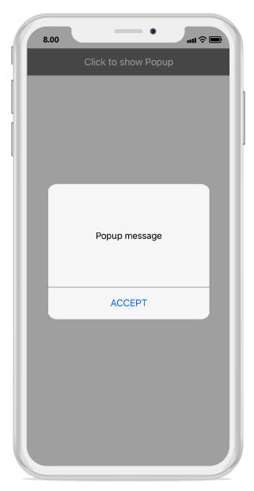

---
layout: post
title: Popup Layouts | SfPopupLayout |Xamarin.iOS | Syncfusion
description: Layouts in SfPopupLayout
platform: Xamarin.iOS
control: SfPopupLayout
documentation: ug
--- 

# How to 

## Hide the header in the SfPopupLayout 

The SfPopupLayout allows hiding the header by using the [SfPopupLayout.PopupView.ShowHeader](https://help.syncfusion.com/cr/cref_files/xamarin-ios/sfpopuplayout/Syncfusion.SfPopupLayout.iOS~Syncfusion.iOS.PopupLayout.PopupView~ShowHeader.html) property. The default value of this property is `true`.

To hide the header in the SfPopupLayout, follow the code example.



//MyViewController.cs

public MyViewController()
{
    ....
    popupLayout = new SfPopupLayout();
    popupLayout.Content = GetContentOfPopup();
    popupLayout.PopupView.ShowHeader = false;
    this.View.AddSubview(popupLayout);
    ....
}



Executing the above codes renders the following output in iOS device respectively.

## Hide the footer in the SfPopupLayout 

The SfPopupLayout allows hiding the footer by using the [SfPopupLayout.PopupView.ShowFooter](https://help.syncfusion.com/cr/cref_files/xamarin-ios/sfpopuplayout/Syncfusion.SfPopupLayout.iOS~Syncfusion.iOS.PopupLayout.PopupView~ShowFooter.html) property. The default value of this property is `true`.

To hide the footer in the SfPopupLayout, follow the code example.



//MyViewController.cs

public MyViewController()
{
    ....
    popupLayout = new SfPopupLayout();
    popupLayout.Content = GetContentOfPopup();
    popupLayout.PopupView.ShowFooter = false;
    this.View.AddSubview(popupLayout);
    ....
}



Executing the above codes renders the following output in iOS device respectively.

## Hide the Close icon in the SfPopupLayout 

The SfPopupLayout allows hiding the Close icon by using the [SfPopupLayout.PopupView.ShowCloseButton](https://help.syncfusion.com/cr/cref_files/xamarin-ios/sfpopuplayout/Syncfusion.SfPopupLayout.iOS~Syncfusion.iOS.PopupLayout.PopupView~ShowCloseButton.html) property. The default value of this property is `true`.

To hide the Close icon in SfPopupLayout, follow the code example.



//MyViewController.cs

public MyViewController()
{
    ....
    popupLayout = new SfPopupLayout();
    popupLayout.Content = GetContentOfPopup();
    popupLayout.PopupView.ShowCloseButton = false;
    this.View.AddSubview(popupLayout);
    ....
}



Executing the above codes renders the following output in iOS device respectively.

## Loading SfPopupLayout in GridTappedEvent of SfDataGrid

SfPopupLayout allows you to open it in the GridTapped event of SfDataGrid.

Refer the below code example to show the popup in Grid tapped event.



using Syncfusion.iOS.PopupLayout;

namespace GettingStarted
{
    public class MyViewController:UIViewController
    {
        SfPopupLayout popupLayout;
        SfDataGrid dataGrid;
        ViewModel viewModel;

        public MyViewController()
        {
            dataGrid = new SfDataGrid();
            viewModel = new ViewModel();
            dataGrid.ItemsSource = viewModel.OrdersInfo;
            dataGrid.GridTapped += DataGrid_GridTapped;

            popupLayout = new SfPopupLayout();
            popupLayout.Content = dataGrid;

            this.View.AddSubview(popupLayout);
        }
        
        private void DataGrid_GridTapped(object sender, GridTappedEventArgs e)
        {
            popupLayout.Show();
        }

        public override void ViewDidLayoutSubviews()
        {
            base.ViewDidLayoutSubviews();
            popupLayout.Frame = new CGRect(0, 20, this.View.Frame.Width, this.View.Frame.Height - 20);
        }
    }
}


## Loading SfPopupLayout in TouchesEnded event of UITableView

SfPopupLayout allows you to open it in the TouchesEnded event of UITableView.

Refer the below code example to show the popup in TouchesEnded event.



// CustomViewController.cs

public class CustomViewController:UIViewController
{
    UITableView tableView;
    ContactsViewModel viewModel;
    DataSource sfDataSource;
    internal static SfPopupLayout popupLayout;
   
    public CustomViewController()
    {
        tableView = new UITableView();
        tableView.RowHeight = 70;
        tableView.SeparatorColor = UIColor.Clear;
        tableView.EstimatedRowHeight = 70;
        viewModel = new ContactsViewModel();
        sfDataSource = new DataSource();
        sfDataSource.Source = viewModel.ContactsList;
        tableView.Source = new PopupTableViewSource(sfDataSource);
        tableView.ContentInset = new UIEdgeInsets(10, 10, 0, 20);
        tableView.BackgroundColor = UIColor.FromRGB(244, 244, 244);
        tableView.SectionHeaderHeight = 50;
        tableView.ScrollEnabled = false;
        popupLayout = new SfPopupLayout();
        popupLayout.Content = tableView;
        this.View.BackgroundColor = UIColor.White;
        this.View.AddSubviews(popupLayout);
    }
   
    public override void ViewDidLayoutSubviews()
    {
        popupLayout.Frame = new CGRect(0, 20, this.View.Frame.Width, this.View.Frame.Height);
        
        base.ViewDidLayoutSubviews();
    }
}




// PopupTableViewSource.cs

public class PopupTableViewSource : UITableViewSource
{
    DataSource dataSource;
   
    public PopupTableViewSource(DataSource sfDataSource)
    {
        dataSource = sfDataSource;
    }
   
    public override UITableViewCell GetCell(UITableView tableView, Foundation.NSIndexPath indexPath)
    {
        var item = dataSource.DisplayItems[indexPath.Row];
        if (item is Contacts)
        {
            PopupContactCell cell = tableView.DequeueReusableCell("TableCell") as PopupContactCell;
            if (cell == null)
                cell = new PopupContactCell();
            cell.UpdateValue(item);
            return cell;
        }
        return new UITableViewCell();
    }
    public override nint RowsInSection(UITableView tableView, nint section)
    {
        return (nint)dataSource.DisplayItems.Count;
    }
    public override nfloat GetHeightForRow(UITableView tableView, NSIndexPath indexPath)
    {
        return tableView.RowHeight;
    }
}




// PopupContactCell.cs

public class PopupContactCell : UITableViewCell
{
    #region Field
    UILabel popupContentView;
    private UIImageView ContactImage;
    private UIImageView PhoneImage;
    private UILabel ContactName;
    private UILabel ContactNumber;
    #endregion

    #region Constructor
    public PopupContactCell()
    {
        this.AutosizesSubviews = false;
        this.BackgroundColor = UIColor.FromRGB(255, 255, 255);
        ContactName = CreateLabel(ContactName);
        ContactName.Font = UIFont.FromName("Helvetica Neue", 15);
        ContactNumber = CreateLabel(ContactNumber);
        ContactNumber.TextColor = UIColor.LightGray;
        ContactImage = new UIImageView();
        PhoneImage = new UIImageView();
        SelectionStyle = UITableViewCellSelectionStyle.Blue;
        this.AddSubviews(new UIView[] { ContactImage, ContactName, ContactNumber, PhoneImage});
        this.Layer.AddSublayer(new CALayer());
    }
    #endregion

    #region Private Method
    private UILabel CreateLabel(UILabel label)
    {
        label = new UILabel();
        label.TextColor = UIColor.Black;
        label.TextAlignment = UITextAlignment.Left;
        label.LineBreakMode = UILineBreakMode.CharacterWrap;
        label.Font = UIFont.FromName("Helvetica Neue", 11);
        return label;
    }
    Random r = new Random();
    public void UpdateValue(object obj)
    {
        var contact = obj as Contacts;
        ContactName.Text = contact.ContactName;
        ContactNumber.Text = contact.ContactNumber;
        ContactImage.Image = UIImage.FromBundle("Images/PopupImage" + r.Next(1, 10) + ".png");
        PhoneImage.Image = UIImage.FromBundle("Images/Popup_CallerImage.png");
    }
    #endregion
    #region override 
    public override void LayoutSubviews()
    {
        this.Layer.Frame = this.Frame;
        this.Layer.Sublayers[0].BackgroundColor = UIColor.FromRGB(244, 244, 244).CGColor;
        this.Layer.Sublayers[0].Frame = new CGRect(0, 0, this.Frame.Width, 10);
        nfloat y = 0;
        foreach (var subview in this.Subviews)
        {
            if (subview is UIImageView && subview == ContactImage)
            {
                subview.Frame = new CoreGraphics.CGRect(this.Frame.Left + 20, 25, 35, this.Frame.Height - 35);
            }
            else if (subview is UILabel && !(subview == ContactImage))
            {
                subview.Frame = new CoreGraphics.CGRect(ContactImage.Frame.Right + 20, y + 20, (this.Frame.Width - ContactImage.Frame.Right - 80), this.Frame.Height / 3);
                y += subview.Frame.Height;
            }
            else if (subview is UIImageView && subview == PhoneImage)
            {
                subview.Frame = new CoreGraphics.CGRect(ContactName.Frame.Right, 28, 20, this.Frame.Height - 48);
            }
           
        }
    }
    public override void TouchesEnded(NSSet touches, UIEvent evt)
    {
        base.TouchesEnded(touches, evt);
        CustomViewController.popupLayout.PopupView.BackgroundColor = UIColor.FromRGB(255, 255, 255);
        CustomViewController.popupLayout.PopupView.PopupStyle.BorderThickness = 0;
        CustomViewController.popupLayout.PopupView.ShowFooter = false;
        CustomViewController.popupLayout.PopupView.HeaderTitle = "Notification";
        CustomViewController.popupLayout.PopupView.HeaderHeight = 30;
        CustomViewController.popupLayout.PopupView.PopupStyle.HeaderFontSize = 18;
        CustomViewController.popupLayout.PopupView.PopupStyle.HeaderBackgroundColor = UIColor.White;
        CustomViewController.popupLayout.PopupView.Frame = new CGRect(-1, -1, 220, 150);
        CustomViewController.popupLayout.PopupView.ContentView = GetCustomPopupView();
        CustomViewController.popupLayout.Show();
       
    }
    private UIView GetCustomPopupView()
    {
        popupContentView = new UILabel();
        popupContentView.Text = "TableView items are tapped.";
        popupContentView.TextColor = UIColor.Black;
        popupContentView.Font = UIFont.SystemFontOfSize(16);        
        popupContentView.BackgroundColor = UIColor.White;
        popupContentView.TextAlignment = UITextAlignment.Center;
        return popupContentView;
    }
    #endregion
}




// Contacts.cs

public class Contacts
{
    private string contactName;
    private string contactNumber;
    private UIColor color;
    public Contacts(string name, string number)
    {
        contactName = name;
        contactNumber = number;
    }
    public string ContactName
    {
        get { return contactName; }
        set { contactName = value; }
    }
    public string ContactNumber
    {
        get { return contactNumber; }
        set { contactNumber = value; }
    }
    public UIColor ContactColor
    {
        get { return color; }
        set
        {
            color = value;
        }
    }
}




// ContactsLists.cs

public class ContactsLists : ObservableCollection<Contacts>
{
    public ContactsLists()
    {
        Random r = new Random();
        foreach (var cusName in CustomerNames)
        {
            var contact = new Contacts(cusName, r.Next(720, 799).ToString() + " - " + r.Next(3010, 3999).ToString());
            contact.ContactColor = UIColor.FromRGB(r.Next(40, 255), r.Next(40, 255), r.Next(40, 255));
            this.Add(contact);
        }
    }

    string[] CustomerNames = new string[] {
        "Kyle",
        "Gina",
        "Irene",
        "Katie",
        "Michael",
        "Oscar",
        "Ralph",
        "Torrey",
        "William",
        "Bill",
        "Daniel",
        "Frank",
    };
}




// ContactsViewModel.cs

public class ContactsViewModel
{
    public ContactsViewModel()
    {
        ContactsList = new ContactsLists();
    }
   
    private ContactsLists contactsList;
    public ContactsLists ContactsList
    {
        get { return this.contactsList; }
        set { this.contactsList = value; }
    }
   
    public event PropertyChangedEventHandler PropertyChanged;
    public void OnPropertyChanged(string propertyName)
    {
        PropertyChangedEventHandler handler = PropertyChanged;
        if (handler != null)
        {
            var e = new PropertyChangedEventArgs(propertyName);
            handler(this, e);
        }
    }
}


## Loading UITableView as a content view of SfPopupLayout

SfPopupLayout allows you to load UITableView as a content view.

Refer the below code example to load UITableView in SfPopupLayout.



// CustomViewController.cs

public class CustomViewController : UIViewController
{
    UITableView tableView;
    ContactsViewModel viewModel;
    DataSource sfDataSource;
    internal static SfPopupLayout popupLayout;
    UIView view;
    UIButton showPopupButton;
    public CustomViewController()
    {
        tableView = new UITableView();
        tableView.RowHeight = 70;
        tableView.SeparatorColor = UIColor.Clear;
        tableView.EstimatedRowHeight = 70;
        tableView.AllowsSelection = false;
        viewModel = new ContactsViewModel();
        sfDataSource = new DataSource();
        sfDataSource.Source = viewModel.ContactsList;
        tableView.Source = new PopupTableViewSource(sfDataSource);
        tableView.ContentInset = new UIEdgeInsets(0, 10, 0, 20);
        tableView.BackgroundColor = UIColor.FromRGB(244, 244, 244);
        tableView.SectionHeaderHeight = 50;
        tableView.ScrollEnabled = false;
        view = new UIView();
        view.BackgroundColor = UIColor.White;
        showPopupButton = new UIButton();
        showPopupButton.SetTitle("CLICK TO SHOW POPUP", UIControlState.Normal);
        showPopupButton.SetTitleColor(UIColor.Black, UIControlState.Normal);
        showPopupButton.BackgroundColor = UIColor.LightGray;
        showPopupButton.TouchDown += ShowPopupButton_TouchDown;
        view.AddSubviews(showPopupButton);
        popupLayout = new SfPopupLayout();
        popupLayout.Content = view;
        this.View.BackgroundColor = UIColor.White;
        this.View.AddSubviews(popupLayout);
    }
    private void ShowPopupButton_TouchDown(object sender, EventArgs e)
    {
        popupLayout.PopupView.BackgroundColor = UIColor.FromRGB(255, 255, 255);
        popupLayout.PopupView.PopupStyle.BorderThickness = 0;
        popupLayout.PopupView.ShowFooter = false;
        popupLayout.PopupView.HeaderTitle = "TableView";
        popupLayout.PopupView.HeaderHeight = 30;
        popupLayout.PopupView.PopupStyle.HeaderFontSize = 18;
        popupLayout.PopupView.PopupStyle.HeaderBackgroundColor = UIColor.White;
        popupLayout.PopupView.Frame = new CGRect(-1, -1, 250, 250);
        popupLayout.PopupView.ContentView = tableView;
        popupLayout.Show();
    }
    public override void ViewDidLayoutSubviews()
    {
        popupLayout.Frame = new CGRect(0, 20, this.View.Frame.Width, this.View.Frame.Height);
        showPopupButton.Frame = new CGRect(0, 20, this.View.Frame.Width, 40);
        base.ViewDidLayoutSubviews();
    }
}




// PopupContactCell.cs

public class PopupContactCell : UITableViewCell
{
    private UIImageView ContactImage;
    private UIImageView PhoneImage;
    private UILabel ContactName;
    private UILabel ContactNumber;
  
    public PopupContactCell()
    {
        this.AutosizesSubviews = false;
        this.BackgroundColor = UIColor.FromRGB(255, 255, 255);
        ContactName = CreateLabel(ContactName);
        ContactName.Font = UIFont.FromName("Helvetica Neue", 15);
        ContactNumber = CreateLabel(ContactNumber);
        ContactNumber.TextColor = UIColor.LightGray;
        ContactImage = new UIImageView();
        PhoneImage = new UIImageView();
        SelectionStyle = UITableViewCellSelectionStyle.Blue;
        this.AddSubviews(new UIView[] { ContactImage, ContactName, ContactNumber, PhoneImage });
        this.Layer.AddSublayer(new CALayer());
    }
 
    private UILabel CreateLabel(UILabel label)
    {
        label = new UILabel();
        label.TextColor = UIColor.Black;
        label.TextAlignment = UITextAlignment.Left;
        label.LineBreakMode = UILineBreakMode.CharacterWrap;
        label.Font = UIFont.FromName("Helvetica Neue", 11);
        return label;
    }
    Random r = new Random();
    public void UpdateValue(object obj)
    {
        var contact = obj as Contacts;
        ContactName.Text = contact.ContactName;
        ContactNumber.Text = contact.ContactNumber;
        ContactImage.Image = UIImage.FromBundle("Images/PopupImage" + r.Next(1, 10) + ".png");
        PhoneImage.Image = UIImage.FromBundle("Images/Popup_CallerImage.png");
    }
  
    public override void LayoutSubviews()
    {
        this.Layer.Frame = this.Frame;
        this.Layer.Sublayers[0].BackgroundColor = UIColor.FromRGB(244, 244, 244).CGColor;
        this.Layer.Sublayers[0].Frame = new CGRect(0, 0, this.Frame.Width, 10);
        nfloat y = 0;
        foreach (var subview in this.Subviews)
        {
            if (subview is UIImageView && subview == ContactImage)
            {
                subview.Frame = new CoreGraphics.CGRect(this.Frame.Left + 20, 25, 35, this.Frame.Height - 35);
            }
            else if (subview is UILabel && !(subview == ContactImage))
            {
                subview.Frame = new CoreGraphics.CGRect(ContactImage.Frame.Right + 20, y + 20, (this.Frame.Width - ContactImage.Frame.Right - 80), this.Frame.Height / 3);
                y += subview.Frame.Height;
            }
            else if (subview is UIImageView && subview == PhoneImage)
            {
                subview.Frame = new CoreGraphics.CGRect(ContactName.Frame.Right, 28, 20, this.Frame.Height - 48);
            }
        }
    }
}
