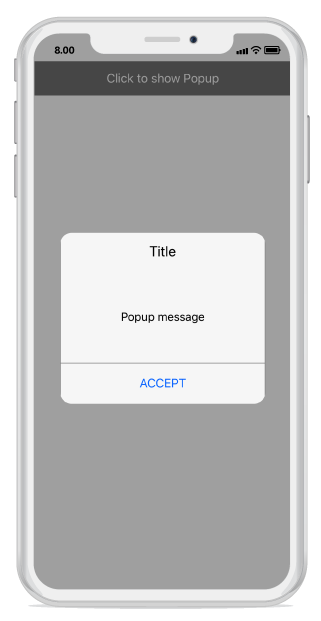

---
layout: post
title: Popup Layouts | SfPopupLayout |Xamarin.iOS | Syncfusion
description: Layouts in SfPopupLayout
platform: Xamarin.iOS
control: SfPopupLayout
documentation: ug
--- 

# How to 

## Hide the header in the SfPopupLayout 

The SfPopupLayout allows hiding the header by using the [SfPopupLayout.PopupView.ShowHeader](https://help.syncfusion.com/cr/cref_files/xamarin-ios/sfpopuplayout/Syncfusion.SfPopupLayout.iOS~Syncfusion.iOS.PopupLayout.PopupView~ShowHeader.html) property. The default value of this property is `true`.

To hide the header in the SfPopupLayout, follow the code example.



//MyViewController.cs

public MyViewController()
{
    ....
    popupLayout = new SfPopupLayout();
    popupLayout.Content = GetContentOfPopup();
    popupLayout.PopupView.ShowHeader = false;
    this.View.AddSubview(popupLayout);
    ....
}



This is how the final output will look like on iOS device.

## Hide the footer in the SfPopupLayout 

The SfPopupLayout allows hiding the footer by using the [SfPopupLayout.PopupView.ShowFooter](https://help.syncfusion.com/cr/cref_files/xamarin-ios/sfpopuplayout/Syncfusion.SfPopupLayout.iOS~Syncfusion.iOS.PopupLayout.PopupView~ShowFooter.html) property. The default value of this property is `true`.

To hide the footer in the SfPopupLayout, follow the code example.



//MyViewController.cs

public MyViewController()
{
    ....
    popupLayout = new SfPopupLayout();
    popupLayout.Content = GetContentOfPopup();
    popupLayout.PopupView.ShowFooter = false;
    this.View.AddSubview(popupLayout);
    ....
}



This is how the final output will look like on iOS device.

## Hide the Close icon in the SfPopupLayout 

The SfPopupLayout allows hiding the Close icon by using the [SfPopupLayout.PopupView.ShowCloseButton](https://help.syncfusion.com/cr/cref_files/xamarin-ios/sfpopuplayout/Syncfusion.SfPopupLayout.iOS~Syncfusion.iOS.PopupLayout.PopupView~ShowCloseButton.html) property. The default value of this property is `true`.

To hide the Close icon in SfPopupLayout, follow the code example.



//MyViewController.cs

public MyViewController()
{
    ....
    popupLayout = new SfPopupLayout();
    popupLayout.Content = GetContentOfPopup();
    popupLayout.PopupView.ShowCloseButton = false;
    this.View.AddSubview(popupLayout);
    ....
}



This is how the final output will look like on iOS device.

## Loading SfPopupLayout in GridTappedEvent of SfDataGrid

SfPopupLayout allows you to open it in the GridTapped event of SfDataGrid.

Refer the below code example to show the popup in Grid tapped event.



using Syncfusion.iOS.PopupLayout;

namespace GettingStarted
{
    public class MyViewController:UIViewController
    {
        SfPopupLayout popupLayout;
        SfDataGrid dataGrid;
        ViewModel viewModel;

        public MyViewController()
        {
            dataGrid = new SfDataGrid();
            viewModel = new ViewModel();
            dataGrid.ItemsSource = viewModel.OrdersInfo;
            dataGrid.GridTapped += DataGrid_GridTapped;

            popupLayout = new SfPopupLayout();
            popupLayout.Content = dataGrid;

            this.View.AddSubview(popupLayout);
        }
        
        private void DataGrid_GridTapped(object sender, GridTappedEventArgs e)
        {
            popupLayout.Show();
        }

        public override void ViewDidLayoutSubviews()
        {
            base.ViewDidLayoutSubviews();
            popupLayout.Frame = new CGRect(0, 20, this.View.Frame.Width, this.View.Frame.Height - 20);
        }
    }
}
