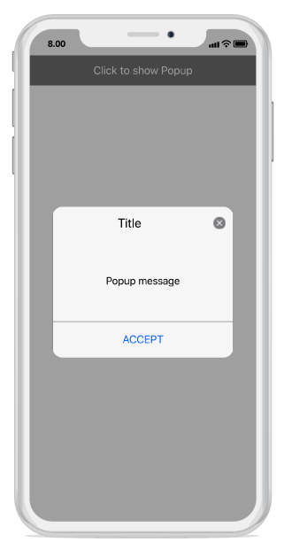
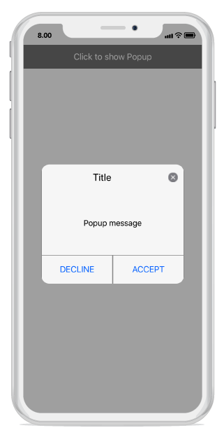
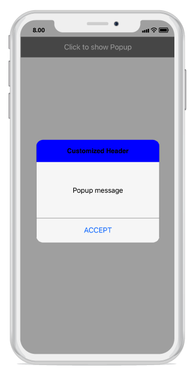
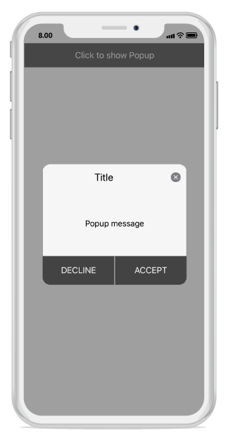
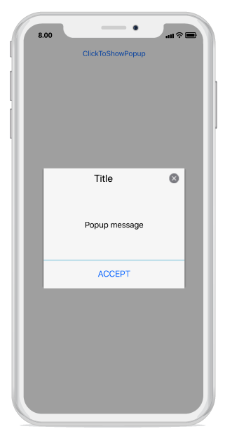

---
layout: post
title: Popup Layouts | SfPopupLayout |Xamarin.iOS | Syncfusion
description: Layouts in SfPopupLayout
platform: Xamarin.iOS
control: SfPopupLayout
documentation: ug
--- 

# Layout Customizations

The SfPopupLayout supports two types of [SfPopupLayout.PopupView.AppearanceMode](https://help.syncfusion.com/cr/cref_files/xamarin-ios/sfpopuplayout/Syncfusion.SfPopupLayout.iOS~Syncfusion.iOS.PopupLayout.AppearanceMode.html). By default, the `AppearanceMode.OneButton` is set. You can change the appearance of the SfPopupLayout by using the `SfPopupLayout.PopupView.AppearanceMode` property.

Two different appearance modes in the SfPopupLayout are as follows.

<table>
<tr>
<th> Modes </th>
<th> Description </th>
</tr>
<tr>
<td> {{'[OneButton](https://help.syncfusion.com/cr/cref_files/xamarin-ios/sfpopuplayout/Syncfusion.SfPopupLayout.iOS~Syncfusion.iOS.PopupLayout.AppearanceMode.html)'| markdownify }} </td>
<td> Shows the SfPopupLayout with one button in the footer view. This is the default value.</td>
</tr>
<tr>
<td> {{'[TwoButton](https://help.syncfusion.com/cr/cref_files/xamarin-ios/sfpopuplayout/Syncfusion.SfPopupLayout.iOS~Syncfusion.iOS.PopupLayout.AppearanceMode.html)'| markdownify }} </td>
<td> Shows the SfPopupLayout with two buttons in the footer view.</td>
</tr>
</table>

## Pop-up with one button in the footer

In the following code example, the `SfPopupLayout.PopupView.AppearanceMode` property is set as `OneButton` which displays only the Accept button in the footer view.



using Syncfusion.iOS.PopupLayout;

namespace GettingStarted
{
    public class MyViewController:UIViewController
    {
        SfPopupLayout popupLayout;
        CustomView customView;
        UIButton showPopupButton;

        public MyViewController()
        {
            popupLayout = new SfPopupLayout();
            popupLayout.Content = GetContentOfPopup();

            //Setting the AppearanceMode as OneButton
            popupLayout.PopupView.AppearanceMode = AppearanceMode.OneButton;

            this.View.AddSubview(popupLayout);
        }
        private UIView GetContentOfPopup()
        {
            customView = new CustomView();
            customView.BackgroundColor = UIColor.White;

            showPopupButton = new UIButton();
            showPopupButton.SetTitle("Click to show Popup", UIControlState.Normal);
            showPopupButton.SetTitleColor(UIColor.White, UIControlState.Normal);
            showPopupButton.BackgroundColor = UIColor.Gray;
            showPopupButton.TouchDown += ShowPopupButton_TouchDown;

            customView.AddSubview(showPopupButton);
            return customView;
        }
        private void ShowPopupButton_TouchDown(object sender, EventArgs e)
        {
            popupLayout.Show();
        }
        public override void ViewDidLayoutSubviews()
        {
            base.ViewDidLayoutSubviews();
            popupLayout.Frame = new CGRect(0, 20, this.View.Frame.Width, this.View.Frame.Height - 20);
        }
    }
}


Executing the above codes renders the following output in an iOS device.

## Pop-up with two buttons in the footer

In the following code example, the `SfPopupLayout.PopupView.AppearanceMode` property is set as `TwoButton` which displays both Accept button and Decline button in the footer view.



using Syncfusion.iOS.PopupLayout;

namespace GettingStarted
{
    public class MyViewController:UIViewController
    {
        SfPopupLayout popupLayout;
        CustomView customView;
        UIButton showPopupButton;

        public MyViewController()
        {
            popupLayout = new SfPopupLayout();
            popupLayout.Content = GetContentOfPopup();

            //Setting the AppearanceMode as TwoButton
            popupLayout.PopupView.AppearanceMode = AppearanceMode.TwoButton;

            this.View.AddSubview(popupLayout);
        }
        private UIView GetContentOfPopup()
        {
            customView = new CustomView();
            customView.BackgroundColor = UIColor.White;

            showPopupButton = new UIButton();
            showPopupButton.SetTitle("Click to show Popup", UIControlState.Normal);
            showPopupButton.SetTitleColor(UIColor.White, UIControlState.Normal);
            showPopupButton.BackgroundColor = UIColor.Gray;
            showPopupButton.TouchDown += ShowPopupButton_TouchDown;

            customView.AddSubview(showPopupButton);
            return customView;
        }
        private void ShowPopupButton_TouchDown(object sender, EventArgs e)
        {
            popupLayout.Show();
        }
        public override void ViewDidLayoutSubviews()
        {
            base.ViewDidLayoutSubviews();
            popupLayout.Frame = new CGRect(0, 20, this.View.Frame.Width, this.View.Frame.Height - 20);
        }
    }
}


Executing the above codes renders the following output in an iOS device.

## Customizing pop-up layouts
 
You can customize the entire view of the pop-up by loading the templates or custom views for the header, body, and footer.

### Header customization

Any view can be added as the header content using the [SfPopupLayout.PopupView.HeaderView](https://help.syncfusion.com/cr/cref_files/xamarin-ios/sfpopuplayout/Syncfusion.SfPopupLayout.iOS~Syncfusion.iOS.PopupLayout.PopupView~HeaderView.html) property to refresh it. Refer to the following code example in which a UILabel is added as a header content.



using Syncfusion.iOS.PopupLayout;

namespace GettingStarted
{
    public class MyViewController:UIViewController
    {
        SfPopupLayout popupLayout;
        CustomView customView;
        UIButton showPopupButton;
        UILabel headerContent;

        public MyViewController()
        {
            popupLayout = new SfPopupLayout();
            popupLayout.Content = GetContentOfPopup();

            headerContent = new UILabel();
            headerContent.Text = "Customized Header";
            headerContent.TextAlignment = UITextAlignment.Center;
            headerContent.BackgroundColor = UIColor.Blue;
            headerContent.Font = UIFont.FromName("Helvetica-Bold", 16);

            // Adding Header view of the SfPopupLayout
            popupLayout.PopupView.HeaderView = headerContent;
            popupLayout.PopupView.ShowCloseButton = false;
            this.View.AddSubview(popupLayout);
        }
        private UIView GetContentOfPopup()
        {
            customView = new CustomView();
            customView.BackgroundColor = UIColor.White;

            showPopupButton = new UIButton();
            showPopupButton.SetTitle("Click to show Popup", UIControlState.Normal);
            showPopupButton.SetTitleColor(UIColor.White, UIControlState.Normal);
            showPopupButton.BackgroundColor = UIColor.Gray;
            showPopupButton.TouchDown += ShowPopupButton_TouchDown;

            customView.AddSubview(showPopupButton);
            return customView;
        }
        private void ShowPopupButton_TouchDown(object sender, EventArgs e)
        {
            popupLayout.Show();
        }
        public override void ViewDidLayoutSubviews()
        {
            base.ViewDidLayoutSubviews();
            popupLayout.Frame = new CGRect(0, 20, this.View.Frame.Width, this.View.Frame.Height - 20);
        }
    }
}


Executing the above codes renders the following output in an iOS device.

### Footer customization

Any view can be added as the footer content using the [SfPopupLayout.PopupView.FooterView](https://help.syncfusion.com/cr/cref_files/xamarin-ios/sfpopuplayout/Syncfusion.SfPopupLayout.iOS~Syncfusion.iOS.PopupLayout.PopupView~FooterView.html) property to refresh it. Refer to the following code example in which a UILabel is added as a footer content.



using Syncfusion.iOS.PopupLayout;

namespace GettingStarted
{
    public class MyViewController:UIViewController
    {
        SfPopupLayout popupLayout;
        CustomView customView;
        UIButton showPopupButton;
        UILabel footerContent;

        public MyViewController()
        {
            popupLayout = new SfPopupLayout();
            popupLayout.Content = GetContentOfPopup();

            footerContent = new UILabel();
            footerContent.Text = "Customized Footer";
            footerContent.TextAlignment = UITextAlignment.Center;
            footerContent.BackgroundColor = UIColor.Blue;
            footerContent.Font = UIFont.FromName("Helvetica-Bold", 16);
           
            // Adding Footer view of the SfPopupLayout
            popupLayout.PopupView.FooterView = footerContent;

            this.View.AddSubview(popupLayout);
        }
        private UIView GetContentOfPopup()
        {
            customView = new CustomView();
            customView.BackgroundColor = UIColor.White;

            showPopupButton = new UIButton();
            showPopupButton.SetTitle("Click to show Popup", UIControlState.Normal);
            showPopupButton.SetTitleColor(UIColor.White, UIControlState.Normal);
            showPopupButton.BackgroundColor = UIColor.Gray;
            showPopupButton.TouchDown += ShowPopupButton_TouchDown;

            customView.AddSubview(showPopupButton);
            return customView;
        }
        private void ShowPopupButton_TouchDown(object sender, EventArgs e)
        {
            popupLayout.Show();
        }
        public override void ViewDidLayoutSubviews()
        {
            base.ViewDidLayoutSubviews();
            popupLayout.Frame = new CGRect(0, 20, this.View.Frame.Width, this.View.Frame.Height - 20);
        }
    }
}


Executing the above codes renders the following output in an iOS device.

## Styles

The SfPopupLayout applies style to all of its elements by using the [SfPopupLayout.PopupView.PopupStyle](https://help.syncfusion.com/cr/cref_files/xamarin-ios/sfpopuplayout/Syncfusion.SfPopupLayout.iOS~Syncfusion.iOS.PopupLayout.PopupView~PopupStyle.html) property.

### Customizing header elements

The SfPopupLayout allows customizing the header elements with various available header customizations.

<table>
<tr>
<th> Property </th>
<th> Description </th>
</tr>
<tr>
<td> {{'[SfPopupLayout.PopupView.PopupStyle.HeaderBackgroundColor](https://help.syncfusion.com/cr/cref_files/xamarin-ios/sfpopuplayout/Syncfusion.SfPopupLayout.iOS~Syncfusion.iOS.PopupLayout.PopupStyle~HeaderBackgroundColor.html)'| markdownify }} </td>
<td>  Gets or sets the background color for the header.</td>
</tr>
<tr>
<td> {{'[SfPopupLayout.PopupView.PopupStyle.HeaderFont](https://help.syncfusion.com/cr/cref_files/xamarin-ios/sfpopuplayout/Syncfusion.SfPopupLayout.iOS~Syncfusion.iOS.PopupLayout.PopupStyle~HeaderFont.html)'| markdownify }} </td>
<td>  Gets or sets the font style for the header title.</td>
</tr>
<tr>
<td> {{'[SfPopupLayout.PopupView.PopupStyle.HeaderFontSize](https://help.syncfusion.com/cr/cref_files/xamarin-ios/sfpopuplayout/Syncfusion.SfPopupLayout.iOS~Syncfusion.iOS.PopupLayout.PopupStyle~HeaderFontSize.html)'| markdownify }} </td>
<td> Gets or sets the font size for the header title.</td>
</tr>
<tr>
<td> {{'[SfPopupLayout.PopupView.PopupStyle.HeaderTextAlignment](https://help.syncfusion.com/cr/cref_files/xamarin-ios/sfpopuplayout/Syncfusion.SfPopupLayout.iOS~Syncfusion.iOS.PopupLayout.PopupStyle~HeaderTextAlignment.html)'| markdownify }} </td>
<td>  Gets or sets the text alignment for the header.</td>
</tr>
<tr>
<td> {{'[SfPopupLayout.PopupView.PopupStyle.HeaderTextColor](https://help.syncfusion.com/cr/cref_files/xamarin-ios/sfpopuplayout/Syncfusion.SfPopupLayout.iOS~Syncfusion.iOS.PopupLayout.PopupStyle~HeaderTextColor.html)'| markdownify }} </td>
<td>  Gets or sets the text color for the header title.</td>
</tr>
</table>

Refer to the following code example for customizing the header elements.



//MyViewController.cs

public MyViewController()
{
    ....
    popupLayout = new SfPopupLayout();
    popupLayout.Content = GetContentOfPopup();
    popupLayout.PopupView.PopupStyle.HeaderBackgroundColor = UIColor.FromRGB(105, 105, 105);
    popupLayout.PopupView.PopupStyle.HeaderFont = "Helvetica-Bold";
    popupLayout.PopupView.PopupStyle.HeaderFontSize = 25;
    popupLayout.PopupView.PopupStyle.HeaderTextAlignment = UITextAlignment.Center;
    popupLayout.PopupView.PopupStyle.HeaderTextColor = UIColor.White;
    this.View.AddSubview(popupLayout);
    ....
}



Executing the above codes renders the following output in an iOS device.

### Customizing footer elements

The SfPopupLayout allows customizing the footer elements with various available footer customizations.

<table>
<tr>
<th> Property </th>
<th> Description </th>
</tr>
<tr>
<td> {{'[SfPopupLayout.PopupView.PopupStyle.FooterBackgroundColor](https://help.syncfusion.com/cr/cref_files/xamarin-ios/sfpopuplayout/Syncfusion.SfPopupLayout.iOS~Syncfusion.iOS.PopupLayout.PopupStyle~FooterBackgroundColor.html)'| markdownify }} </td>
<td>  Gets or sets the background color for the footer.</td>
</tr>
<tr>
<td> {{'[SfPopupLayout.PopupView.PopupStyle.AcceptButtonBackgroundColor](https://help.syncfusion.com/cr/cref_files/xamarin-ios/sfpopuplayout/Syncfusion.SfPopupLayout.iOS~Syncfusion.iOS.PopupLayout.PopupStyle~AcceptButtonBackgroundColor.html)'| markdownify }} </td>
<td>  Gets or sets the background color for the Accept button in the footer.</td>
</tr>
<tr>
<td> {{'[SfPopupLayout.PopupView.PopupStyle.AcceptButtonTextColor](https://help.syncfusion.com/cr/cref_files/xamarin-ios/sfpopuplayout/Syncfusion.SfPopupLayout.iOS~Syncfusion.iOS.PopupLayout.PopupStyle~AcceptButtonTextColor.html)'| markdownify }} </td>
<td>  Gets or sets the foreground color for the Accept button in the footer.</td>
</tr>
<tr>
<td> {{'[SfPopupLayout.PopupView.PopupStyle.DeclineButtonBackgroundColor](https://help.syncfusion.com/cr/cref_files/xamarin-ios/sfpopuplayout/Syncfusion.SfPopupLayout.iOS~Syncfusion.iOS.PopupLayout.PopupStyle~DeclineButtonBackgroundColor.html)'| markdownify }} </td>
<td> Gets or sets the background color for the Decline button in the footer.</td>
</tr>
<tr>
<td> {{'[SfPopupLayout.PopupView.PopupStyle.DeclineButtonTextColor](https://help.syncfusion.com/cr/cref_files/xamarin-ios/sfpopuplayout/Syncfusion.SfPopupLayout.iOS~Syncfusion.iOS.PopupLayout.PopupStyle~DeclineButtonTextColor.html)'| markdownify }} </td>
<td>  Gets or sets the foreground color for the Decline button in the footer.</td>
</tr>
</table>

Refer to the following code example for customizing the header elements.



//MyViewController.cs

public MyViewController()
{
    ....
    popupLayout = new SfPopupLayout();
    popupLayout.Content = GetContentOfPopup();
    popupLayout.PopupView.PopupStyle.FooterBackgroundColor = UIColor.LightGray;
    popupLayout.PopupView.PopupStyle.AcceptButtonBackgroundColor = UIColor.FromRGB(105, 105, 105);
    popupLayout.PopupView.PopupStyle.AcceptButtonTextColor = UIColor.White;
    popupLayout.PopupView.PopupStyle.DeclineButtonBackgroundColor = UIColor.FromRGB(105, 105, 105);
    popupLayout.PopupView.PopupStyle.DeclineButtonTextColor = UIColor.White;
    this.View.AddSubview(popupLayout);
    ....
}



Executing the above codes renders the following output in an iOS device.

### Border customization

The SfPopupLayout allows customizing the border appearance with various available border customizations.

<table>
<tr>
<th> Property </th>
<th> Description </th>
</tr>
<tr>
<td> {{'[SfPopupLayout.PopupView.PopupStyle.BorderColor](https://help.syncfusion.com/cr/cref_files/xamarin-ios/sfpopuplayout/Syncfusion.SfPopupLayout.iOS~Syncfusion.iOS.PopupLayout.PopupStyle~BorderColor.html)'| markdownify }} </td>
<td>  Gets or sets the border color for the PopupView.</td>
</tr>
<tr>
<td> {{'[SfPopupLayout.PopupView.PopupStyle.BorderThickness](https://help.syncfusion.com/cr/cref_files/xamarin-ios/sfpopuplayout/Syncfusion.SfPopupLayout.iOS~Syncfusion.iOS.PopupLayout.PopupStyle~BorderThickness.html)'| markdownify }} </td>
<td>  Gets or sets the border thickness for the PopupView.</td>
</tr>
<tr>
<td> {{'[SfPopupLayout.PopupView.PopupStyle.CornerRadius](https://help.syncfusion.com/cr/cref_files/xamarin-ios/sfpopuplayout/Syncfusion.SfPopupLayout.iOS~Syncfusion.iOS.PopupLayout.PopupStyle~CornerRadius.html)'| markdownify }} </td>
<td>  Gets or sets the corner radius for the PopupView.</td>
</tr>
</table>

Refer to the following code example for customizing the border elements.



//MyViewController.cs

public MyViewController()
{
    ....
    popupLayout = new SfPopupLayout();
    popupLayout.Content = GetContentOfPopup();
    popupLayout.PopupView.PopupStyle.BorderColor = UIColor.Blue;
    popupLayout.PopupView.PopupStyle.BorderThickness = 3;
    popupLayout.PopupView.PopupStyle.CornerRadius = 5;
    this.View.AddSubview(popupLayout);
    ....
}



Executing the above codes renders the following output in an iOS device.

