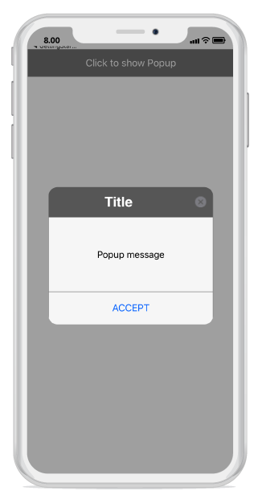

---
layout: post
title: Popup Layouts | SfPopupLayout |Xamarin.iOS | Syncfusion
description: Layouts in SfPopupLayout
platform: Xamarin.iOS
control: SfPopupLayout
documentation: ug
--- 

# Layout Customizations

SfPopupLayout supports two types of [SfPopupLayout.PopupView.AppearanceMode](https://help.syncfusion.com/cr/cref_files/xamarin-ios/sfpopuplayout/Syncfusion.SfPopupLayout.iOS~Syncfusion.iOS.PopupLayout.AppearanceMode.html). By default, "AppearanceMode.OneButton" is set. You can change the appearance of the SfPopupLayout by using `SfPopupLayout.PopupView.AppearanceMode` property.
Two different appearance mode in SfPopupLayout as listed below.

<table>
<tr>
<th> Modes </th>
<th> Description </th>
</tr>
<tr>
<td> {{'[OneButton](https://help.syncfusion.com/cr/cref_files/xamarin-ios/sfpopuplayout/Syncfusion.SfPopupLayout.iOS~Syncfusion.iOS.PopupLayout.AppearanceMode.html)'| markdownify }} </td>
<td> Shows SfPopupLayout with OneButton in the FooterView. This is the default value.</td>
</tr>
<tr>
<td> {{'[TwoButton](https://help.syncfusion.com/cr/cref_files/xamarin-ios/sfpopuplayout/Syncfusion.SfPopupLayout.iOS~Syncfusion.iOS.PopupLayout.AppearanceMode.html)'| markdownify }} </td>
<td> Shows SfPopupLayout with TwoButtons in the FooterView.</td>
</tr>
</table>

## Popup with one button in the footer

In the below code example we have set `SfPopupLayout.PopupView.AppearanceMode` property as `OneButton` which displays only AcceptButton in the FooterView.

### Type A:



using Syncfusion.iOS.PopupLayout;

namespace GettingStarted
{
    public class MyViewController:UIViewController
    {
        SfPopupLayout popupLayout;
        CustomView customView;
        UIButton showPopupButton;

        public MyViewController()
        {
            popupLayout = new SfPopupLayout();
            popupLayout.Content = GetContentOfPopup();

            //Setting the AppearanceMode as OneButton
            popupLayout.PopupView.AppearanceMode = AppearanceMode.OneButton;

            this.View.AddSubview(popupLayout);
        }
        private UIView GetContentOfPopup()
        {
            customView = new CustomView();
            customView.BackgroundColor = UIColor.White;

            showPopupButton = new UIButton();
            showPopupButton.SetTitle("Click to show Popup", UIControlState.Normal);
            showPopupButton.SetTitleColor(UIColor.White, UIControlState.Normal);
            showPopupButton.BackgroundColor = UIColor.Gray;
            showPopupButton.TouchDown += ShowPopupButton_TouchDown;

            customView.AddSubview(showPopupButton);
            return customView;
        }
        private void ShowPopupButton_TouchDown(object sender, EventArgs e)
        {
            popupLayout.Show();
        }
        public override void ViewDidLayoutSubviews()
        {
            base.ViewDidLayoutSubviews();
            popupLayout.Frame = new CGRect(0, 20, this.View.Frame.Width, this.View.Frame.Height - 20);
        }
    }
}


If we run the above sample with `AppearanceMode` as `OneButton`, the output will appear on iOS device as shown below.

## Popup with two buttons in the footer

In the below code example we have set `SfPopupLayout.PopupView.AppearanceMode` property as `TwoButton` which displays only AcceptButton in the FooterView.

### Type A:



using Syncfusion.iOS.PopupLayout;

namespace GettingStarted
{
    public class MyViewController:UIViewController
    {
        SfPopupLayout popupLayout;
        CustomView customView;
        UIButton showPopupButton;

        public MyViewController()
        {
            popupLayout = new SfPopupLayout();
            popupLayout.Content = GetContentOfPopup();

            //Setting the AppearanceMode as TwoButton
            popupLayout.PopupView.AppearanceMode = AppearanceMode.TwoButton;

            this.View.AddSubview(popupLayout);
        }
        private UIView GetContentOfPopup()
        {
            customView = new CustomView();
            customView.BackgroundColor = UIColor.White;

            showPopupButton = new UIButton();
            showPopupButton.SetTitle("Click to show Popup", UIControlState.Normal);
            showPopupButton.SetTitleColor(UIColor.White, UIControlState.Normal);
            showPopupButton.BackgroundColor = UIColor.Gray;
            showPopupButton.TouchDown += ShowPopupButton_TouchDown;

            customView.AddSubview(showPopupButton);
            return customView;
        }
        private void ShowPopupButton_TouchDown(object sender, EventArgs e)
        {
            popupLayout.Show();
        }
        public override void ViewDidLayoutSubviews()
        {
            base.ViewDidLayoutSubviews();
            popupLayout.Frame = new CGRect(0, 20, this.View.Frame.Width, this.View.Frame.Height - 20);
        }
    }
}


If we run the above sample with `AppearanceMode` as `TwoButton`, the output will appear on iOS device as shown below.

## Customizing Popup Layouts
 
You can also customize the entire view of the popup by loading templates or custom views individually for the header, body and footer of the popup.

### Header customization

Any view can be added as the header content using the [SfPopupLayout.PopupView.HeaderView](https://help.syncfusion.com/cr/cref_files/xamarin-ios/sfpopuplayout/Syncfusion.SfPopupLayout.iOS~Syncfusion.iOS.PopupLayout.PopupView~HeaderView.html) property to refresh it. Refer to the following code example in which a UILabel is added as a header content:

#### Type A:



using Syncfusion.iOS.PopupLayout;

namespace GettingStarted
{
    public class MyViewController:UIViewController
    {
        SfPopupLayout popupLayout;
        CustomView customView;
        UIButton showPopupButton;
        UILabel headerContent;

        public MyViewController()
        {
            popupLayout = new SfPopupLayout();
            popupLayout.Content = GetContentOfPopup();

            headerContent = new UILabel();
            headerContent.Text = "Customized Header";
            headerContent.TextAlignment = UITextAlignment.Center;
            headerContent.BackgroundColor = UIColor.Blue;
            headerContent.Font = UIFont.FromName("Helvetica-Bold", 16);

            // Adding Header view of the SfPopupLayout
            popupLayout.PopupView.HeaderView = headerContent;
            this.View.AddSubview(popupLayout);
        }
        private UIView GetContentOfPopup()
        {
            customView = new CustomView();
            customView.BackgroundColor = UIColor.White;

            showPopupButton = new UIButton();
            showPopupButton.SetTitle("Click to show Popup", UIControlState.Normal);
            showPopupButton.SetTitleColor(UIColor.White, UIControlState.Normal);
            showPopupButton.BackgroundColor = UIColor.Gray;
            showPopupButton.TouchDown += ShowPopupButton_TouchDown;

            customView.AddSubview(showPopupButton);
            return customView;
        }
        private void ShowPopupButton_TouchDown(object sender, EventArgs e)
        {
            popupLayout.Show();
        }
        public override void ViewDidLayoutSubviews()
        {
            base.ViewDidLayoutSubviews();
            popupLayout.Frame = new CGRect(0, 20, this.View.Frame.Width, this.View.Frame.Height - 20);
        }
    }
}


This is how the final output will look like on iOS device.

### Footer customization

Any view can be added as the header content using the [SfPopupLayout.PopupView.FooterView](https://help.syncfusion.com/cr/cref_files/xamarin-ios/sfpopuplayout/Syncfusion.SfPopupLayout.iOS~Syncfusion.iOS.PopupLayout.PopupView~FooterView.html) property to refresh it. Refer to the following code example in which a UILabel is added as a header content:

#### Type A:



using Syncfusion.iOS.PopupLayout;

namespace GettingStarted
{
    public class MyViewController:UIViewController
    {
        SfPopupLayout popupLayout;
        CustomView customView;
        UIButton showPopupButton;
        UILabel footerContent;

        public MyViewController()
        {
            popupLayout = new SfPopupLayout();
            popupLayout.Content = GetContentOfPopup();

            footerContent = new UILabel();
            footerContent.Text = "Customized Footer";
            footerContent.TextAlignment = UITextAlignment.Center;
            footerContent.BackgroundColor = UIColor.Blue;
            footerContent.Font = UIFont.FromName("Helvetica-Bold", 16);
           
            // Adding Footer view of the SfPopupLayout
            popupLayout.PopupView.FooterView = footerContent;

            this.View.AddSubview(popupLayout);
        }
        private UIView GetContentOfPopup()
        {
            customView = new CustomView();
            customView.BackgroundColor = UIColor.White;

            showPopupButton = new UIButton();
            showPopupButton.SetTitle("Click to show Popup", UIControlState.Normal);
            showPopupButton.SetTitleColor(UIColor.White, UIControlState.Normal);
            showPopupButton.BackgroundColor = UIColor.Gray;
            showPopupButton.TouchDown += ShowPopupButton_TouchDown;

            customView.AddSubview(showPopupButton);
            return customView;
        }
        private void ShowPopupButton_TouchDown(object sender, EventArgs e)
        {
            popupLayout.Show();
        }
        public override void ViewDidLayoutSubviews()
        {
            base.ViewDidLayoutSubviews();
            popupLayout.Frame = new CGRect(0, 20, this.View.Frame.Width, this.View.Frame.Height - 20);
        }
    }
}


This is how the final output will look like on iOS device.

### How to hide Header in SfPopupLayout ?

SfPopupLayout allows you to hide the Header by using [SfPopupLayout.PopupView.ShowHeader](https://help.syncfusion.com/cr/cref_files/xamarin-ios/sfpopuplayout/Syncfusion.SfPopupLayout.iOS~Syncfusion.iOS.PopupLayout.PopupView~ShowHeader.html) property. The default value of this property is `true`.

To hide the header in SfPopupLayout, follow the code example:



//MyViewController.cs

public MyViewController()
{
    ....
    popupLayout = new SfPopupLayout();
    popupLayout.Content = GetContentOfPopup();
    popupLayout.PopupView.ShowHeader = false;
    this.View.AddSubview(popupLayout);
    ....
}



This is how the final output will look like on iOS device.

### How to hide Footer in SfPopupLayout ?

SfPopupLayout allows you to hide the Header by using [SfPopupLayout.PopupView.ShowFooter](https://help.syncfusion.com/cr/cref_files/xamarin-ios/sfpopuplayout/Syncfusion.SfPopupLayout.iOS~Syncfusion.iOS.PopupLayout.PopupView~ShowFooter.html) property. The default value of this property is `true`.

To hide the footer in SfPopupLayout, follow the code example:



//MyViewController.cs

public MyViewController()
{
    ....
    popupLayout = new SfPopupLayout();
    popupLayout.Content = GetContentOfPopup();
    popupLayout.PopupView.ShowFooter = false;
    this.View.AddSubview(popupLayout);
    ....
}



This is how the final output will look like on iOS device.

### How to hide the close button in SfPopupLayout ?

SfPopupLayout allows you to hide the Close button by using [SfPopupLayout.PopupView.ShowCloseButton](https://help.syncfusion.com/cr/cref_files/xamarin-ios/sfpopuplayout/Syncfusion.SfPopupLayout.iOS~Syncfusion.iOS.PopupLayout.PopupView~ShowCloseButton.html) property. The default value of this property is `true`.

To hide the close button in SfPopupLayout, follow the code example:



//MyViewController.cs

public MyViewController()
{
    ....
    popupLayout = new SfPopupLayout();
    popupLayout.Content = GetContentOfPopup();
    popupLayout.PopupView.ShowCloseButton = false;
    this.View.AddSubview(popupLayout);
    ....
}



This is how the final output will look like on iOS device.

# Styles

SfPopupLayout allows you to apply style to all of its elements by using [SfPopupLayout.PopupView.PopupStyle](https://help.syncfusion.com/cr/cref_files/xamarin-ios/sfpopuplayout/Syncfusion.SfPopupLayout.iOS~Syncfusion.iOS.PopupLayout.PopupView~PopupStyle.html) property.

## Customizing Header elements

SfPopupLayout allows you to customize header elements. Refer the below table for available header customization.

<table>
<tr>
<th> Property </th>
<th> Description </th>
</tr>
<tr>
<td> {{'[SfPopupLayout.PopupView.PopupStyle.HeaderBackgroundColor](https://help.syncfusion.com/cr/cref_files/xamarin-ios/sfpopuplayout/Syncfusion.SfPopupLayout.iOS~Syncfusion.iOS.PopupLayout.PopupStyle~HeaderBackgroundColor.html)'| markdownify }} </td>
<td>  Gets or sets the background color to be applied for the header.</td>
</tr>
<tr>
<td> {{'[SfPopupLayout.PopupView.PopupStyle.HeaderFont](https://help.syncfusion.com/cr/cref_files/xamarin-ios/sfpopuplayout/Syncfusion.SfPopupLayout.iOS~Syncfusion.iOS.PopupLayout.PopupStyle~HeaderFont.html)'| markdownify }} </td>
<td>  Gets or sets the font style to be applied for the header title.</td>
</tr>
<tr>
<td> {{'[SfPopupLayout.PopupView.PopupStyle.HeaderFontSize](https://help.syncfusion.com/cr/cref_files/xamarin-ios/sfpopuplayout/Syncfusion.SfPopupLayout.iOS~Syncfusion.iOS.PopupLayout.PopupStyle~HeaderFontSize.html)'| markdownify }} </td>
<td> Gets or sets the font size of the header title.</td>
</tr>
<tr>
<td> {{'[SfPopupLayout.PopupView.PopupStyle.HeaderTextAlignment](https://help.syncfusion.com/cr/cref_files/xamarin-ios/sfpopuplayout/Syncfusion.SfPopupLayout.iOS~Syncfusion.iOS.PopupLayout.PopupStyle~HeaderTextAlignment.html)'| markdownify }} </td>
<td>  Gets or sets the text alignment of the header.</td>
</tr>
<tr>
<td> {{'[SfPopupLayout.PopupView.PopupStyle.HeaderTextColor](https://help.syncfusion.com/cr/cref_files/xamarin-ios/sfpopuplayout/Syncfusion.SfPopupLayout.iOS~Syncfusion.iOS.PopupLayout.PopupStyle~HeaderTextColor.html)'| markdownify }} </td>
<td>  Gets or sets the text color to be applied for the header title.</td>
</tr>
</table>

Refer the below code example for customizing the header elements.



//MyViewController.cs

public MyViewController()
{
    ....
    popupLayout = new SfPopupLayout();
    popupLayout.Content = GetContentOfPopup();
    popupLayout.PopupView.PopupStyle.HeaderBackgroundColor = UIColor.Blue;
    popupLayout.PopupView.PopupStyle.HeaderFont = "Helvetica-Bold";
    popupLayout.PopupView.PopupStyle.HeaderFontSize = 25;
    popupLayout.PopupView.PopupStyle.HeaderTextAlignment = UITextAlignment.Center;
    popupLayout.PopupView.PopupStyle.HeaderTextColor = UIColor.White;
    this.View.AddSubview(popupLayout);
    ....
}



This is how the final output will look like on iOS device.

## Customizing Footer elements

SfPopupLayout allows you to customize footer elements. Refer the below table for available footer customization.

<table>
<tr>
<th> Property </th>
<th> Description </th>
</tr>
<tr>
<td> {{'[SfPopupLayout.PopupView.PopupStyle.FooterBackgroundColor](https://help.syncfusion.com/cr/cref_files/xamarin-ios/sfpopuplayout/Syncfusion.SfPopupLayout.iOS~Syncfusion.iOS.PopupLayout.PopupStyle~FooterBackgroundColor.html)'| markdownify }} </td>
<td>  Gets the background color of the footer.</td>
</tr>
<tr>
<td> {{'[SfPopupLayout.PopupView.PopupStyle.AcceptButtonBackgroundColor](https://help.syncfusion.com/cr/cref_files/xamarin-ios/sfpopuplayout/Syncfusion.SfPopupLayout.iOS~Syncfusion.iOS.PopupLayout.PopupStyle~AcceptButtonBackgroundColor.html)'| markdownify }} </td>
<td>  Gets or sets the background color of the accept button in the footer.</td>
</tr>
<tr>
<td> {{'[SfPopupLayout.PopupView.PopupStyle.AcceptButtonTextColor](https://help.syncfusion.com/cr/cref_files/xamarin-ios/sfpopuplayout/Syncfusion.SfPopupLayout.iOS~Syncfusion.iOS.PopupLayout.PopupStyle~AcceptButtonTextColor.html)'| markdownify }} </td>
<td>  Gets or sets the foreground color of the accept button in the footer.</td>
</tr>
<tr>
<td> {{'[SfPopupLayout.PopupView.PopupStyle.DeclineButtonBackgroundColor](https://help.syncfusion.com/cr/cref_files/xamarin-ios/sfpopuplayout/Syncfusion.SfPopupLayout.iOS~Syncfusion.iOS.PopupLayout.PopupStyle~DeclineButtonBackgroundColor.html)'| markdownify }} </td>
<td> Gets or sets the background color of the decline button in the footer.</td>
</tr>
<tr>
<td> {{'[SfPopupLayout.PopupView.PopupStyle.DeclineButtonTextColor](https://help.syncfusion.com/cr/cref_files/xamarin-ios/sfpopuplayout/Syncfusion.SfPopupLayout.iOS~Syncfusion.iOS.PopupLayout.PopupStyle~DeclineButtonTextColor.html)'| markdownify }} </td>
<td>  Gets or sets the foreground color of the decline button in the footer.</td>
</tr>
</table>

Refer the below code example for customizing the header elements.



//MyViewController.cs

public MyViewController()
{
    ....
    popupLayout = new SfPopupLayout();
    popupLayout.Content = GetContentOfPopup();
    popupLayout.PopupView.PopupStyle.FooterBackgroundColor = UIColor.LightGray;
    popupLayout.PopupView.PopupStyle.AcceptButtonBackgroundColor = UIColor.DarkGray;
    popupLayout.PopupView.PopupStyle.AcceptButtonTextColor = UIColor.White;
    popupLayout.PopupView.PopupStyle.DeclineButtonBackgroundColor = UIColor.DarkGray;
    popupLayout.PopupView.PopupStyle.DeclineButtonTextColor = UIColor.White;
    this.View.AddSubview(popupLayout);
    ....
}



This is how the final output will look like on iOS device.

## Border Customization

SfPopupLayout allows you to customize border appearance. Refer the below table for available customization for border.

<table>
<tr>
<th> Property </th>
<th> Description </th>
</tr>
<tr>
<td> {{'[SfPopupLayout.PopupView.PopupStyle.BorderColor](https://help.syncfusion.com/cr/cref_files/xamarin-ios/sfpopuplayout/Syncfusion.SfPopupLayout.iOS~Syncfusion.iOS.PopupLayout.PopupStyle~BorderColor.html)'| markdownify }} </td>
<td>  Gets or sets the border color for the PopupView.</td>
</tr>
<tr>
<td> {{'[SfPopupLayout.PopupView.PopupStyle.BorderThickness](https://help.syncfusion.com/cr/cref_files/xamarin-ios/sfpopuplayout/Syncfusion.SfPopupLayout.iOS~Syncfusion.iOS.PopupLayout.PopupStyle~BorderThickness.html)'| markdownify }} </td>
<td>  Gets or sets the border thickness for the PopupView.</td>
</tr>
<tr>
<td> {{'[SfPopupLayout.PopupView.PopupStyle.CornerRadius](https://help.syncfusion.com/cr/cref_files/xamarin-ios/sfpopuplayout/Syncfusion.SfPopupLayout.iOS~Syncfusion.iOS.PopupLayout.PopupStyle~CornerRadius.html)'| markdownify }} </td>
<td>  Gets or sets the corner radius for the PopupView.</td>
</tr>
</table>

Refer the below code example for customizing the border elements.



//MyViewController.cs

public MyViewController()
{
    ....
    popupLayout = new SfPopupLayout();
    popupLayout.Content = GetContentOfPopup();
    popupLayout.PopupView.PopupStyle.BorderColor = UIColor.Blue;
    popupLayout.PopupView.PopupStyle.BorderThickness = 3;
    popupLayout.PopupView.PopupStyle.CornerRadius = 5;
    this.View.AddSubview(popupLayout);
    ....
}


