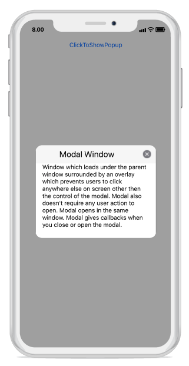

---
layout: post
title: Model Window Popup | SfPopupLayout |Xamarin.iOS | Syncfusion
description: Model Window Popup with SfPopupLayout
platform: Xamarin.iOS
control: SfPopupLayout
documentation: ug
--- 

# Model Window Popup

You can use pop-up layout as model window by using the built-in close icon and [SfPopupLayout.StaysOpen](https://help.syncfusion.com/cr/cref_files/xamarin-ios/sfpopuplayout/Syncfusion.SfPopupLayout.iOS~Syncfusion.iOS.PopupLayout.SfPopupLayout~StaysOpen.html) to prevent the user from interacting with your application until they close the window.

Model Window will loads under the parent window surrounded by the overlay which prevents users to click anywhere else on screen other then the content of the modal.

Modal also doesn't require any user action to open.

Modal opens in the same window.

Modal gives callbacks when you close or open the modal.

Refer the below code example in which popup will close only if you click cancel button, ok button or close icon with toast message displayed from popup footer button clicked callback.



using Syncfusion.iOS.PopupLayout;

namespace GettingStarted
{
    public class MyViewController:UIViewController
    {
        SfPopupLayout popupLayout;
        UILabel popupContentView;
        CustomView customView;
        UIButton showPopupButton;
        UILabel toastMessage;
       
        public MyViewController()
        {
            popupLayout = new SfPopupLayout();

            popupContentView = new UILabel();
            popupContentView.Text = "Window which loads under the parent window surrounded by the overlay which prevents users to click anywhere else on screen other then the content of the modal.Modal also doesn't require any user action to open.Modal opens in the same window.Modal gives callbacks when you close or open the modal.";
            popupContentView.TextColor = UIColor.Black;
            popupContentView.BackgroundColor = UIColor.Cyan;
            popupContentView.TextAlignment = UITextAlignment.Center;

            popupLayout.PopupView.AcceptButtonClicked += PopupView_AcceptButtonClicked;
            popupLayout.PopupView.DeclineButtonClicked += PopupView_DeclineButtonClicked;
            popupLayout.PopupView.AppearanceMode = AppearanceMode.TwoButton;
            popupLayout.PopupView.AcceptButtonText = "OK";
            popupLayout.PopupView.DeclineButtonText = "Cancel";
            popupLayout.PopupView.HeaderTitle = "Model Window";

            popupLayout.Content = GetContentOfPopup();
            this.View.AddSubview(popupLayout);
        }

        private void PopupView_DeclineButtonClicked(object sender, System.ComponentModel.CancelEventArgs e)
        {
            popupLayout.IsOpen = false;
            DisplayToast();
        }

        private void PopupView_AcceptButtonClicked(object sender, System.ComponentModel.CancelEventArgs e)
        {
            popupLayout.IsOpen = false;
            DisplayToast();
        }

        private void DisplayToast()
        {
            toastMessage = new UILabel();
            toastMessage.Hidden = false;
            toastMessage.Text = "Popup Closed";
            toastMessage.Layer.CornerRadius = 20f;
            toastMessage.TextColor = UIColor.White;
            toastMessage.TextAlignment = UITextAlignment.Center;
            toastMessage.ClipsToBounds = true;
            toastMessage.Font = UIFont.SystemFontOfSize(14);
            toastMessage.BackgroundColor = UIColor.FromRGB(169, 169, 169);
            this.View.AddSubview(toastMessage);
            toastMessage.Frame = new CGRect((this.View.Frame.Right / 4), this.View.Frame.Bottom - 150, 200, 40);
            UIView.Animate(0.5, 0, UIViewAnimationOptions.CurveLinear, () =>
            {
                toastMessage.Alpha = 1.0f;
            },
                () =>
                {
                    UIView.Animate(3.0, () =>
                    {
                        toastMessage.Alpha = 0.0f;
                    });
                }
            );

        }

        private UIView GetContentOfPopup()
        {
            customView = new CustomView();
            customView.BackgroundColor = UIColor.White;

            showPopupButton = new UIButton();
            showPopupButton.SetTitle("Click to show Popup", UIControlState.Normal);
            showPopupButton.SetTitleColor(UIColor.White, UIControlState.Normal);
            showPopupButton.BackgroundColor = UIColor.Gray;
            showPopupButton.TouchDown += ShowPopupButton_TouchDown;

            customView.AddSubview(showPopupButton);
            return customView;
        }
        private void ShowPopupButton_TouchDown(object sender, EventArgs e)
        {
            // Below code ensures that the popup doesnot collapse when user interacts outside the popup.
            popupLayout.StaysOpen = true;
            popupLayout.PopupView.ShowCloseButton = true;
            popupLayout.IsOpen = true;   
        }
        public override void ViewDidLayoutSubviews()
        {
            base.ViewDidLayoutSubviews();
            popupLayout.Frame = new CGRect(0, 20, this.View.Frame.Width, this.View.Frame.Height - 20);
        }
    }
}



// CustomView.cs

public class CustomView : UIView
{
    public CustomView() : base()
    {
    }
    public override void LayoutSubviews()
    {
        base.LayoutSubviews();
        this.Subviews[0].Frame = new CGRect(0, 20, this.Frame.Right, 50);
    }
}


If we run the above sample, the below output will appears on iOS device as shown below.
