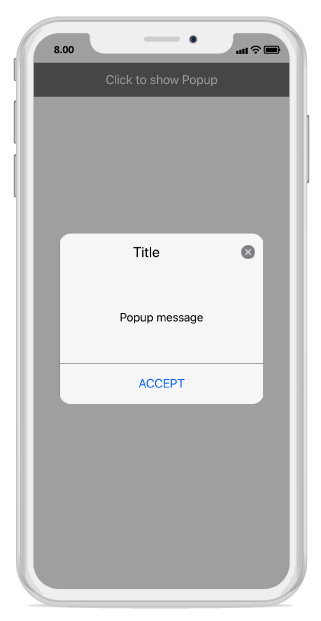
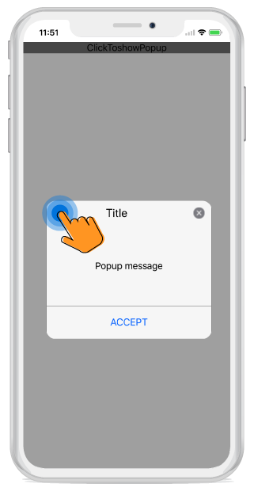

---
layout: post
title: Popup positioning | SfPopupLayout |Xamarin.iOS | Syncfusion
description: Positioning capabilities of SfPopupLayout
platform: Xamarin.iOS
control: SfPopupLayout
documentation: ug
--- 

### Showing SfPopupLayout at various position

SfPopupLayout allows you to show the Popup content at various position based on the requirement.

Following are the list of options available to show SfPopupLayout at various position.

<table>
<tr>
<th> Methods / Property </th>
<th> Description </th>
</tr>
<tr>
<td> {{'[SfPopupLayout.IsOpen](https://help.syncfusion.com/cr/cref_files/xamarin-ios/sfpopuplayout/Syncfusion.SfPopupLayout.iOS~Syncfusion.iOS.PopupLayout.SfPopupLayout~IsOpen.html)'| markdownify }} </td>
<td> Shows SfPopupLayout at the center.</td>
</tr>
<tr>
<td> {{'[SfPopupLayout.Show()](https://help.syncfusion.com/cr/cref_files/xamarin-ios/sfpopuplayout/Syncfusion.SfPopupLayout.iOS~Syncfusion.iOS.PopupLayout.SfPopupLayout~Show.html)'| markdownify }} </td>
<td> It is similar to SfPopupLayout.IsOpen property.</td>
</tr>
<tr>
<td> {{'[popupLayout.Show(x-position, y-position)](https://help.syncfusion.com/cr/cref_files/xamarin-ios/sfpopuplayout/Syncfusion.SfPopupLayout.iOS~Syncfusion.iOS.PopupLayout.SfPopupLayout~Show.html)'| markdownify }} </td>
<td> Shows SfPopupLayout at the specified X and y position.</td>
</tr>
<tr>
<td> {{'[popupLayout.ShowAtTouchPoint()](https://help.syncfusion.com/cr/cref_files/xamarin-ios/sfpopuplayout/Syncfusion.SfPopupLayout.iOS~Syncfusion.iOS.PopupLayout.SfPopupLayout~ShowAtTouchPoint.html)'| markdownify }} </td>
<td> Shows SfPopupLayout at the touch point.</td>
</tr>
<tr>
<td> {{'[popupLayout.ShowRelativeToView(View, RelativePosition)](https://help.syncfusion.com/cr/cref_files/xamarin-ios/sfpopuplayout/Syncfusion.SfPopupLayout.iOS~Syncfusion.iOS.PopupLayout.SfPopupLayout~ShowRelativeToView.html)'| markdownify }} </td>
<td> Shows SfPopupLayout at the position relative to the specified view.</td>
</tr>
</table>

#### IsOpen Property

In the below code example we have open the SfPopupLayout by using `SfPopupLayout.IsOpen` property.

##### Type A:


using Syncfusion.iOS.PopupLayout;

namespace GettingStarted
{
    public class MyViewController:UIViewController
    {
        SfPopupLayout popupLayout;
        CustomView customView;
        UIButton showPopupButton;
        
        public MyViewController()
        {
            popupLayout = new SfPopupLayout();
            popupLayout.Content = GetContentOfPopup();
            this.View.AddSubview(popupLayout);
        }
        private UIView GetContentOfPopup()
        {
            customView = new CustomView();
            customView.BackgroundColor = UIColor.White;

            showPopupButton = new UIButton();
            showPopupButton.SetTitle("Click to show Popup", UIControlState.Normal);
            showPopupButton.SetTitleColor(UIColor.White, UIControlState.Normal);
            showPopupButton.BackgroundColor = UIColor.Gray;
            showPopupButton.TouchDown += ShowPopupButton_TouchDown;
            customView.AddSubview(showPopupButton);

            return customView;
        }
        private void ShowPopupButton_TouchDown(object sender, EventArgs e)
        {
              popupLayout.IsOpen = true;
        }
        public override void ViewDidLayoutSubviews()
        {
            base.ViewDidLayoutSubviews();
            popupLayout.Frame = new CGRect(0, 20, this.View.Frame.Width, this.View.Frame.Height - 20);
        }
    }
}


N > SfPopupLayout.IsOpen property is not applicable for Type B.

If we run the above sample, the below output will appear on iOS device as shown below.

#### SfPopupLayout.Show()

In the below code example we have open the SfPopupLayout by using `SfPopupLayout.Show()`.

##### Type A:



using Syncfusion.iOS.PopupLayout;

namespace GettingStarted
{
    public class MyViewController:UIViewController
    {
        SfPopupLayout popupLayout;
        CustomView customView;
        UIButton showPopupButton;
        
        public MyViewController()
        {
            popupLayout = new SfPopupLayout();
            popupLayout.Content = GetContentOfPopup();
            this.View.AddSubview(popupLayout);
        }
        private UIView GetContentOfPopup()
        {
            customView = new CustomView();
            customView.BackgroundColor = UIColor.White;

            showPopupButton = new UIButton();
            showPopupButton.SetTitle("Click to show Popup", UIControlState.Normal);
            showPopupButton.SetTitleColor(UIColor.White, UIControlState.Normal);
            showPopupButton.BackgroundColor = UIColor.Gray;
            showPopupButton.TouchDown += ShowPopupButton_TouchDown;
            customView.AddSubview(showPopupButton);

            return customView;
        }
        private void ShowPopupButton_TouchDown(object sender, EventArgs e)
        {
            //Shows SfPopupLayout at the center of the view.
            popupLayout.Show();  
        }
        public override void ViewDidLayoutSubviews()
        {
            base.ViewDidLayoutSubviews();
            popupLayout.Frame = new CGRect(0, 20, this.View.Frame.Width, this.View.Frame.Height - 20);
        }
    }
}


If we run the above sample, the below output will appear on iOS device as shown below.

#### SfPopupLayout.Show(x-position, y-position)

In the below code example we have open the SfPopupLayout by using `SfPopupLayout.Show(x-position, y-position)`.

##### Type A:



using Syncfusion.iOS.PopupLayout;

namespace GettingStarted
{
    public class MyViewController:UIViewController
    {
        SfPopupLayout popupLayout;
        CustomView customView;
        UIButton showPopupButton;
        
        public MyViewController()
        {
            popupLayout = new SfPopupLayout();
            popupLayout.Content = GetContentOfPopup();
            this.View.AddSubview(popupLayout);
        }
        private UIView GetContentOfPopup()
        {
            customView = new CustomView();
            customView.BackgroundColor = UIColor.White;

            showPopupButton = new UIButton();
            showPopupButton.SetTitle("Click to show Popup", UIControlState.Normal);
            showPopupButton.SetTitleColor(UIColor.White, UIControlState.Normal);
            showPopupButton.BackgroundColor = UIColor.Gray;
            showPopupButton.TouchDown += ShowPopupButton_TouchDown;
            customView.AddSubview(showPopupButton);

            return customView;
        }
        private void ShowPopupButton_TouchDown(object sender, EventArgs e)
        {
            //Shows SfPopupLayout at x-position 100 and y position 100.
            popupLayout.Show(100, 100);  

        }
        public override void ViewDidLayoutSubviews()
        {
            base.ViewDidLayoutSubviews();
            popupLayout.Frame = new CGRect(0, 20, this.View.Frame.Width, this.View.Frame.Height - 20);
        }
    }
}


If we run the above sample, the below output will appear on iOS device as shown below.

#### SfPopupLayout.ShowAtTouchPoint()

In the below code example we have open the SfPopupLayout by using `SfPopupLayout.ShowAtTouchPoint()`.

##### Type A:



using Syncfusion.iOS.PopupLayout;

namespace GettingStarted
{
    public class MyViewController:UIViewController
    {
        SfPopupLayout popupLayout;
        CustomView customView;
        UIButton showPopupButton;
        
        public MyViewController()
        {
            popupLayout = new SfPopupLayout();
            popupLayout.Content = GetContentOfPopup();
            this.View.AddSubview(popupLayout);
        }
        private UIView GetContentOfPopup()
        {
            customView = new CustomView();
            customView.BackgroundColor = UIColor.White;

            showPopupButton = new UIButton();
            showPopupButton.SetTitle("Click to show Popup", UIControlState.Normal);
            showPopupButton.SetTitleColor(UIColor.White, UIControlState.Normal);
            showPopupButton.BackgroundColor = UIColor.Gray;
            showPopupButton.TouchDown += ShowPopupButton_TouchDown;
            customView.AddSubview(showPopupButton);

            return customView;
        }
        private void ShowPopupButton_TouchDown(object sender, EventArgs e)
        {
            //Shows SfPopupLayout at the touch point.
            popupLayout.ShowAtTouchPoint(); 

        }
        public override void ViewDidLayoutSubviews()
        {
            base.ViewDidLayoutSubviews();
            popupLayout.Frame = new CGRect(0, 20, this.View.Frame.Width, this.View.Frame.Height - 20);
        }
    }
}


N > SfPopupLayout.ShowAtTouchPoint() is not applicable for Type B.

If we run the above sample, the below output will appear on iOS device as shown below.

#### SfPopupLayout.ShowRelativeToView(View, RelativePosition)

In the below code example we have open the SfPopupLayout by using `SfPopupLayout.ShowRelativeToView(View, RelativePosition)`.

##### Type A:



using Syncfusion.iOS.PopupLayout;

namespace GettingStarted
{
    public class MyViewController:UIViewController
    {
        SfPopupLayout popupLayout;
        CustomView customView;
        UIButton showPopupButton;
        UILabel label;
        
        public MyViewController()
        {
            popupLayout = new SfPopupLayout();
            popupLayout.Content = GetContentOfPopup();
            this.View.AddSubview(popupLayout);
        }
        private UIView GetContentOfPopup()
        {
            customView = new CustomView();
            customView.BackgroundColor = UIColor.White;

            showPopupButton = new UIButton();
            showPopupButton.SetTitle("Click to show Popup", UIControlState.Normal);
            showPopupButton.SetTitleColor(UIColor.White, UIControlState.Normal);
            showPopupButton.BackgroundColor = UIColor.Gray;
            showPopupButton.TouchDown += ShowPopupButton_TouchDown;
            customView.AddSubview(showPopupButton);

            label = new UILabel();
            label.Text = "This is SfPopupLayout";   
            label.TextColor = UIColor.Black;    
            customView.AddSubview(label);
            return customView;
        }
        private void ShowPopupButton_TouchDown(object sender, EventArgs e)
        {
            //Shows SfPopupLayout at the bottom of the label.
            popupLayout.ShowRelativeToView(label, RelativePosition.AlignBottom);
        }
        public override void ViewDidLayoutSubviews()
        {
            base.ViewDidLayoutSubviews();
            popupLayout.Frame = new CGRect(0, 20, this.View.Frame.Width, this.View.Frame.Height - 20);
        }
    }
}




// CustomView.cs

public class CustomView : UIView
{
    public CustomView() : base()
    {
    }
    public override void LayoutSubviews()
    {
        base.LayoutSubviews();
        this.Subviews[0].Frame = new CGRect(0, 20, this.Frame.Right, 50);
        this.Subviews[1].Frame = new CGRect(0, 70, this.Frame.Right, 50);
    }
}


If we run the above sample, the below output will appear on iOS device as shown below.

