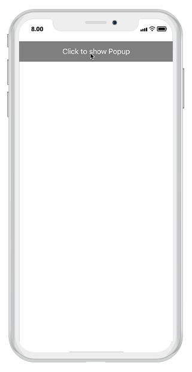
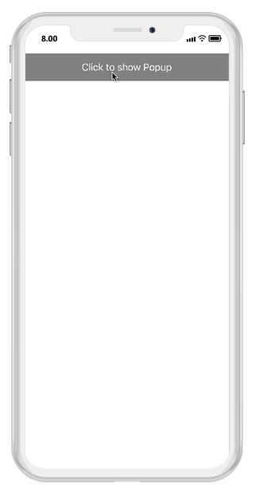
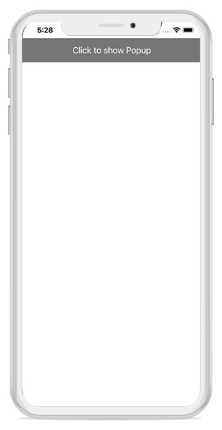
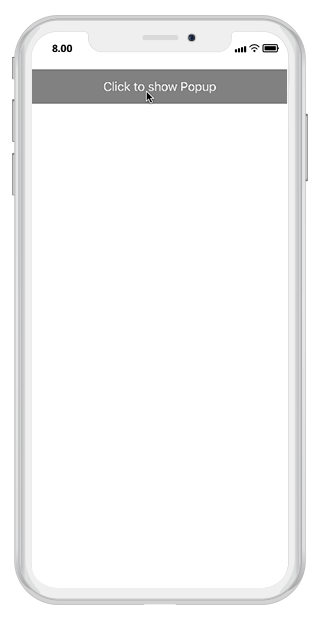
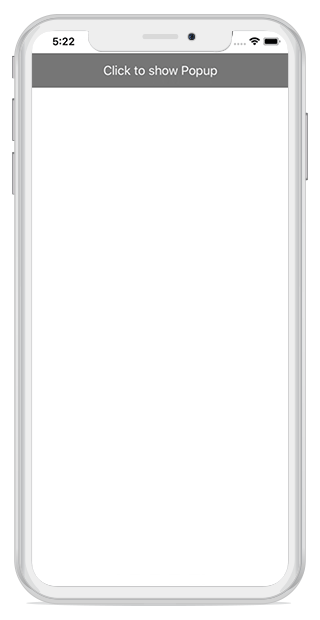
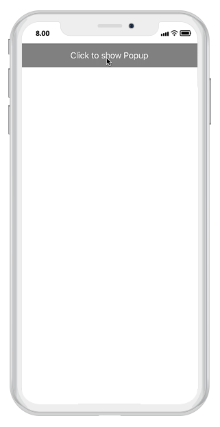

---
layout: post
title: Popup Animations | SfPopupLayout |Xamarin.iOS | Syncfusion
description: Animations in SfPopupLayout
platform: Xamarin.iOS
control: SfPopupLayout
documentation: ug
--- 

# Popup Animations

Built-in animations are available in SfPopupLayout, which is applied when the PopupView opens and closes in the screen.
SfPopupLayout has different animation modes as listed below.

* [Zoom](https://help.syncfusion.com/cr/cref_files/xamarin-ios/sfpopuplayout/Syncfusion.SfPopupLayout.iOS~Syncfusion.iOS.PopupLayout.AnimationMode.html)
* [Fade](https://help.syncfusion.com/cr/cref_files/xamarin-ios/sfpopuplayout/Syncfusion.SfPopupLayout.iOS~Syncfusion.iOS.PopupLayout.AnimationMode.html)
* [SlideOnLeft](https://help.syncfusion.com/cr/cref_files/xamarin-ios/sfpopuplayout/Syncfusion.SfPopupLayout.iOS~Syncfusion.iOS.PopupLayout.AnimationMode.html)
* [SlideOnRight](https://help.syncfusion.com/cr/cref_files/xamarin-ios/sfpopuplayout/Syncfusion.SfPopupLayout.iOS~Syncfusion.iOS.PopupLayout.AnimationMode.html)
* [SlideOnTop](https://help.syncfusion.com/cr/cref_files/xamarin-ios/sfpopuplayout/Syncfusion.SfPopupLayout.iOS~Syncfusion.iOS.PopupLayout.AnimationMode.html)
* [SlideOnBottom](https://help.syncfusion.com/cr/cref_files/xamarin-ios/sfpopuplayout/Syncfusion.SfPopupLayout.iOS~Syncfusion.iOS.PopupLayout.AnimationMode.html)
* [None](https://help.syncfusion.com/cr/cref_files/xamarin-ios/sfpopuplayout/Syncfusion.SfPopupLayout.iOS~Syncfusion.iOS.PopupLayout.AnimationMode.html)

N> Setting of AnimationMode is same for both `Displaying pop-up when the SfPopupLayout is set as root view` and `Displaying pop-up when the SfPopupLayout is not set as root view` 

## Zoom 

Zoom-out animation will be applied when the PopupView opens and Zoom-in animation will be applied when the PopupView closes.




//MyViewController.cs

public MyViewController()
{
    ....
    popupLayout = new SfPopupLayout();
    popupLayout.Content = GetContentOfPopup();
    popupLayout.PopupView.AnimationMode = AnimationMode.Zoom;
    this.View.AddSubview(popupLayout);
    ....
}




Executing the above codes renders the following output in an iOS device.

## Fade 

Fade-out animation will be applied when the PopupView opens and Fade-in animation will be applied when the PopupView closes




//MyViewController.cs

public MyViewController()
{
    ....
    popupLayout = new SfPopupLayout();
    popupLayout.Content = GetContentOfPopup();
    popupLayout.PopupView.AnimationMode = AnimationMode.Fade;
    this.View.AddSubview(popupLayout);
    ....
}




Executing the above codes renders the following output in an iOS device.

## SlideOnLeft 

PopupView will be animated from left-to-right, when it opens and from right-to-left when the PopupView closes.




//MyViewController.cs

public MyViewController()
{
    ....
    popupLayout = new SfPopupLayout();
    popupLayout.Content = GetContentOfPopup();
    popupLayout.PopupView.AnimationMode = AnimationMode.SlideOnLeft;
    this.View.AddSubview(popupLayout);  
    ....
}




Executing the above codes renders the following output in an iOS device.

## SlideOnRight

PopupView will be animated from right-to-left, when it opens and from left-to-right when the PopupView closes.




//MyViewController.cs

public MyViewController()
{
    ....
    popupLayout = new SfPopupLayout();
    popupLayout.Content = GetContentOfPopup();
    popupLayout.PopupView.AnimationMode = AnimationMode.SlideOnRight;
    this.View.AddSubview(popupLayout); 
    ....
}



Executing the above codes renders the following output in an iOS device.

## SlideOnTop 

PopupView will be animated from top-to-bottom, when it opens and from bottom-to-top when the PopupView closes.




//MyViewController.cs

public MyViewController()
{
    ....
    popupLayout = new SfPopupLayout();
    popupLayout.Content = GetContentOfPopup();
    popupLayout.PopupView.AnimationMode = AnimationMode.SlideOnTop;
    this.View.AddSubview(popupLayout);  
    ....
}




Executing the above codes renders the following output in an iOS device.

## SlideOnBottom

PopupView will be animated from bottom-to-top, when it opens and from top-to-bottom when the PopupView closes.




//MyViewController.cs  

public MyViewController()
{
    ....
    popupLayout = new SfPopupLayout();
    popupLayout.Content = GetContentOfPopup();
    popupLayout.PopupView.AnimationMode = AnimationMode.SlideOnBottom;
    this.View.AddSubview(popupLayout);  
    ....
}




Executing the above codes renders the following output in an iOS device.

## None

Animation will not be applied.




//MyViewController.cs

public MyViewController()
{
    ....
    popupLayout = new SfPopupLayout();
    popupLayout.Content = GetContentOfPopup();
    popupLayout.PopupView.AnimationMode = AnimationMode.None;
    this.View.AddSubview(popupLayout);
    ....
}




Executing the above codes renders the following output in an iOS device.

