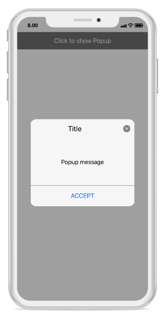
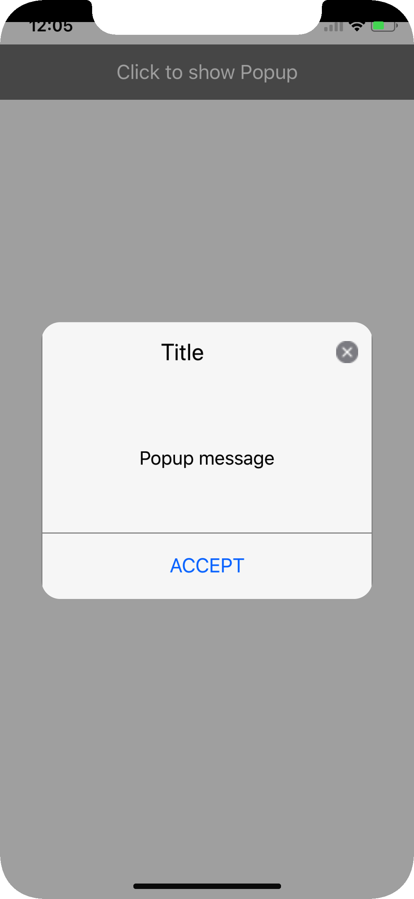
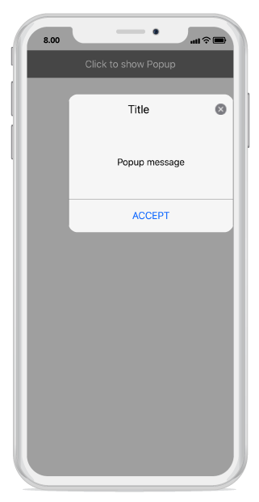
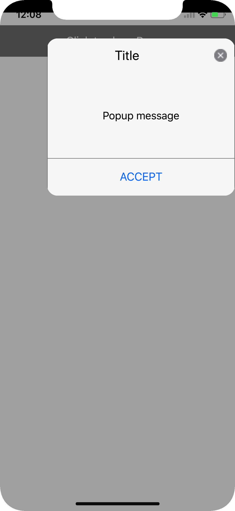
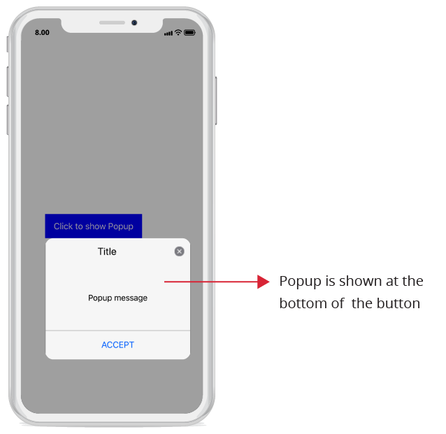

---
layout: post
title: Popup positioning | SfPopupLayout |Xamarin.iOS | Syncfusion
description: Positioning capabilities of SfPopupLayout
platform: Xamarin.iOS
control: SfPopupLayout
documentation: ug
--- 

# Popup Positioning

SfPopupLayout allows you to show the Popup content at various position based on the requirement.

Following are the list of options available to show SfPopupLayout at various position.

<table>
<tr>
<th> Methods / Property </th>
<th> Description </th>
</tr>
<tr>
<td> {{'[SfPopupLayout.IsOpen](https://help.syncfusion.com/cr/cref_files/xamarin-ios/sfpopuplayout/Syncfusion.SfPopupLayout.iOS~Syncfusion.iOS.PopupLayout.SfPopupLayout~IsOpen.html)'| markdownify }} </td>
<td> Shows SfPopupLayout at the center.</td>
</tr>
<tr>
<td> {{'[SfPopupLayout.Show()](https://help.syncfusion.com/cr/cref_files/xamarin-ios/sfpopuplayout/Syncfusion.SfPopupLayout.iOS~Syncfusion.iOS.PopupLayout.SfPopupLayout~Show.html)'| markdownify }} </td>
<td> It is similar to SfPopupLayout.IsOpen property.</td>
</tr>
<tr>
<td> {{'[SfPopupLayout.Show(x-position, y-position)](https://help.syncfusion.com/cr/cref_files/xamarin-ios/sfpopuplayout/Syncfusion.SfPopupLayout.iOS~Syncfusion.iOS.PopupLayout.SfPopupLayout~Show.html)'| markdownify }} </td>
<td> Shows SfPopupLayout at the specified X and y position.</td>
</tr>
<tr>
<td> {{'[SfPopupLayout.ShowAtTouchPoint()](https://help.syncfusion.com/cr/cref_files/xamarin-ios/sfpopuplayout/Syncfusion.SfPopupLayout.iOS~Syncfusion.iOS.PopupLayout.SfPopupLayout~ShowAtTouchPoint.html)'| markdownify }} </td>
<td> Shows SfPopupLayout at the touch point.</td>
</tr>
<tr>
<td> {{'[SfPopupLayout.ShowRelativeToView(View, RelativePosition)](https://help.syncfusion.com/cr/cref_files/xamarin-ios/sfpopuplayout/Syncfusion.SfPopupLayout.iOS~Syncfusion.iOS.PopupLayout.SfPopupLayout~ShowRelativeToView.html)'| markdownify }} </td>
<td> Shows SfPopupLayout at the position relative to the specified view.</td>
</tr>
</table>

## Center Positioning

SfPopupLayout can be shown at the center by using the following options.

### IsOpen Property

To open the SfPopupLayout, use the `SfPopupLayout.IsOpen` property as in the following code sample.



using Syncfusion.iOS.PopupLayout;

namespace GettingStarted
{
    public class MyViewController:UIViewController
    {
        SfPopupLayout popupLayout;
        CustomView customView;
        UIButton showPopupButton;
        
        public MyViewController()
        {
            popupLayout = new SfPopupLayout();
            popupLayout.Content = GetContentOfPopup();
            this.View.AddSubview(popupLayout);
        }
        private UIView GetContentOfPopup()
        {
            customView = new CustomView();
            customView.BackgroundColor = UIColor.White;

            showPopupButton = new UIButton();
            showPopupButton.SetTitle("Click to show Popup", UIControlState.Normal);
            showPopupButton.SetTitleColor(UIColor.White, UIControlState.Normal);
            showPopupButton.BackgroundColor = UIColor.Gray;
            showPopupButton.TouchDown += ShowPopupButton_TouchDown;
            customView.AddSubview(showPopupButton);

            return customView;
        }
        private void ShowPopupButton_TouchDown(object sender, EventArgs e)
        {
              popupLayout.IsOpen = true;
        }
        public override void ViewDidLayoutSubviews()
        {
            base.ViewDidLayoutSubviews();
            popupLayout.Frame = new CGRect(0, 20, this.View.Frame.Width, this.View.Frame.Height - 20);
        }
    }
}


If we run the above sample, the below output will appear on iOS device as shown below.

N> SfPopupLayout.IsOpen property is not applicable for `Displaying pop-up when the SfPopupLayout is not set as root view`.

### SfPopupLayout.Show()

To open the SfPopupLayout, use the `SfPopupLayout.Show()` as in the following code sample.



using Syncfusion.iOS.PopupLayout;

namespace GettingStarted
{
    public class MyViewController:UIViewController
    {
        SfPopupLayout popupLayout;
        CustomView customView;
        UIButton showPopupButton;
        
        public MyViewController()
        {
            popupLayout = new SfPopupLayout();
            popupLayout.Content = GetContentOfPopup();
            this.View.AddSubview(popupLayout);
        }
        private UIView GetContentOfPopup()
        {
            customView = new CustomView();
            customView.BackgroundColor = UIColor.White;

            showPopupButton = new UIButton();
            showPopupButton.SetTitle("Click to show Popup", UIControlState.Normal);
            showPopupButton.SetTitleColor(UIColor.White, UIControlState.Normal);
            showPopupButton.BackgroundColor = UIColor.Gray;
            showPopupButton.TouchDown += ShowPopupButton_TouchDown;
            customView.AddSubview(showPopupButton);

            return customView;
        }
        private void ShowPopupButton_TouchDown(object sender, EventArgs e)
        {
            //Shows SfPopupLayout at the center of the view.
            popupLayout.Show();  
        }
        public override void ViewDidLayoutSubviews()
        {
            base.ViewDidLayoutSubviews();
            popupLayout.Frame = new CGRect(0, 20, this.View.Frame.Width, this.View.Frame.Height - 20);
        }
    }
}


Executing the above codes renders the following output in iOS device respectively.

## Absolute Positioning

SfPopupLayout can be shown at the specified position by using the following method.

### SfPopupLayout.Show(x-position, y-position)

To open the SfPopupLayout in specific X,Y coordinates, use the `SfPopupLayout.Show(x-position, y-position)` property as in the following code sample.



using Syncfusion.iOS.PopupLayout;

namespace GettingStarted
{
    public class MyViewController:UIViewController
    {
        SfPopupLayout popupLayout;
        CustomView customView;
        UIButton showPopupButton;
        
        public MyViewController()
        {
            popupLayout = new SfPopupLayout();
            popupLayout.Content = GetContentOfPopup();
            this.View.AddSubview(popupLayout);
        }
        private UIView GetContentOfPopup()
        {
            customView = new CustomView();
            customView.BackgroundColor = UIColor.White;

            showPopupButton = new UIButton();
            showPopupButton.SetTitle("Click to show Popup", UIControlState.Normal);
            showPopupButton.SetTitleColor(UIColor.White, UIControlState.Normal);
            showPopupButton.BackgroundColor = UIColor.Gray;
            showPopupButton.TouchDown += ShowPopupButton_TouchDown;
            customView.AddSubview(showPopupButton);

            return customView;
        }
        private void ShowPopupButton_TouchDown(object sender, EventArgs e)
        {
            //Shows SfPopupLayout at x-position 100 and y position 100.
            popupLayout.Show(100, 700);  

        }
        public override void ViewDidLayoutSubviews()
        {
            base.ViewDidLayoutSubviews();
            popupLayout.Frame = new CGRect(0, 20, this.View.Frame.Width, this.View.Frame.Height - 20);
        }
    }
}


Executing the above codes renders the following output in iOS device respectively.

### SfPopupLayout.ShowAtTouchPoint()

To open the SfPopupLayout from the touch point in the screen, use the `SfPopupLayout.ShowAtTouchPoint()` property as in the following code sample.



using Syncfusion.iOS.PopupLayout;

namespace GettingStarted
{
    public class MyViewController:UIViewController
    {
        SfPopupLayout popupLayout;
        CustomView customView;
        UIButton showPopupButton;
        
        public MyViewController()
        {
            popupLayout = new SfPopupLayout();
            popupLayout.Content = GetContentOfPopup();
            this.View.AddSubview(popupLayout);
        }
        private UIView GetContentOfPopup()
        {
            customView = new CustomView();
            customView.BackgroundColor = UIColor.White;

            showPopupButton = new UIButton();
            showPopupButton.SetTitle("Click to show Popup", UIControlState.Normal);
            showPopupButton.SetTitleColor(UIColor.White, UIControlState.Normal);
            showPopupButton.BackgroundColor = UIColor.Gray;
            showPopupButton.TouchDown += ShowPopupButton_TouchDown;
            customView.AddSubview(showPopupButton);

            return customView;
        }
        private void ShowPopupButton_TouchDown(object sender, EventArgs e)
        {
            //Shows SfPopupLayout at the touch point.
            popupLayout.ShowAtTouchPoint(); 

        }
        public override void ViewDidLayoutSubviews()
        {
            base.ViewDidLayoutSubviews();
            popupLayout.Frame = new CGRect(0, 20, this.View.Frame.Width, this.View.Frame.Height - 20);
        }
    }
}


Executing the above codes renders the following output in iOS device respectively.

N> SfPopupLayout.ShowAtTouchPoint() is not applicable for `Displaying pop-up when the SfPopupLayout is not set as root view`.

## Relative Positioning

SfPopupLayout can be shown at the relative position by using the following method.

### SfPopupLayout.ShowRelativeToView(View, RelativePosition)

To open the SfPopupLayout relative to a view, use the `SfPopupLayout.ShowRelativeToView(View, RelativePosition)` property as in the following code sample.

#### Type A:



using Syncfusion.iOS.PopupLayout;

namespace GettingStarted
{
    public class MyViewController:UIViewController
    {
        SfPopupLayout popupLayout;
        CustomView customView;
        UIButton showPopupButton;
        
        public MyViewController()
        {
            popupLayout = new SfPopupLayout();
            popupLayout.Content = GetContentOfPopup();
            this.View.AddSubview(popupLayout);
        }
        private UIView GetContentOfPopup()
        {
            customView = new CustomView();
            customView.BackgroundColor = UIColor.White;

            showPopupButton = new UIButton();
            showPopupButton.SetTitle("Click to show Popup", UIControlState.Normal);
            showPopupButton.SetTitleColor(UIColor.White, UIControlState.Normal);
            showPopupButton.BackgroundColor = UIColor.Gray;
            showPopupButton.TouchDown += ShowPopupButton_TouchDown;
            customView.AddSubview(showPopupButton);

            return customView;
        }
        private void ShowPopupButton_TouchDown(object sender, EventArgs e)
        {
            //Shows SfPopupLayout at the bottom of the label.
            popupLayout.ShowRelativeToView(showPopupButton, RelativePosition.AlignBottom);
        }
        public override void ViewDidLayoutSubviews()
        {
            base.ViewDidLayoutSubviews();
            popupLayout.Frame = new CGRect(0, 20, this.View.Frame.Width, this.View.Frame.Height - 20);
        }
    }
}




// CustomView.cs

public class CustomView : UIView
{
    public CustomView() : base()
    {
    }
    public override void LayoutSubviews()
    {
        base.LayoutSubviews();
        this.Subviews[0].Frame = new CGRect(50, 280, 200, 50);
    }
}


Executing the above codes renders the following output in iOS device respectively.

