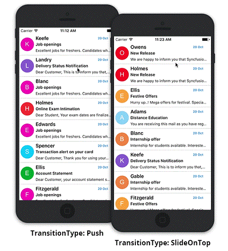
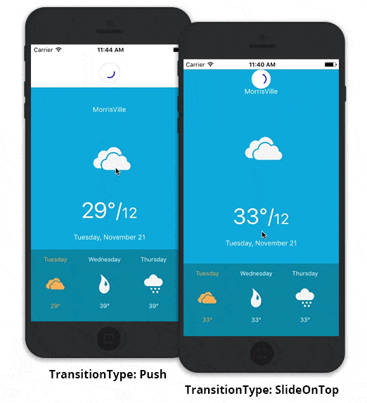

---
layout: post
title: Customizing PullableContent | SfPullToRefresh | Xamarin.iOS | Syncfusion
description: Customizing the PullableContent of SfPullToRefresh
platform: Xamarin.iOS
control: SfPullToRefresh
documentation: ug
--- 

# Customizing PullableContent

SfPullToRefresh supports various views as its pullable content. 

This section explains how to refresh the following views by hosting as a pullable content of SfPullToRefresh.

* [CollectionView](#collectionview) 
* [SfDataGrid](#sfdatagrid) 
* [Custom view](#custom-view) 

## CollectionView

SfPullToRefresh can host the CollectionView as its pullable content and refresh the view. 

### CollectionView customizations

Refer the below code example for creating a collection view and customizing it. 



//MyViewController.cs

UICollectionView collectionView;
CollectionViewSource collectionViewSource;
UICollectionViewFlowLayout collectionViewFlowLayout;

public MyViewController()
{
    ....
    this.collectionViewFlowLayout = new UICollectionViewFlowLayout()
    {
        MinimumLineSpacing = 0.5f,
        ScrollDirection = UICollectionViewScrollDirection.Vertical,
    };
    this.collectionView = new UICollectionView(CGRect.Empty, collectionViewFlowLayout);
    this.collectionView.ShowsHorizontalScrollIndicator = false;
    this.collectionViewSource = new CollectionViewSource();
    this.collectionView.DataSource = this.collectionViewSource;
    this.collectionView.RegisterClassForCell(typeof(CollectionViewCell), CollectionViewCell.CellID);
    ....
}



The example code of the CollectionViewSource and the CollectionViewCell of the CollectionView are not displayed here, however you can download the source code of this sample here.

### Adapting CollectionView in SfPullToRefresh

Refer the below code example, in which the collection view is added as a pullable content of SfPullToRefresh and refreshing of the pullable content is handled.



//MyViewController.cs

SfPullToRefresh pullToRefresh;

public MyViewController()
{
    ....
    pullToRefresh = new SfPullToRefresh(this);
    pullToRefresh.TransitionType = TransitionType.Push;
    pullToRefresh.Refreshing += PullToRefresh_Refreshing;
    pullToRefresh.PullableContent = collectionView;
    View.AddSubview(this.pullToRefresh);
    ....
}

private async void PullToRefresh_Refreshing(object sender, RefreshingEventArgs e)
{
    await Task.Delay(3000);
    this.collectionViewSource.repository.RefreshItemSource();
    this.collectionView.ReloadData();
    e.Refreshed = true;
}

//InboxRepository.cs 

private Random random;

public ObservableCollection<Mail> InboxItems{ get; set; }

public void RefreshItemSource()
{
    int count = random.Next(1, 6);

    for (int i = 0; i < count; i++)
    {
        int randomNumber = random.Next(0, 9);
        Mail mail = new Mail();
        mail.Sender = sender[random.Next(0, 24)];
        mail.Subject = subject[randomNumber];
        mail.Details = details[randomNumber];
        mail.BackgroundColor = colors[randomNumber];
        InboxItems.Insert(i, mail);
    }
}



The final output of the sample, SfPullToRefresh adapting CollectionView as its pullable content is below.

## SfDataGrid

SfPullToRefresh can host the `SfDataGrid` as its pullable content and refresh it.

### SfDataGrid customizations

Refer the below code example to create a SfDataGrid and customize it. Click [here](https://help.syncfusion.com/xamarin-ios/sfdatagrid/getting-started) to explore SfDataGrid.



//MyViewController.cs

SfDataGrid SfGrid;
GridGettingStartedViewModel viewModel;

public MyViewController()
{
    ....
    sfGrid = new SfDataGrid(this);
    SfGrid.ItemsSource = viewModel.OrdersInfo;
    SfGrid.HeaderRowHeight = 45;
    SfGrid.RowHeight = 45;
    viewModel = new GridGettingStartedViewModel();
    sfGrid.AutoGenerateColumns = false;
    GridGenerateColumns();
    sfGrid.ColumnSizer = ColumnSizer.Star;
    ....
}

void GridGenerateColumns()
{
    sfGrid.Columns.Add(new GridTextColumn() { MappingName = "OrderID", HeaderText = "Order ID" });
    sfGrid.Columns.Add(new GridTextColumn() { MappingName = "CustomerID", HeaderText = "Customer ID", TextAlignment = GravityFlags.CenterVertical });
    sfGrid.Columns.Add(new GridTextColumn() { MappingName = "Freight", Format = "C", CultureInfo = new CultureInfo("en-US"), TextAlignment = GravityFlags.Center });
    sfGrid.Columns.Add(new GridTextColumn() { MappingName = "ShipCity", HeaderText = "Ship City", TextAlignment = GravityFlags.CenterVertical });
}



The example code of the ViewModel are not displayed here, however you can download the source code of this sample here.

### Adapting SfDataGrid in SfPullToRefresh

Refer the below code example, in which SfDataGrid is added as a pullable content of SfPullToRefresh and refreshing of the pullable content is handled.



//MyViewController.cs

SfPullToRefresh pullToRefresh;

public MyViewController()
{
    ....
    pullToRefresh = new SfPullToRefresh(this);
    pullToRefresh.Refreshing += PullToRefresh_Refreshing;
    pullToRefresh.RefreshContentThreshold = 45;
    pullToRefresh.PullableContent = sfGrid;
    View.AddSubview(this.pullToRefresh);
    ....
}

private async void PullToRefresh_Refreshing(object sender, RefreshingEventArgs e)
{
    await Task.Delay(3000);
    viewModel.ItemsSourceRefresh();
    e.Refreshed = true;
}



The final output of the sample, SfPullToRefresh adapting SfDataGrid as its pullable content is below.

## Custom view

A view is customized and added as the pullable content of SfPullToRefresh. 

The code example of the customized view is below:



public class CustomView : UIView
{
    BaseView baseView;
    CustomScrollView customScrollView;
    UILabel cityLabel;

    public CustomView(BaseView view, CustomScrollView scrollView, UILabel city) : base()
    {
        baseView = view;
        customScrollView = scrollView;
        cityLabel = city;
        this.AddSubview(view);
        this.AddSubview(scrollView);
        this.AddSubview(city);
    }

    public override void LayoutSubviews()
    {
        base.LayoutSubviews();
        cityLabel.Frame = new CGRect(0, 20, this.Frame.Width, 50);
        baseView.Frame = new CGRect(0, (Frame.Height / 4), Frame.Width, Frame.Height / 2);
        customScrollView.Frame = new CGRect(0, this.Frame.Height - 150, this.Frame.Width, 150);
    }
}



The example code of the other custom views are not displayed here, however you can download the source code of this sample here.

### Adapting custom view in SfPullToRefresh

Refer the below code example, in which the above custom view is added as a pullable content of SfPullToRefresh and refreshing of the pullable content is handled.



public MyViewController()
{
    ....
    pullToRefresh = new SfPullToRefresh();
    //The custom view is set as the pullable content of SfPullToRefresh.
    pullToRefresh.PullableContent = customView;
    pullToRefresh.Refreshing += PullToRefresh_Refreshing;
    ....
}

private void PullToRefresh_Refreshing(object sender, RefreshingEventArgs e)
{
    NSTimer.CreateScheduledTimer(TimeSpan.FromSeconds(3), new Action<NSTimer>(delegate {
        baseView.model.Temperature = (NSString)new Random().Next(10, 40).ToString();
        baseView.UpdateBaseView();
        baseView.selectedView.SelectView();
        baseView.selectedView.UpdateTemperature();
        e.Refreshed = true;
    }));
}



The final output of the above sample is below.

## Samples

You can download the source code of the sample from the below link.

* CollectionView

* SfDataGrid

* Custom view
