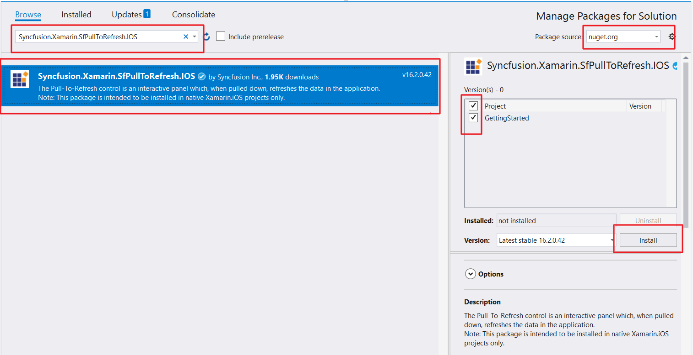
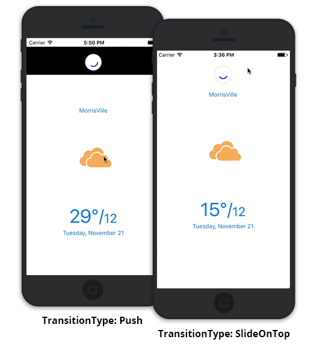

# Getting Started

This section provides a quick overview for working with SfPullToRefresh in Xamarin.iOS. Walk through the entire process of creating a simple application with this control.

## Assembly deployment

After installing Essential Studio for Xamarin, all the required assemblies can be found in {Syncfusion Essential Studio Installed location}\Essential Studio\{{ site.releaseversion }}\Xamarin\lib this installation folder.

e.g., C:\Program Files (x86)\Syncfusion\Essential Studio\{{ site.releaseversion }}\Xamarin\lib

N> Assemblies can be found in unzipped package location in Mac.

### SfPullToRefresh for Xamarin.iOS

The following assembly should be added as reference from the "lib" folder to use SfPullToRefresh in the application:

<table>
<tr>
<th> Project </th>
<th> Required assemblies </th>
</tr>
<tr>
<td> Xamarin.iOS </td>
<td> ios-unified\Syncfusion.SfPullToRefresh.iOS.dll </td>
</tr>
</table>

## NuGet installation

To install the required NuGet for the SfPullToRefresh control in the application, first you have to configure the NuGet packages of the Syncfusion components.

[How to configure package source and install Syncfusion NuGet packages in an existing project?](https://www.syncfusion.com/kb/7441/how-to-configure-package-source-and-install-syncfusion-nuget-packages-in-an-existing-project)

### SfPullToRefresh for Xamarin.iOS

The following NuGet package should be installed to use SfPullToRefresh control in the application:

<table>
<tr>
<th> Project </th>
<th> Required packages </th>
</tr>
<tr>
<td> Xamarin.iOS </td>
<td> Syncfusion.Xamarin.SfPullToRefresh.iOS </td>
</tr>
</table>

Refer to the following screenshot in which the Syncfusion.Xamarin.SfPullToRefresh.iOS package is highlighted:

## Create a sample application with SfPullToRefresh

SfPullToRefresh control can be configured entirely in C# code. To create a sample application for this control, follow the topics:  

* [Creating the project](#creating-the-project)  
* [Adding SfPullToRefresh in Xamarin.iOS](#adding-sfpulltorefresh-in-xamarinios) 
* [Adding a simple view as the PullableContent](#adding-a-simple-view-as-the-pullablecontent) 
* [Refreshing the view](#refreshing-the-view) 
* [TransitionType Customization](#transitiontype-customization)
* [Final Output of the sample](#final-output-of-the-sample)
* [Sample Link](#sample-link)

### Creating the project

Create a new iOS application in Xamarin Studio or Visual Studio for Xamarin.iOS.

### Adding SfPullToRefresh in Xamarin.iOS

1. Add the required assembly references to the project as mentioned in the [Assembly deployment](#assembly-deployment) section or install the NuGet as mentioned in the [NuGet installation](#nuget-installation) section.

2. Import SfPullToRefresh control under the namespace `Syncfusion.SfPullToRefresh`.

3. Create an instance of SfPullToRefresh control and add as the sub view of the UIViewController. Refer to the following code example to add this control to the application:



using Syncfusion.SfPullToRefresh; 

public class MyViewController : UIViewController
{
    SfPullToRefresh pullToRefresh; 

    public MyViewController()
    {
        pullToRefresh = new SfPullToRefresh(); 
        this.View.AddSubview(pullToRefresh);
    } 
} 



### Adding a simple view as the PullableContent

Any view can be added as the pullable content using [SfPullToRefresh.PullableContent](https://help.syncfusion.com/cr/cref_files/xamarin-ios/Syncfusion.SfPullToRefresh.iOS~Syncfusion.SfPullToRefresh.SfPullToRefresh~PullableContent.html) property to refresh it. Refer to the following code example in which a simple custom view is added as pullable content:



//MyViewController.cs

CustomView customView;
BaseView baseView;
UILabel label;
UIButton button;

public MyViewController()
{
	....
	InitializeViews();
    customView = new CustomView(label, baseView);
	//Setting the PullableContent of the SfPullToRefresh.
	pullToRefresh.PullableContent = customView;
	....
}

private void InitializeViews()
{
    ....
    baseView = new BaseView();
    label = new UILabel();
    ....
}



### Refreshing the view

To refresh the view, hook the [SfPullToRefresh.Refreshing](https://help.syncfusion.com/cr/cref_files/xamarin-ios/Syncfusion.SfPullToRefresh.iOS~Syncfusion.SfPullToRefresh.SfPullToRefresh~Refreshing_EV.html) event. The [SfPullToRefresh.Refreshing](https://help.syncfusion.com/cr/cref_files/xamarin-ios/Syncfusion.SfPullToRefresh.iOS~Syncfusion.SfPullToRefresh.SfPullToRefresh~Refreshing_EV.html) event will be fired, once the pulling progress reaches 100% and touch is released. The user can do the required operations to refresh the view and once the view is refreshed, set the [RefreshingEventArgs.Refreshed](https://help.syncfusion.com/cr/cref_files/xamarin-ios/Syncfusion.SfPullToRefresh.iOS~Syncfusion.SfPullToRefresh.RefreshingEventArgs~Refreshed.html) to <b>true</b> to stop the refreshing animation. 

Refer to the following code example illustrating hooking of the [SfPullToRefresh.Refreshing](https://help.syncfusion.com/cr/cref_files/xamarin-ios/Syncfusion.SfPullToRefresh.iOS~Syncfusion.SfPullToRefresh.SfPullToRefresh~Refreshing_EV.html) event and refreshing the view:



//MyViewController.cs
public MyViewController()
{
    ....
    //Hooking the Refreshing event.
    pullToRefresh.Refreshing += PullToRefresh_Refreshing;
    ....
}

private void PullToRefresh_Refreshing(object sender, RefreshingEventArgs e)
{
    NSTimer.CreateScheduledTimer(TimeSpan.FromSeconds(3), new Action<NSTimer>(delegate {
        baseView.model.Temperature = (NSString)new Random().Next(10, 40).ToString();
        baseView.UpdateBaseView();
        e.Refreshed = true;
    }));
}



### TransitionType customization

SfPullToRefresh support two types of transitions. By default, `TransitionType.SlideOnTop` is enabled. 

Refer to the topic `TransitionType` under `Built-in Customization` section for more details regarding [SfPullToRefresh.TransitionType](https://help.syncfusion.com/cr/cref_files/xamarin-ios/Syncfusion.SfPullToRefresh.iOS~Syncfusion.SfPullToRefresh.SfPullToRefresh~TransitionType.html) property.

Refer to the following code example to switch to the `TransitionType.Push` mode of transition:



public MyViewController()
{
	....
	pullToRefresh.TransitionType = TransitionType.Push;
	....
}



### Final output of the sample

The following GIF demonstrates the final output of the sample:

### Sample link

You can download the source code of this sample [here](http://files2.syncfusion.com/Xamarin.iOS/Samples/SfPullToRefresh_GettingStarted.zip).
