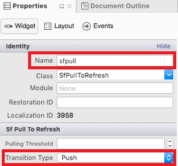
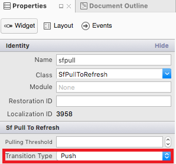

# Getting Started

This section provides a quick overview for working with SfPullToRefresh in Xamarin.iOS. Walk through the entire process of creating a simple application with this control.

## Assembly deployment

After installing Essential Studio for Xamarin, all the required assemblies can be found in {Syncfusion Essential Studio Installed location}\Essential Studio\{{ site.releaseversion }}\Xamarin\lib this installation folder.

e.g., C:\Program Files (x86)\Syncfusion\Essential Studio\{{ site.releaseversion }}\Xamarin\lib

N> Assemblies can be found in unzipped package location in Mac.

## NuGet configuration

To install the required NuGet for the SfPullToRefresh control in the application, configure the NuGet packages of the Syncfusion components.

Refer to the following KB to configure the NuGet packages of the Syncfusion components:

[How to configure package source and install Syncfusion NuGet packages in an existing project?](https://www.syncfusion.com/kb/7441/how-to-configure-package-source-and-install-syncfusion-nuget-packages-in-an-existing-project)

The following NuGet package should be installed to use the SfPullToRefresh control in the application.

<table>
<tr>
<th> Project </th>
<th> Required package </th>
</tr>
<tr>
<td> Xamarin.iOS </td>
<td>Syncfusion.SfPopupLayout.iOS</td>
</tr>
</table>

### Adding SfPullToRefresh Reference

Syncfusion Xamarin components are available in [nuget.org](https://www.nuget.org/). To add SfPullToRefresh to your project, open the NuGet package manager in Visual Studio, and search for [Syncfusion.Xamarin.SfPullToRefresh.IOS](https://www.nuget.org/packages/Syncfusion.Xamarin.SFPullTORefresh.IOS), and then install it.

Refer to the following screenshot in which the Syncfusion.Xamarin.SfPullToRefresh.iOS package is highlighted:

To know more about obtaining our components, refer to this [link](https://help.syncfusion.com/xamarin-ios/introduction/download-and-installation). Also, if you prefer to manually refer the assemblies instead of NuGet, refer the list of assemblies mentioned in the table below.

<table>
<tr>
<th> Project </th>
<th> Required assembly </th>
</tr>
<tr>
<td> Xamarin.iOS </td>
<td> ios-unified\Syncfusion.SfPullToRefresh.iOS.dll </td>
</tr>
</table>

I> Starting with v16.2.0.x, if you reference Syncfusion assemblies from trial setup or from the NuGet feed, you also have to include a license key in your projects. Please refer to this [link](https://help.syncfusion.com/common/essential-studio/licensing/license-key) to know about registering Syncfusion license key in your Xamarin application to use our components.

## Create a sample application with SfPullToRefresh

SfPullToRefresh control can be configured entirely in C# code or via story board. To create a sample application for this control, follow the topics:  

* [Creating the project](#creating-the-project)  
* [Adding SfPullToRefresh in Xamarin.iOS](#adding-sfpulltorefresh-in-xamarinios) 
* [Adding a simple view as the PullableContent](#adding-a-simple-view-as-the-pullablecontent) 
* [Refreshing the view](#refreshing-the-view) 
* [TransitionType Customization](#transitiontype-customization)
* [Final Output of the sample](#final-output-of-the-sample)
* [Sample Link](#sample-link)

### Creating the project

Create a new iOS application in Xamarin Studio or Visual Studio for Xamarin.iOS.

## Adding SfPullToRefresh in Xamarin.iOS using story board

1. Add a new storyboard inside of project

2. Drag SfPullToRefresh control from toolbox and drop into storyboard

3. Now Drag the SfDataGrid control from the toolbox and drop it into the SfPullToRefresh in StoryBoard.

4. Since this is a hosting control it does not show a preview on the designer page and you can only see the PullToRefresh when deployed in the device.

5. Open the properties window of SfPullToRefresh and set the required properties like shown in the below image.

6. Set the SfDataGrid as PullableContent to SfPullToRefresh in code behind.




    public partial class newViewController : UIViewController
    {
     

        ViewModel viewModel;
        public newViewController() : base("newViewController", null)
        {
            
        }

        public override void ViewDidLoad()
        {
            base.ViewDidLoad();
            // Perform any additional setup after loading the view, typically from a nib.
            viewModel = new ViewModel();
           
            sfgrid.ItemsSource = viewModel.OrdersInfo;
            sfpull.PullableContent = sfgrid;
           
        }

        public override void DidReceiveMemoryWarning()
        {
            base.DidReceiveMemoryWarning();
        }
    }




You can download the entire source code of this demo for Xamarin.Android from [here](http://www.syncfusion.com/downloads/support/directtrac/general/ze/StoryBoard_Support_SfPullToRefresh_iOS1723365924).

Refer this link to know the properties that can be configured via designer for SfPullToRefresh

### Adding SfPullToRefresh in Xamarin.iOS

1. Add the required assembly references to the project as mentioned in the [Assembly deployment](#assembly-deployment) section or install the NuGet as mentioned in the [NuGet installation](#nuget-installation) section.

2. Import SfPullToRefresh control under the namespace `Syncfusion.SfPullToRefresh`.

3. Create an instance of SfPullToRefresh control and add as the subview of the UIViewController. Refer to the following code example to add this control to the application:




using Syncfusion.SfPullToRefresh; 

public class MyViewController : UIViewController
{
    SfPullToRefresh pullToRefresh; 

    public MyViewController()
    {
        pullToRefresh = new SfPullToRefresh(); 
        this.View.AddSubview(pullToRefresh);
    } 
} 




### Adding a simple view as the PullableContent

Any view can be added as the pullable content using [SfPullToRefresh.PullableContent](https://help.syncfusion.com/cr/cref_files/xamarin-ios/Syncfusion.SfPullToRefresh.iOS~Syncfusion.SfPullToRefresh.SfPullToRefresh~PullableContent.html) property to refresh it. Refer to the following code example in which a simple custom view is added as pullable content:




//MyViewController.cs

CustomView customView;
BaseView baseView;
UILabel label;
UIButton button;

public MyViewController()
{
	....
	InitializeViews();
    customView = new CustomView(label, baseView);
	//Setting the PullableContent of the SfPullToRefresh.
	pullToRefresh.PullableContent = customView;
	....
}

private void InitializeViews()
{
    ....
    baseView = new BaseView();
    label = new UILabel();
    ....
}




### Refreshing the view

To refresh the view, hook the [SfPullToRefresh.Refreshing](https://help.syncfusion.com/cr/cref_files/xamarin-ios/Syncfusion.SfPullToRefresh.iOS~Syncfusion.SfPullToRefresh.SfPullToRefresh~Refreshing_EV.html) event. The [SfPullToRefresh.Refreshing](https://help.syncfusion.com/cr/cref_files/xamarin-ios/Syncfusion.SfPullToRefresh.iOS~Syncfusion.SfPullToRefresh.SfPullToRefresh~Refreshing_EV.html) event will be fired, once the pulling progress reaches 100% and touch is released. The user can do the required operations to refresh the view and once the view is refreshed, set the [RefreshingEventArgs.Refreshed](https://help.syncfusion.com/cr/cref_files/xamarin-ios/Syncfusion.SfPullToRefresh.iOS~Syncfusion.SfPullToRefresh.RefreshingEventArgs~Refreshed.html) to <b>true</b> to stop the refreshing animation. 

Refer to the following code example illustrating hooking of the [SfPullToRefresh.Refreshing](https://help.syncfusion.com/cr/cref_files/xamarin-ios/Syncfusion.SfPullToRefresh.iOS~Syncfusion.SfPullToRefresh.SfPullToRefresh~Refreshing_EV.html) event and refreshing the view:




//MyViewController.cs
public MyViewController()
{
    ....
    //Hooking the Refreshing event.
    pullToRefresh.Refreshing += PullToRefresh_Refreshing;
    ....
}

private void PullToRefresh_Refreshing(object sender, RefreshingEventArgs e)
{
    NSTimer.CreateScheduledTimer(TimeSpan.FromSeconds(3), new Action<NSTimer>(delegate {
        baseView.model.Temperature = (NSString)new Random().Next(10, 40).ToString();
        baseView.UpdateBaseView();
        e.Refreshed = true;
    }));
}




### TransitionType customization

SfPullToRefresh support two types of transitions. By default, `TransitionType.SlideOnTop` is enabled. 

Refer to the topic `TransitionType` under `Built-in Customization` section for more details regarding [SfPullToRefresh.TransitionType](https://help.syncfusion.com/cr/cref_files/xamarin-ios/Syncfusion.SfPullToRefresh.iOS~Syncfusion.SfPullToRefresh.SfPullToRefresh~TransitionType.html) property.

Refer to the following code example to switch to the `TransitionType.Push` mode of transition:




public MyViewController()
{
	....
	pullToRefresh.TransitionType = TransitionType.Push;
	....
}




Refer the below image to set TransitionType Mode to SfPullToRefresh via StoryBoard.

### Final output of the sample

The following GIF demonstrates the final output of the sample:

### Sample link

You can download the source code of this sample [here](http://files2.syncfusion.com/Xamarin.iOS/Samples/SfPullToRefresh_GettingStarted.zip).

## Properties that can be configured via story board

<table>
<tr>
<th> Properties</th>
<th> Attribute Name</th>
</tr>
<tr><td>PullingThreshold</td> <td>Pulling Threshold</td></tr>
<tr><td>ProgressStrokeColor</td><td>Progress Stroke Color</td></tr>
<tr><td>ProgressBackgroundColor</td><td>Progress Background Color</td></tr>
<tr><td>ProgressShadowColor</td><td>Progress Shadow Color</td></tr>
<tr><td>ProgressStrokeWidth</td><td>Progress Stroke Width</td></tr>
<tr><td>TransitionType</td><td>Transition Type</td></tr>
<tr><td>RefreshContentThreshold</td><td>Refresh Content Threshold</td></tr>
<tr><td>RefreshContentRadius</td><td>Refresh Content Radius</td></tr>
</table>