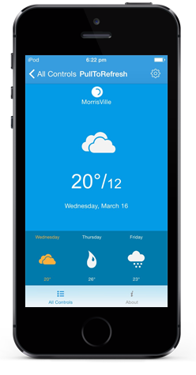

# Overview

SfPullToRefresh is a pullable panel which on pulling down the main content in order to refresh the data in the application application.  RefreshContent will be hidden and can be shown by swiping down on the main content and a refresh content, mainly a progress indicator or refresh indicator will be shown. The application will be refreshed once you have pulled down a certain distance.

## Key Features

• `Transition`: Specifies the transition type of the `PullToRefresh`. 
• `Position`: Specifies the position of the transition to take place.
• `Refresh()`: `Refresh()` refreshes the content being viewed.

## Use Case Scenarios

PullToRefresh controls are mainly used in applications where the user needs to refresh the content on demand. The main applications that use the PullToRefresh are listed below:

1. Facebook
2. Weather
3. Gmail
4. Live Score applications

