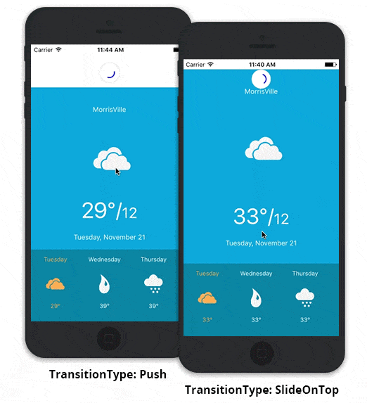

# SfPullToRefresh

SfPullToRefresh is a refresh control that allows you to interact and refresh the view loaded as pullable content. It supports loading complex and custom layouts that can be refreshed programmatically or through interaction.

# Key Features:

* Facilitates the user to refresh the view programmatically. Use [SfPullToRefresh.StartRefreshing()](https://help.syncfusion.com/cr/cref_files/xamarin-ios/sfpulltorefresh/Syncfusion.SfPullToRefresh.iOS~Syncfusion.SfPullToRefresh.SfPullToRefresh~StartRefreshing.html) to start the refreshing programmatically and [SfPullToRefresh.EndRefreshing()](https://help.syncfusion.com/cr/cref_files/xamarin-ios/sfpulltorefresh/Syncfusion.SfPullToRefresh.iOS~Syncfusion.SfPullToRefresh.SfPullToRefresh~EndRefreshing.html) to end the programmatic refresh.

* Provides two types of transition for refreshing. Users can toggle between the transition using the  [SfPullToRefresh.TransitionType](https://help.syncfusion.com/cr/cref_files/xamarin-ios/sfpulltorefresh/Syncfusion.SfPullToRefresh.iOS~Syncfusion.SfPullToRefresh.SfPullToRefresh~TransitionType.html) property. 

* Customizable progress view. The size, background color, stroke color and the width of the stroke can be customized using below properties. 
  * [SfPullToRefresh.RefreshContentRadius](https://help.syncfusion.com/cr/cref_files/xamarin-ios/sfpulltorefresh/Syncfusion.SfPullToRefresh.iOS~Syncfusion.SfPullToRefresh.SfPullToRefresh~RefreshContentRadius.html)
  * [SfPullToRefresh.ProgressBackgroundColor](https://help.syncfusion.com/cr/cref_files/xamarin-ios/sfpulltorefresh/Syncfusion.SfPullToRefresh.iOS~Syncfusion.SfPullToRefresh.SfPullToRefresh~ProgressBackgroundColor.html)
  * [SfPullToRefresh.ProgressStrokeColor](https://help.syncfusion.com/cr/cref_files/xamarin-ios/sfpulltorefresh/Syncfusion.SfPullToRefresh.iOS~Syncfusion.SfPullToRefresh.SfPullToRefresh~ProgressStrokeColor.html)
  * [SfPullToRefresh.ProgressStrokeWidth](https://help.syncfusion.com/cr/cref_files/xamarin-ios/sfpulltorefresh/Syncfusion.SfPullToRefresh.iOS~Syncfusion.SfPullToRefresh.SfPullToRefresh~ProgressStrokeWidth.html)

