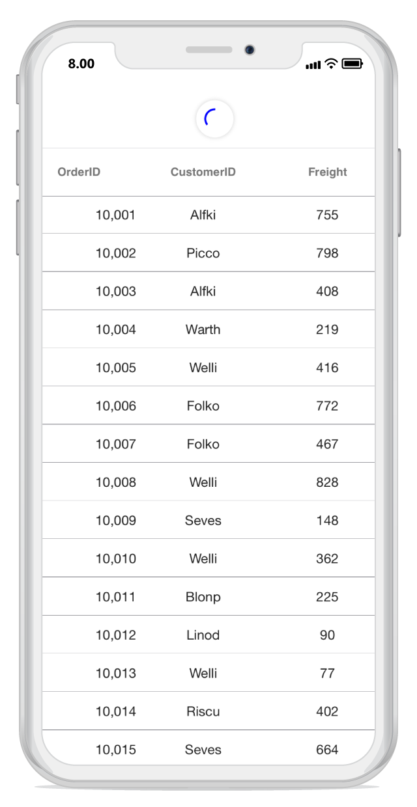

---
layout: post
title: StoryBoard Support | SfPullToRefresh | Xamarin.iOS | Syncfusion
description: Renderer the SfPullToRefresh using StoryBoard
platform: Xamarin.iOS
control: SfPullToRefresh
documentation: ug
--- 

# Renderer the SfPullToRefresh on StoryBoard

This section explains how to renderer SfPullToRefresh using axml with SfDataGrid

## This following steps will illustrates how to use SfPullToRefresh on StoryBoard

1. Create a new  ViewController. 

2. Drag the SfPullToRefresh from toolbox and Drop into StoryBoard. 

3. Since this is hosting control so it does not has preview on StoryBoard. You can see ths SfPullToRefresh only when deploy on device.

4. Set the identity name  for SfPullToRefresh on properties window.

5. Set the TransitionType as Push on properties window.

6. Now Drag the SfDataGrid from ToolBox and drop into inside the SfPullToRefresh on StoryBoard.

8. Set the SfDataGrid as PullableContent to SfPullToRefresh on code behind.

9. Ensure the behavior.

Please refer the below code to set SfDataGrid as PullableContent to SfPullToRefresh on code behind


    public partial class newViewController : UIViewController
    {
     

        ViewModel viewModel;
        public newViewController() : base("newViewController", null)
        {
            
        }

        public override void ViewDidLoad()
        {
            base.ViewDidLoad();
            // Perform any additional setup after loading the view, typically from a nib.
            viewModel = new ViewModel();
           
            sfgrid.ItemsSource = viewModel.OrdersInfo;
            sfpull.PullableContent = sfgrid;
           
        }

        public override void DidReceiveMemoryWarning()
        {
            base.DidReceiveMemoryWarning();
        }
    }


Now, run the application to render the following output.

You can download the entire source code of this demo for Xamarin.Android from [here](http://www.syncfusion.com/downloads/support/directtrac/general/ze/StoryBoard_Support_SfPullToRefresh_iOS1723365924).

