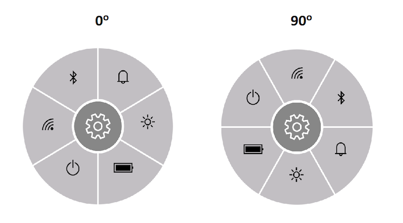

# Layout types

The following two different [LayoutType]](https://help.syncfusion.com/cr/xamarin-ios/Syncfusion.SfRadialMenu.iOS~Syncfusion.SfRadialMenu.iOS.SfRadialMenu~LayoutType.html) available in radial menu:

* Default
* Custom

Both the layout types divide the available space equally among all the children in the circular panel.

## Default

Number of segments in the panel is determined by children count in the level. Since the segment count in each hierarchical level differs, radial menu items are arranged in a sequential order as added in the radial menu.





radialMenu.LayoutType = LayoutType.Default;





## Custom

The number of segments in the panel is determined using the [VisibleItemCount](https://help.syncfusion.com/cr/xamarin-ios/Syncfusion.SfRadialMenu.iOS~Syncfusion.SfRadialMenu.iOS.SfRadialMenu~VisibleItemCount.html) property. Since the segment count in all the hierarchical levels are same, radial menu items are arranged in any order based on the [SlottedIndex](https://help.syncfusion.com/cr/xamarin-ios/Syncfusion.SfRadialMenu.iOS~Syncfusion.SfRadialMenu.iOS.SfRadialMenuItem~SlottedIndex.html) property.





radialMenu.LayoutType = LayoutType.Custom;





### VisibleItemCount

The [VisibleItemCount](https://help.syncfusion.com/cr/xamarin-ios/Syncfusion.SfRadialMenu.iOS~Syncfusion.SfRadialMenu.iOS.SfRadialMenu~VisibleItemCount.html) property is used to specify the number of segments available in circular panel. When children count is greater than the value given in the VisibleItemCount property, the overflowing children are not arranged in the panel. When children count is lesser than the VisibleItemCount property, then remaining segments are left free.





radialMenu.VisibleItemCount= 3;





### SlottedIndex

The [SlottedIndex](https://help.syncfusion.com/cr/xamarin-ios/Syncfusion.SfRadialMenu.iOS~Syncfusion.SfRadialMenu.iOS.SfRadialMenuItem~SlottedIndex.html) property is used to specify the index of the radial menu item in circular panel. Based on the index, the radial menu items are inserted in the segment. When the SlottedIndex is not specified for a RadialMenuItem, the menu item is arranged in the next available free segment.

## Code snippet for VisibleItemCount and SegmentIndex





������������string[]�layer =�new�string[]�{�"\uE701",�"\uE702",�"\uEA8F",�"\uE706",�"\uEBAA",�"\uE7E8"�};
            int[]�slottedIndex=�new�int[]�{ 1, 0, 2 };
������������SfRadialMenu�sfRadialMenu�=�new�SfRadialMenu();
������������sfRadialMenu.CenterButtonText�=�"\uE713";
������������sfRadialMenu.CenterButtonBackText�=�"\uE72B";
            sfRadialMenu.VisibleItemCount= 3;
������������sfRadialMenu.CenterButtonIconFont�=�UIFont.FromName("Segoe�MDL2�Assets",�30);//
������������for�(int�i�=�0;�i�<�VisibleItemCount;�i++)
������������{
����������������//Adding�Items
����������������SfRadialMenuItem�item�=�new�SfRadialMenuItem()�{�IconFont�=�UIFont.FromName("Segoe�MDL2�Assets",�20),�FontIcon�=�layer[i],slottedIndex[i]};
����������������sfRadialMenu.Items.Add(item);
������������}
������������sfRadialMenu.CenterButtonPlacement�=�SfRadialMenuCenterButtonPlacement.Center;
������������this.View.AddSubview(sfRadialMenu);
		




### StartAngle

`StartAngle` property is used to set the angle from which the arrangement of radial menu items should start.




			SfRadialMenu radialMenu = new SfRadialMenu();

			//Initializing RadialMenu's properties
			radialMenu.CenterButtonText = "\uE713";
			sfRadialMenu.CenterButtonBackText�=�"\uE713";
			radialMenu.CenterButtonIconFont = UIFont.FromName("Segoe�MDL2�Assets",�30);
			radialMenu.StartAngle = 90;

			//Adding Main menu Items

			string[] menuItems = new string[] { "\uE701", "\uE702","\uEA8F","\uE793", "\uE83F","\uE7E8" };

			for (int i = 0; i < 6; i++)
			{
				SfRadialMenuItem mainMenuItems = new SfRadialMenuItem();
				mainMenuItems.FontIcon = menuItems[i];
				mainMenuItems.IconFont = UIFont.FromName("Segoe�MDL2�Assets",�30);
				radialMenu.Items.Add(mainMenuItems);
			}

			radialMenu.CenterButtonPlacement�=�SfRadialMenuCenterButtonPlacement.Center;
������������this.View.AddSubview(radialMenu);




