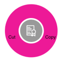

# SfRadialMenuItem Customization

The [SfRadialMenuItem](https://help.syncfusion.com/cr/xamarin-ios/Syncfusion.SfRadialMenu.iOS~Syncfusion.SfRadialMenu.iOS.SfRadialMenuItem.html) class provides various options such as `Custom Views`, `FontIcons`, and `Images` to customize the items. You can add radial menu items by hierarchy. To add a SfRadialMenuItem with SfRadialMenu, create an instance of SfRadialMenuItem, and add it to the [Items](https://help.syncfusion.com/cr/xamarin-ios/Syncfusion.SfRadialMenu.iOS~Syncfusion.SfRadialMenu.iOS.SfRadialMenu~Items.html) property that is available in SfRadialMenu.

## Items

The [Items](https://help.syncfusion.com/cr/xamarin-ios/Syncfusion.SfRadialMenu.iOS~Syncfusion.SfRadialMenu.iOS.SfRadialMenu~Items.html) ) property populates the items of an inner rim in `SfRadialMenu` when the items of an outer rim are tapped.




using Foundation;
using Syncfusion.SfRadialMenu.iOS;
using System;
using UIKit;

namespace RadialMenuNative
{
    public partial class ViewController : UIViewController
    {
        public ViewController(IntPtr handle) : base(handle)
        {
        }

        public override void ViewDidLoad()
        {
            base.ViewDidLoad();
            SfRadialMenu radialMenu = new SfRadialMenu();
            radialMenu.CenterButtonIconFont = UIFont.FromName("Sample", 30);
            radialMenu.CenterButtonText = "\uE713";
            radialMenu.Items.Add(new SfRadialMenuItem() { Text = "Cut" });
            radialMenu.Items.Add(new SfRadialMenuItem() { Text = "Copy" });
            radialMenu.Items[0].Items.Add(new SfRadialMenuItem() { Text = "Paste" });
            radialMenu.CenterButtonPlacement = SfRadialMenuCenterButtonPlacement.Center;
            this.View.AddSubview(radialMenu);
        }

        public override void DidReceiveMemoryWarning()
        {
            base.DidReceiveMemoryWarning();
            // Release any cached data, images, etc that aren't in use.
        }
    }
}




## Text

The [Text](https://help.syncfusion.com/cr/xamarin-ios/Syncfusion.SfRadialMenu.iOS~Syncfusion.SfRadialMenu.iOS.SfRadialMenuItem~Text.html) property provides text to the [SfRadialMenuItem](https://help.syncfusion.com/cr/xamarin-ios/Syncfusion.SfRadialMenu.iOS~Syncfusion.SfRadialMenu.iOS.SfRadialMenuItem.html).




using Foundation;
using Syncfusion.SfRadialMenu.iOS;
using System;
using UIKit;

namespace RadialMenuNative
{
    public partial class ViewController : UIViewController
    {
        public ViewController(IntPtr handle) : base(handle)
        {
        }

        public override void ViewDidLoad()
        {
            base.ViewDidLoad();
            SfRadialMenu radialMenu = new SfRadialMenu();
            radialMenu.CenterButtonIconFont = UIFont.FromName("Sample", 30);
            radialMenu.CenterButtonText = "\uE713";
            radialMenu.Items.Add(new SfRadialMenuItem() { Text = "Cut" });
            radialMenu.Items.Add(new SfRadialMenuItem() { Text = "Copy" });
            radialMenu.Items[0].Items.Add(new SfRadialMenuItem() { Text = "Paste" });
            radialMenu.CenterButtonPlacement = SfRadialMenuCenterButtonPlacement.Center;
            this.View.AddSubview(radialMenu);
        }

        public override void DidReceiveMemoryWarning()
        {
            base.DidReceiveMemoryWarning();
            // Release any cached data, images, etc that aren't in use.
        }
    }
}




## Height

The [Height](https://help.syncfusion.com/cr/xamarin-ios/Syncfusion.SfRadialMenu.iOS~Syncfusion.SfRadialMenu.iOS.SfRadialMenuItem~Height.html) changes the height of the [SfRadialMenuItem](https://help.syncfusion.com/cr/xamarin-ios/Syncfusion.SfRadialMenu.iOS~Syncfusion.SfRadialMenu.iOS.SfRadialMenuItem.html).




 using Foundation;
using Syncfusion.SfRadialMenu.iOS;
using System;
using UIKit;

namespace RadialMenuNative
{
    public partial class ViewController : UIViewController
    {
        public ViewController(IntPtr handle) : base(handle)
        {
        }

        public override void ViewDidLoad()
        {
            base.ViewDidLoad();
            SfRadialMenu radialMenu = new SfRadialMenu();
            radialMenu.CenterButtonIconFont = UIFont.FromName("Sample", 30);
            radialMenu.CenterButtonText = "\uE713";
            radialMenu.Items.Add(new SfRadialMenuItem() { Text = "Cut", Height = 50 });
            radialMenu.Items.Add(new SfRadialMenuItem() { Text = "Cut", Height = 50 });
            radialMenu.Items[0].Items.Add(new SfRadialMenuItem() { Text = "Paste" });
            radialMenu.CenterButtonPlacement = SfRadialMenuCenterButtonPlacement.Center;
            this.View.AddSubview(radialMenu);
        }

        public override void DidReceiveMemoryWarning()
        {
            base.DidReceiveMemoryWarning();
            // Release any cached data, images, etc that aren't in use.
        }
    }
}




## Width

The [Width](https://help.syncfusion.com/cr/xamarin-ios/Syncfusion.SfRadialMenu.iOS~Syncfusion.SfRadialMenu.iOS.SfRadialMenuItem~Width.html) property changes the width of the [https://help.syncfusion.com/cr/xamarin-ios/Syncfusion.SfRadialMenu.iOS~Syncfusion.SfRadialMenu.iOS.SfRadialMenuItem.html).




using Foundation;
using Syncfusion.SfRadialMenu.iOS;
using System;
using UIKit;

namespace RadialMenuNative
{
    public partial class ViewController : UIViewController
    {
        public ViewController(IntPtr handle) : base(handle)
        {
        }

        public override void ViewDidLoad()
        {
            base.ViewDidLoad();
            SfRadialMenu radialMenu = new SfRadialMenu();
            radialMenu.CenterButtonIconFont = UIFont.FromName("Sample", 30);
            radialMenu.CenterButtonText = "\uE713";
            radialMenu.Items.Add(new SfRadialMenuItem() { Text = "Cut", Width = 100 });
            radialMenu.Items.Add(new SfRadialMenuItem() { Text = "Cut", Width = 100});
            radialMenu.Items[0].Items.Add(new SfRadialMenuItem() { Text = "Paste" });
            radialMenu.CenterButtonPlacement = SfRadialMenuCenterButtonPlacement.Center;
            this.View.AddSubview(radialMenu);
        }

        public override void DidReceiveMemoryWarning()
        {
            base.DidReceiveMemoryWarning();
            // Release any cached data, images, etc that aren't in use.
        }
    }
}




## BackgroundColor

The [BackgroundColor](https://help.syncfusion.com/cr/xamarin-ios/Syncfusion.SfRadialMenu.iOS~Syncfusion.SfRadialMenu.iOS.SfRadialMenuItem~BackgroundColor.html) property changes the background color of the [SfRadialMenuItem](https://help.syncfusion.com/cr/xamarin-ios/Syncfusion.SfRadialMenu.iOS~Syncfusion.SfRadialMenu.iOS.SfRadialMenuItem.html).




 using Foundation;
using Syncfusion.SfRadialMenu.iOS;
using System;
using UIKit;

namespace RadialMenuNative
{
    public partial class ViewController : UIViewController
    {
        public ViewController(IntPtr handle) : base(handle)
        {
        }

        public override void ViewDidLoad()
        {
            base.ViewDidLoad();
            SfRadialMenu radialMenu = new SfRadialMenu();
            radialMenu.CenterButtonIconFont = UIFont.FromName("Sample", 30);
            radialMenu.CenterButtonText = "\uE713";
            radialMenu.Items.Add(new SfRadialMenuItem() { Text = "Cut", BackgroundColor = UIColor.FromRGB(232, 25, 156) });
            radialMenu.Items.Add(new SfRadialMenuItem() { Text = "Copy", BackgroundColor = UIColor.FromRGB(232, 25, 156) });
            radialMenu.Items[0].Items.Add(new SfRadialMenuItem() { Text = "Paste" });
            radialMenu.CenterButtonPlacement = SfRadialMenuCenterButtonPlacement.Center;
            this.View.AddSubview(radialMenu);
        }

        public override void DidReceiveMemoryWarning()
        {
            base.DidReceiveMemoryWarning();
            // Release any cached data, images, etc that aren't in use.
        }
    }
}




## Font

The [Font](https://help.syncfusion.com/cr/xamarin-ios/Syncfusion.SfRadialMenu.iOS~Syncfusion.SfRadialMenu.iOS.SfRadialMenuItem~Font.html) property changes the font family of text in [SfRadialMenuItem](https://help.syncfusion.com/cr/xamarin-ios/Syncfusion.SfRadialMenu.iOS~Syncfusion.SfRadialMenu.iOS.SfRadialMenuItem.html).




using Foundation;
using Syncfusion.SfRadialMenu.iOS;
using System;
using UIKit;

namespace RadialMenuNative
{
    public partial class ViewController : UIViewController
    {
        public ViewController(IntPtr handle) : base(handle)
        {
        }

        public override void ViewDidLoad()
        {
            base.ViewDidLoad();
            SfRadialMenu radialMenu = new SfRadialMenu();
            radialMenu.CenterButtonIconFont = UIFont.FromName("Sample", 30);
            radialMenu.CenterButtonText = "\uE713";
            radialMenu.Items.Add(new SfRadialMenuItem() { Text = "Cut", Font = UIFont.FromName("Times New Roman", 15) });
            radialMenu.Items.Add(new SfRadialMenuItem() { Text = "Copy", Font = UIFont.FromName("Times New Roman", 15) });
            radialMenu.Items[0].Items.Add(new SfRadialMenuItem() { Text = "Paste" });
            radialMenu.CenterButtonPlacement = SfRadialMenuCenterButtonPlacement.Center;
            this.View.AddSubview(radialMenu);
        }

        public override void DidReceiveMemoryWarning()
        {
            base.DidReceiveMemoryWarning();
            // Release any cached data, images, etc that aren't in use.
        }
    }
}




## FontSize

The [FontSize](https://help.syncfusion.com/cr/xamarin-ios/Syncfusion.SfRadialMenu.iOS~Syncfusion.SfRadialMenu.iOS.SfRadialMenuItem~FontSize.html) property changes the text size of the [SfRadialMenuItem](https://help.syncfusion.com/cr/xamarin-ios/Syncfusion.SfRadialMenu.iOS~Syncfusion.SfRadialMenu.iOS.SfRadialMenuItem.html).




using Foundation;
using Syncfusion.SfRadialMenu.iOS;
using System;
using UIKit;

namespace RadialMenuNative
{
    public partial class ViewController : UIViewController
    {
        public ViewController(IntPtr handle) : base(handle)
        {
        }

        public override void ViewDidLoad()
        {
            base.ViewDidLoad();
            SfRadialMenu radialMenu = new SfRadialMenu();
            radialMenu.CenterButtonIconFont = UIFont.FromName("Sample", 30);
            radialMenu.CenterButtonText = "\uE713";
            radialMenu.Items.Add(new SfRadialMenuItem() { Text = "Cut", IconFont = UIFont.FromName("Times New Roman", 30), FontSize = 15 });
            radialMenu.Items.Add(new SfRadialMenuItem() { Text = "Copy", IconFont = UIFont.FromName("Times New Roman", 30),FontSize = 15 });
            radialMenu.Items[0].Items.Add(new SfRadialMenuItem() { Text = "Paste" });
            radialMenu.CenterButtonPlacement = SfRadialMenuCenterButtonPlacement.Center;
            this.View.AddSubview(radialMenu);
        }

        public override void DidReceiveMemoryWarning()
        {
            base.DidReceiveMemoryWarning();
            // Release any cached data, images, etc that aren't in use.
        }
    }
}




## Image

The [Image](https://help.syncfusion.com/cr/xamarin-ios/Syncfusion.SfRadialMenu.iOS~Syncfusion.SfRadialMenu.iOS.SfRadialMenuItem~Image.html) property provides image support to the [SfRadialMenuItem](https://help.syncfusion.com/cr/xamarin-ios/Syncfusion.SfRadialMenu.iOS~Syncfusion.SfRadialMenu.iOS.SfRadialMenuItem.html).




using Foundation;
using Syncfusion.SfRadialMenu.iOS;
using System;
using UIKit;

namespace RadialMenuNative
{
    public partial class ViewController : UIViewController
    {
        public ViewController(IntPtr handle) : base(handle)
        {
        }

        public override void ViewDidLoad()
        {
            base.ViewDidLoad();
            SfRadialMenu radialMenu = new SfRadialMenu();
            radialMenu.CenterButtonIconFont = UIFont.FromName("Sample", 30);
            radialMenu.CenterButtonText = "\uE713";
            radialMenu.RimRadius = 100;
            radialMenu.Items.Add(new SfRadialMenuItem() { Image = "HomePageLibrary.png" });
            radialMenu.Items.Add(new SfRadialMenuItem() { Image = "eServices.png" });
            radialMenu.CenterButtonPlacement = SfRadialMenuCenterButtonPlacement.Center;
            this.View.AddSubview(radialMenu);
        }

        public override void DidReceiveMemoryWarning()
        {
            base.DidReceiveMemoryWarning();
            // Release any cached data, images, etc that aren't in use.
        }
    }
}




## BackgroundImage

The [BackgroundImage](https://help.syncfusion.com/cr/xamarin-ios/Syncfusion.SfRadialMenu.iOS~Syncfusion.SfRadialMenu.iOS.SfRadialMenuItem~BackgroundImage.html) property provides the background image support to the [SfRadialMenuItem](https://help.syncfusion.com/cr/xamarin-ios/Syncfusion.SfRadialMenu.iOS~Syncfusion.SfRadialMenu.iOS.SfRadialMenuItem.html).




using Foundation;
using Syncfusion.SfRadialMenu.iOS;
using System;
using UIKit;

namespace RadialMenuNative
{
    public partial class ViewController : UIViewController
    {
        public ViewController(IntPtr handle) : base(handle)
        {
        }

        public override void ViewDidLoad()
        {
            base.ViewDidLoad();
            SfRadialMenu radialMenu = new SfRadialMenu();
            radialMenu.CenterButtonIconFont = UIFont.FromName("Sample", 30);
            radialMenu.CenterButtonText = "\uE713";
            radialMenu.RimRadius = 100;
            radialMenu.Items.Add(new SfRadialMenuItem() { BackgroundImage = "HomePageLibrary.png" });
            radialMenu.Items.Add(new SfRadialMenuItem() { BackgroundImage = "eServices.png" });
            radialMenu.CenterButtonPlacement = SfRadialMenuCenterButtonPlacement.Center;
            this.View.AddSubview(radialMenu);
        }

        public override void DidReceiveMemoryWarning()
        {
            base.DidReceiveMemoryWarning();
            // Release any cached data, images, etc that aren't in use.
        }
    }
}




## FontIcon

The [FontIcon](https://help.syncfusion.com/cr/xamarin-ios/Syncfusion.SfRadialMenu.iOS~Syncfusion.SfRadialMenu.iOS.SfRadialMenuItem~FontIcon.html) property provides font icon support to the [SfRadialMenuItem](https://help.syncfusion.com/cr/xamarin-ios/Syncfusion.SfRadialMenu.iOS~Syncfusion.SfRadialMenu.iOS.SfRadialMenuItem.html).




using Foundation;
using Syncfusion.SfRadialMenu.iOS;
using System;
using UIKit;

namespace RadialMenuNative
{
    public partial class ViewController : UIViewController
    {
        public ViewController(IntPtr handle) : base(handle)
        {
        }

        public override void ViewDidLoad()
        {
            base.ViewDidLoad();
            SfRadialMenu radialMenu = new SfRadialMenu();
            radialMenu.CenterButtonIconFont = UIFont.FromName("Sample", 30);
            radialMenu.CenterButtonText = "\uE713";
            radialMenu.RimRadius = 100;
            radialMenu.Items.Add(new SfRadialMenuItem() { FontIcon = "\uE9AB", IconFont = UIFont.FromName("Sample", 20) });
            radialMenu.Items.Add(new SfRadialMenuItem() { FontIcon = "\uEB73", IconFont = UIFont.FromName("Sample", 20) });
            radialMenu.CenterButtonPlacement = SfRadialMenuCenterButtonPlacement.Center;
            this.View.AddSubview(radialMenu);
        }

        public override void DidReceiveMemoryWarning()
        {
            base.DidReceiveMemoryWarning();
            // Release any cached data, images, etc that aren't in use.
        }
    }
}




## FontIconColor

The [FontIconColor](https://help.syncfusion.com/cr/xamarin-android/Syncfusion.SfRadialMenu.Android~Syncfusion.SfRadialMenu.Android.SfRadialMenuItem~FontIconColor.html) property changes the color of font icon in [SfRadialMenuItem](https://help.syncfusion.com/cr/xamarin-ios/Syncfusion.SfRadialMenu.iOS~Syncfusion.SfRadialMenu.iOS.SfRadialMenuItem.html).




using Foundation;
using Syncfusion.SfRadialMenu.iOS;
using System;
using UIKit;

namespace RadialMenuNative
{
    public partial class ViewController : UIViewController
    {
        public ViewController(IntPtr handle) : base(handle)
        {
        }

        public override void ViewDidLoad()
        {
            base.ViewDidLoad();
            SfRadialMenu radialMenu = new SfRadialMenu();
            radialMenu.CenterButtonIconFont = UIFont.FromName("Sample", 30);
            radialMenu.CenterButtonText = "\uE713";
            radialMenu.RimRadius = 100;
            radialMenu.Items.Add(new SfRadialMenuItem() { FontIcon = "\uE9AB", IconFont = UIFont.FromName("Sample", 20) , FontIconColor = UIColor.FromRGB(232, 25, 156) });
            radialMenu.Items.Add(new SfRadialMenuItem() { FontIcon = "\uEB73", IconFont = UIFont.FromName("Sample", 20), FontIconColor = UIColor.FromRGB(232, 25, 156) });
            radialMenu.CenterButtonPlacement = SfRadialMenuCenterButtonPlacement.Center;
            this.View.AddSubview(radialMenu);
        }

        public override void DidReceiveMemoryWarning()
        {
            base.DidReceiveMemoryWarning();
            // Release any cached data, images, etc that aren't in use.
        }
    }
}




## FontSize

The [FontSize](https://help.syncfusion.com/cr/xamarin-ios/Syncfusion.SfRadialMenu.iOS~Syncfusion.SfRadialMenu.iOS.SfRadialMenuItem~FontSize.html) property changes the size of font icon in the [SfRadialMenuItem](https://help.syncfusion.com/cr/xamarin-ios/Syncfusion.SfRadialMenu.iOS~Syncfusion.SfRadialMenu.iOS.SfRadialMenuItem.html).




using Foundation;
using Syncfusion.SfRadialMenu.iOS;
using System;
using UIKit;

namespace RadialMenuNative
{
    public partial class ViewController : UIViewController
    {
        public ViewController(IntPtr handle) : base(handle)
        {
        }

        public override void ViewDidLoad()
        {
            base.ViewDidLoad();
            SfRadialMenu radialMenu = new SfRadialMenu();
            radialMenu.CenterButtonIconFont = UIFont.FromName("Sample", 30);
            radialMenu.CenterButtonText = "\uE713";
            radialMenu.RimRadius = 100;
            radialMenu.Items.Add(new SfRadialMenuItem() { FontIcon = "\uE9AB", IconFont = UIFont.FromName("Sample", 20) });
            radialMenu.Items.Add(new SfRadialMenuItem() { FontIcon = "\uEB73", IconFont = UIFont.FromName("Sample", 20) });
            radialMenu.CenterButtonPlacement = SfRadialMenuCenterButtonPlacement.Center;
            this.View.AddSubview(radialMenu);
        }

        public override void DidReceiveMemoryWarning()
        {
            base.DidReceiveMemoryWarning();
            // Release any cached data, images, etc that aren't in use.
        }
    }
}




## IconFont

The [IconFont](https://help.syncfusion.com/cr/xamarin-ios/Syncfusion.SfRadialMenu.iOS~Syncfusion.SfRadialMenu.iOS.SfRadialMenuItem~IconFont.html) property changes the font family of font icon in the [SfRadialMenuItem](https://help.syncfusion.com/cr/xamarin-ios/Syncfusion.SfRadialMenu.iOS~Syncfusion.SfRadialMenu.iOS.SfRadialMenuItem.html).



	
using Foundation;
using Syncfusion.SfRadialMenu.iOS;
using System;
using UIKit;

namespace RadialMenuNative
{
    public partial class ViewController : UIViewController
    {
        public ViewController(IntPtr handle) : base(handle)
        {
        }

        public override void ViewDidLoad()
        {
            base.ViewDidLoad();
            SfRadialMenu radialMenu = new SfRadialMenu();
            radialMenu.CenterButtonIconFont = UIFont.FromName("Sample", 30);
            radialMenu.CenterButtonText = "\uE713";
            radialMenu.RimRadius = 100;
            radialMenu.Items.Add(new SfRadialMenuItem() { FontIcon = "\uE9AB", IconFont = UIFont.FromName("Sample", 20) });
            radialMenu.Items.Add(new SfRadialMenuItem() { FontIcon = "\uEB73", IconFont = UIFont.FromName("Sample", 20) });
            radialMenu.CenterButtonPlacement = SfRadialMenuCenterButtonPlacement.Center;
            this.View.AddSubview(radialMenu);
        }

        public override void DidReceiveMemoryWarning()
        {
            base.DidReceiveMemoryWarning();
            // Release any cached data, images, etc that aren't in use.
        }
    }
}


