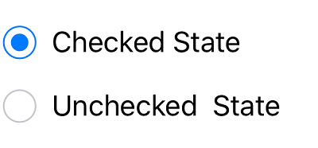
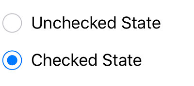

# Event

## StateChanged event

Occurs when the value(state) of the `IsChecked` property is changed by either touching the check box or setting the value to the `IsChecked` property through XAML or C# code. The event arguments are of type `StateChangedEventArgs` and expose the following property:

* `IsChecked`: The new value(state) of the `IsChecked` property.



 SfRadioGroup radioGroup = new SfRadioGroup();
SfRadioButton check = new SfRadioButton();
check.SetTitle("Checked State",UIControlState.Normal);
check.IsChecked = true;
check.StateChanged += RadioButton_StateChanged;
SfRadioButton uncheck = new SfRadioButton();
uncheck.SetTitle("Unchecked State",UIControlState.Normal);
uncheck.StateChanged += RadioButton_StateChanged;
radioGroup.AddArrangedSubview(check);
radioGroup.AddArrangedSubview(uncheck);

private void RadioButton_StateChanged(object sender, StateChangedEventArgs e)
{
    if (e.IsChecked.HasValue && e.IsChecked.Value)
    {
        (sender as SfRadioButton).SetTitle("Checked State",UIControlState.Normal);
    }
    else if (e.IsChecked.HasValue && !e.IsChecked.Value)
    {
       (sender as SfRadioButton).SetTitle("Unchecked State",UIControlState.Normal);
    }
}
 



This demo can be downloaded from this [link](http://files2.syncfusion.com/Xamarin.Android/Samples/MaskedEdit_VisualCustomize.zip).