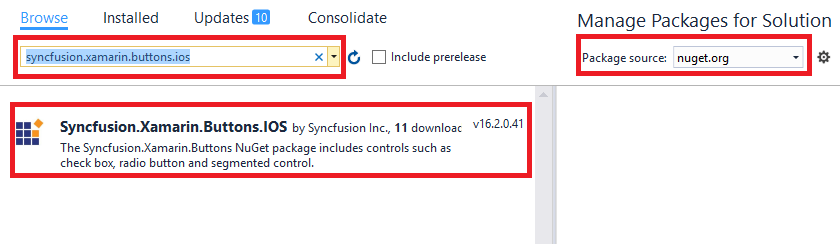

# Getting Started Xamarin.iOS RadioButton (SfRadioButton)

This section explains the steps required to configure the `SfRadioButton` control in a real-time scenario and provides a walk-through on some of the customization features available in `SfRadioButton` control.

## Add a SfRadioButton reference
Syncfusion Xamarin components are available in [nuget.org](https://www.nuget.org/). To add radio button to your project, open the NuGet package manager in Visual Studio, and search for "[syncfusion.xamarin.buttons.ios](https://www.nuget.org/packages/Syncfusion.Xamarin.Buttons.iOS)", and then install it. 

N>Starting with v16.2.0.x, if you reference Syncfusion assemblies from trial setup or from the NuGet feed, you also have to include a license key in your projects. Please refer to this [link](https://help.syncfusion.com/common/essential-studio/licensing/license-key) to know about registering Syncfusion license key in your Xamarin application to use our components.

## Create a Simple SfRadioButton
The `SfRadioButton` control is configured entirely in C# code. The following steps explain how to create a `SfRadioButton` and configure its elements.

### Add namespace for referred assemblies



using Syncfusion.iOS.Buttons;



### Refer the SfRadioButton control with declared suffix name for Namespace



using CoreGraphics;
using Syncfusion.iOS.Buttons;
using System;
using UIKit;

namespace RadioButton_Sample
{
    public partial class ViewController : UIViewController
    {
        public ViewController(IntPtr handle) : base(handle)
        {
        }

        public override void ViewDidLoad()
        {
            base.ViewDidLoad();
            SfRadioButton radioButton = new SfRadioButton();
            View.AddSubview(radioButton);
        }

        public override void DidReceiveMemoryWarning()
        {
            base.DidReceiveMemoryWarning();
            // Release any cached data, images, etc that aren't in use.
        }
    }
}



## Setting caption

The radio button caption can be defined using the `SetTitle` method of `SfRadioButton`. This caption normally describes the meaning of the radio button and it displays next to radio button.
 


SfRadioButton radioButton = new SfRadioButton(); 
radioButton.SetTitle("RadioButton", UIControlState.Normal);



## Change the radio button state

The two different visual states of the `SfRadioButton` are:

* Checked
* Unchecked

You can change the state of the radio button using the `IsChecked` property of `SfRadioButton`. In the checked state, an inner circle is added to the visualization of radio button.
The radio buttons are used when there is a list of two or more options or group that are mutually exclusive and the user must select exactly one choice, such as “Select Gender” or “Choose the best option!”.



SfRadioGroup radioGroup = new SfRadioGroup();
SfRadioButton male = new SfRadioButton();
male.IsChecked = true;
male.SetTitle("Male",UIControlState.Normal);
SfRadioButton female = new SfRadioButton();
female.SetTitle("Female",UIControlState.Normal);
radioGroup.AddArrangedSubview(male);
radioGroup.AddArrangedSubview(female);  



N>`SfRadioButtons` are mutually exclusive among them when they are defined within `SfRadioGroup`.

This demo can be downloaded from this [link](http://files2.syncfusion.com/Xamarin.iOS/Samples/RadioButton_StateChanging.zip).
