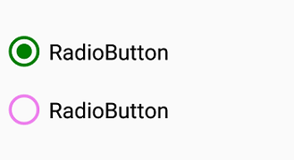
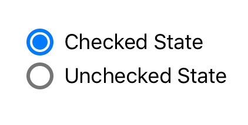

# Visual Customization

## Customizing state color
The default state colors can be customized using the `CheckedColor` and `UncheckedColor `properties. The checked state color is updated to the `CheckedColor` property value when the state is changed to the checked. The unchecked state color is updated to the `UncheckedColor` property value when the state is changed to unchecked.



SfRadioGroup radioGroup = new SfRadioGroup();
SfRadioButton check = new SfRadioButton();
check.SetTitle("RadioButton",UIControlState.Normal);
check.IsChecked = true;
check.CheckedColor = UIColor.Green;
SfRadioButton uncheck = new SfRadioButton();
uncheck.SetTitle("RadioButton", UIControlState.Normal);
uncheck.UncheckedColor = UIColor.FromRGB(238, 130, 238);
radioGroup.AddArrangedSubview(check);
radioGroup.AddArrangedSubview(uncheck);



## BorderWidth
The border thickness of the circle in the RadioButton control can be customized with the `BorderWidth` property.  



SfRadioGroup radioGroup = new SfRadioGroup();
SfRadioButton check = new SfRadioButton();
check.SetTitle("Checked State",UIControlState.Normal);
check.IsChecked = true;
check.BorderWidth = 3;
SfRadioButton uncheck = new SfRadioButton();
uncheck.SetTitle("UnChecked State", UIControlState.Normal);
uncheck.BorderWidth = 3;
radioGroup.AddArrangedSubview(check);
radioGroup.AddArrangedSubview(uncheck);



## Setting caption text appearance 

You can customize the display text appearance of the `SfRadioButton` control using the following properties:

* `SetTitleColor`: Changes the color of the text.
* `HorizontalAlignment`: Changes the horizontal alignment of the caption text.
* `Font`: Changes the font family of the text and sets font attributes(bold/italic/none) of the text and also sets font size of the caption text.



SfRadioButton radioButton = new SfRadioButton();
radioButton.SetTitle("RadioButton", UIControlState.Normal);
radioButton.IsChecked = true;
radioButton.SetTitleColor(UIColor.FromRGB(238, 130, 238), UIControlState.Normal);
radioButton.HorizontalAlignment = UIControlContentHorizontalAlignment.Center;
radioButton.Font = UIFont.FromName("Arial", 20);
radioButton.Font = UIFont.SystemFontOfSize(20);
UIFontDescriptor fontDescriptor = radioButton.Font.FontDescriptor;
radioButton.Font = UIFont.FromDescriptor(fontDescriptor.CreateWithTraits(UIFontDescriptorSymbolicTraits.Bold), 0);



This demo can be downloaded from this [link](http://files2.syncfusion.com/Xamarin.iOS/Samples/RadioButton_VisualCustomization.zip ).
