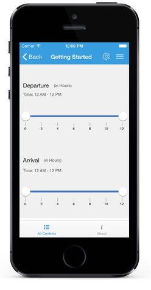

# Getting Started

This section explains you the steps to configure a RangeSlider  control in a real-time scenario and also provides a walk-through on some of the customization features available in RangeSlider control.

## Referencing Essential Studio Components in Your Solution

After installing Essential Studio for Xamarin, you can find all the required assemblies in the installation folders, typically:

{Syncfusion Installed location}\Essential Studio {version number}\lib

You have to add the following assembly reference to the iOS unified project

iOS-unifed\Syncfusion.SfRangeSlider.iOS.dll

### And and Configure the RangeSlider

* Adding reference to RangeSlider.





	using Syncfusion.SfRangeSlider.iOS; 





* Create an instance of SfRangeSlider





	SFRangeSlider rangeSlider = new SFRangeSlider();
	this.AddSubview(rangeSlider);	





### Add Values and Scale

You can set the minimum value for the slider by using the `setMinimum()` and `setMaximum()` properties in the RangeSlider. It can be Numerical values.





	rangeSlider.Minimum=0; 
	rangeSlider.Maximum=24; 
	rangeSlider.DirectionReversed=false; 
	rangeSlider.RangeEnd=20; 
	rangeSlider.RangeStart=4;
	rangeSlider.ShowRange=true; 
	rangeSlider.Orientation=SFOrientation.SFOrientationHorizontal;





N> Likewise, `RangeStart` and `RangeEnd` can be set that denote the start range and end range values while dual thumb is used. The `ShowRange` property is used to switch between a single thumb and double thumb. The `Orientation` property sets the type of orientation.

### Add Ticks and Labels for RangeSlider

The ticks can be set by setting the `TickFrequency` and `TickPlacement`. Likewise, value labels can be set by setting the `ShowValueLabel` property to true. The position of label can be varied by the `LabelPlacement` property.





	rangeSlider.TickFrequency=4; 
	rangeSlider.ShowValueLabel=true; 
	rangeSlider.ValuePlacement=SFValuePlacement.SFValuePlacementTopLeft; 
	rangeSlider.TickPlacement=SFTickPlacement.SFTickPlacementBottomRight;





N> The TickFrequency determines the interval between the ticks.

### Add Snapping Type for RangeSlider

The movement of the thumb can be varied in different ways. This is achieved by setting the SnapsTo property.





	rangeSlider.SnapsTo=SFSnapsTo.SFSnapsToTicks; 
	rangeSlider.StepFrequency=6;





### Configure the properties for RangeSlider

 


	
	rangeSlider.Minimum=0;
	rangeSlider.Maximum=24;
	rangeSlider.RangeStart=4;
	rangeSlider.RangeEnd=20;
	rangeSlider.TickFrequency=4;
	rangeSlider.TickPlacement= SFTickPlacement.SFTickPlacementBottomRight;
	rangeSlider.SnapsTo= SFSnapsTo.SFSnapsToTicks;





 

