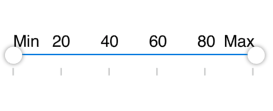

# Customization labels

SfRangeSlider provides option to show or hide the label and position customization.

## Show Value Label

This property allows us to display labels for the ticks. When it sets to true, it displays the label for all the ticks based on the `ValuePlacement` property.

N> The default value of the `ShowValueLabel` property is false.





	rangeSlider.ShowValueLabel= true;





## Set Custom Label

To display custom labels, `ShowCustomLabel` property should be set to true and need to populate the `CustomLabels` property with observable collection of items by specifying the custom labels for corresponding values.




	
	 SfRangeSlider rangeSlider; 
	 public RangeSliderPage ()
     {
           NSMutableArray<SfLabelItems> labels = new NSMutableArray<SfLabelItems>();
		   labels.Add(new SfLabelItems() { Label = (NSString)"Min", Value = 0 });
		   labels.Add(new SfLabelItems() { Label = (NSString)"Max", Value = 100 });
		   rangeSlider = new SfRangeSlider();
           rangeSlider.HeightRequest = 400;
           rangeSlider.ShowCustomLabel = true;
           rangeSlider.CustomLabel = labels;

	 }





## Value Placement

The `ValuePlacement` property describes the position of the Value respective to ticks. 

Available options for this property are:

* BottomRight

* TopLeft





	rangeSlider.ValuePlacement = SFValuePlacement.SFValuePlacementTopLeft;









	rangeSlider.ValuePlacement = SFValuePlacement.SFValuePlacementBottomRight;





## Label Placement

The `LabelPlacement` property describes the position of the labels respective to ticks. 

Available options for this property are:

* BottomRight

* TopLeft





	rangeSlider.LabelPlacement = SFLabelPlacement.SFLabelPlacementTopLeft;





## Customizing label font

The range slider control provides the `Font` property to customize the value text and custom label text.



	SfRangeSlider sfRangeSlider = new SfRangeSlider();
	sfRangeSlider.Frame = new CoreGraphics.CGRect(10, 50, 350, 300);
	sfRangeSlider.FontSize = 22;
	sfRangeSlider.Font = UIFont.FromName("Helvetica", sfRangeSlider.FontSize);
	NSMutableArray<SfLabelItems> labels = new NSMutableArray<SfLabelItems>();
	labels.Add(new SfLabelItems() { Label = (NSString)"Min", Value = 0 });
	labels.Add(new SfLabelItems() { Label = (NSString)"Max", Value = 100 });
	sfRangeSlider.CustomLabel = labels;
	sfRangeSlider.TickPlacement = SFTickPlacement.SFTickPlacementBottomRight;
	sfRangeSlider.ShowCustomLabel = true;
	this.View.AddSubview(sfRangeSlider);
 


## Customizing label color

The `LabelColor` property used to change the color of the label.





	rangeSlider.Labelcolor = Color.Red;




