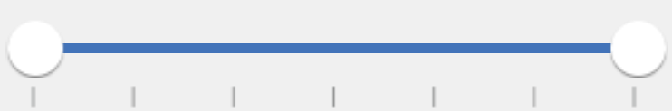

# Orientation of SfRangeSlider

SfRangeSlider provides option to display the values and the slider either horizontally or vertically.

N> The default option is Horizontal.

## Horizontal

In this orientation, the values and the slider are set horizontally. 





rangeSlider.Orientation = SFOrientation.SFOrientationHorizontal;





## Vertical

In this Orientation, the values and the slider are set vertically. 





rangeSlider.Orientation = SFOrientation.SFOrientationVertical;





