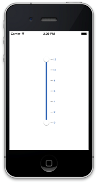

# Overview

SfRangeSlider control allows you to select the range of value within the specified minimum and maximum limits. The range can be selected by moving the Thumb control along a track.

## Key Features

* `Ticks` - The position of the ticks can be customized.

* `Tick Placement` - The TickPlacement property determines where to draw tick marks in a relation to the track.

* `Range` - The SfRangeSlider control supports to select range of value by using two Thumbs.

* `Label Support` - The SfRangeSlider control supports to select range of value by using two Thumbs.